# 豆瓣电影Top250

**数据爬取时间**: 2025-11-14 10:06:59

**电影总数**: 250 部

---

## 1. 肖申克的救赎 / 月黑高飞(港)  /  刺激1995(台)

**评分**: ⭐ 9.7 (N/A)

**信息**: 导演: 弗兰克·德拉邦特 Frank Darabont   主演: 蒂姆·罗宾斯 Tim Robbins /...1994 / 美国 / 犯罪 剧情

**剧情简介**:

一场谋杀案使银行家安迪（蒂姆•罗宾斯 Tim Robbins 饰）蒙冤入狱，谋杀妻子及其情人的指控将囚禁他终生。在肖申克监狱的首次现身就让监狱“大哥”瑞德（摩根•弗里曼 Morgan Freeman 饰）对他另眼相看。瑞德帮助他搞到一把石锤和一幅女明星海报，两人渐成患难 之交。很快，安迪在监狱里大显其才，担当监狱图书管理员，并利用自己的金融知识帮助监狱官避税，引起了典狱长的注意，被招致麾下帮助典狱长洗黑钱。偶然一次，他得知一名新入狱的小偷能够作证帮他洗脱谋杀罪。燃起一丝希望的安迪找到了典狱长，希望他能帮自己翻案。阴险伪善的狱长假装答应安迪，背后却派人杀死小偷，让他唯一能合法出狱的希望泯灭。沮丧的安迪并没有绝望，在一个电闪雷鸣的风雨夜，一场暗藏几十年的越狱计划让他自我救赎，重获自由！老朋友瑞德在他的鼓舞和帮助下，也勇敢地奔向自由。
                                        
                                    　　本片获得1995年奥...

**详情**: https://movie.douban.com/subject/1292052/

---

## 2. 霸王别姬 / 再见，我的妾  /  Farewell My Concubine

**评分**: ⭐ 9.6 (N/A)

**信息**: 导演: 陈凯歌 Kaige Chen   主演: 张国荣 Leslie Cheung / 张丰毅 Fengyi Zha...1993 / 中国大陆 中国香港 / 剧情 爱情 同性

**剧情简介**:

段小楼（张丰毅）与程蝶衣（张国荣）是一对打小一起长大的师兄弟，两人一个演生，一个饰旦，一向配合天衣无缝，尤其一出《霸王别姬》，更是誉满京城，为此，两人约定合演一辈子《霸王别姬》。但两人对戏剧与人生关系的理解有本质不同，段小楼深知戏非人生，程蝶衣则是人戏不分。
                                    
                                　　段小楼在认为该成家立业之时迎娶了名妓菊仙（巩俐），致使程蝶衣认定菊仙是可耻的第三者，使段小楼做了叛徒，自此，三人围绕一出《霸王别姬》生出的爱恨情仇战开始随着时代风云的变迁不断升级，终酿成悲剧。

**详情**: https://movie.douban.com/subject/1291546/

---

## 3. 泰坦尼克号 / 铁达尼号(港 / 台)

**评分**: ⭐ 9.5 (N/A)

**信息**: 导演: 詹姆斯·卡梅隆 James Cameron   主演: 莱昂纳多·迪卡普里奥 Leonardo...1997 / 美国 墨西哥 / 剧情 爱情 灾难

**剧情简介**:

1912年4月10日，号称 “世界工业史上的奇迹”的豪华客轮泰坦尼克号开始了它完工后的首次商业航行，从英国的南安普顿出发驶往美国纽约。富家少女罗丝（凯特•温丝莱特）与母亲及未婚夫卡尔坐上了头等舱；另一边，放荡不羁的少年画家杰克（莱昂纳多·迪卡普里奥）也在码头的一场赌博中赢得了下等舱的船票。
                                    
                                　　罗丝厌倦了上流社会虚伪的生活，不愿嫁给卡尔，打算投海自尽，被杰克救起。很快，美丽活泼的罗丝与英俊开朗的杰克相爱，杰克带罗丝参加下等舱的舞会、为她画像，二人的感情逐渐升温。
                                    
                                　　1912年4月14日，星期天晚上，一个风平浪静的夜晚。泰坦尼克号撞上了冰山，“永不沉没的”泰坦尼克号面临沉船的命运，罗丝和杰克刚萌芽的爱情也将经历生死的考验。

**详情**: https://movie.douban.com/subject/1292722/

---

## 4. 阿甘正传 / 福雷斯特·冈普

**评分**: ⭐ 9.5 (N/A)

**信息**: 导演: 罗伯特·泽米吉斯 Robert Zemeckis   主演: 汤姆·汉克斯 Tom Hanks / ...1994 / 美国 / 剧情 爱情

**剧情简介**:

阿甘（汤姆·汉克斯 饰）于二战结束后不久出生在美国南方阿拉巴马州一个闭塞的小镇，他先天弱智，智商只有75，然而他的妈妈是一个性格坚强的女性，她常常鼓励阿甘“傻人有傻福”，要他自强不息。
                                    
                                　　阿甘像普通孩子一样上学，并且认识了一生的朋友和至爱珍妮（罗宾·莱特·潘 饰），在珍妮 和妈妈的爱护下，阿甘凭着上帝赐予的“飞毛腿”开始了一生不停的奔跑。
                                    
                                　　阿甘成为橄榄球巨星、越战英雄、乒乓球外交使者、亿万富翁，但是，他始终忘不了珍妮，几次匆匆的相聚和离别，更是加深了阿甘的思念。
                                    
                                　　有一天，阿甘收到珍妮的信，他们终于又要见面……

**详情**: https://movie.douban.com/subject/1292720/

---

## 5. 千与千寻 / 神隐少女(台)  /  千与千寻的神隐

**评分**: ⭐ 9.4 (N/A)

**信息**: 导演: 宫崎骏 Hayao Miyazaki   主演: 柊瑠美 Rumi Hîragi / 入野自由 Miy...2001 / 日本 / 剧情 动画 奇幻

**剧情简介**:

千寻和爸爸妈妈一同驱车前往新家，在郊外的小路上不慎进入了神秘的隧道——他们去到了另外一个诡异世界—一个中世纪的小镇。远处飘来食物的香味，爸爸妈妈大快朵颐，孰料之后变成了猪！这时小镇上渐渐来了许多样子古怪、半透明的人。
                                    
                                　　千寻仓皇逃出，一个叫小白的人救了他，喂了她阻止身体消 失的药，并且告诉她怎样去找锅炉爷爷以及汤婆婆，而且必须获得一份工作才能不被魔法变成别的东西。
                                    
                                　　千寻在小白的帮助下幸运地获得了一份在浴池打杂的工作。渐渐她不再被那些怪模怪样的人吓倒，并从小玲那儿知道了小白是凶恶的汤婆婆的弟子。
                                    
                                　　一次，千寻发现小白被一群白色飞舞的纸人打伤，为了救受伤的小白，她用河神送给她的药丸驱出了小白身体内的封印以及守封印的小妖精，但小白还是没有醒过来。
                                    
                                　　为了救小白，千寻又踏上了她的冒险之旅。

**详情**: https://movie.douban.com/subject/1291561/

---

## 6. 美丽人生 / 一个快乐的传说(港)  /  Life Is Beautiful

**评分**: ⭐ 9.5 (N/A)

**信息**: 导演: 罗伯托·贝尼尼 Roberto Benigni   主演: 罗伯托·贝尼尼 Roberto Beni...1997 / 意大利 / 剧情 喜剧 爱情 战争

**剧情简介**:

犹太青年圭多（罗伯托·贝尼尼）邂逅美丽的女教师多拉（尼可莱塔·布拉斯基），他彬彬有礼的向多拉鞠躬：“早安！公主！”。历经诸多令人啼笑皆非的周折后，天遂人愿，两人幸福美满的生活在一起。
                                    
                                　　然而好景不长，法西斯政权下，圭多和儿子被强行送往犹太人集中营。多拉虽没有犹太血统，毅然同行，与丈夫儿子分开关押在一个集中营里。聪明乐天的圭多哄骗儿子这只是一场游戏，奖品就是一辆大坦克，儿子快乐、天真的生活在纳粹的阴霾之中。尽管集中营的生活艰苦寂寞，圭多仍然带给他人很多快乐，他还趁机在纳粹的广播里问候妻子：“早安！公主！”
                                    
                                　　法西斯政权即将倾覆，纳粹的集中营很快就要接受最后的清理，圭多编给儿子的游戏该怎么结束？他们一家能否平安的度过这黑暗的年代呢？

**详情**: https://movie.douban.com/subject/1292063/

---

## 7. 星际穿越 / 星际启示录(港)  /  星际效应(台)

**评分**: ⭐ 9.4 (N/A)

**信息**: 导演: 克里斯托弗·诺兰 Christopher Nolan   主演: 马修·麦康纳 Matthew Mc...2014 / 美国 英国 加拿大 / 剧情 科幻 冒险

**剧情简介**:

近未来的地球黄沙遍野，小麦、秋葵等基础农作物相继因枯萎病灭绝，人类不再像从前那样仰望星空，放纵想象力和灵感的迸发，而是每日在沙尘暴的肆虐下倒数着所剩不多的光景。在家务农的前NASA宇航员库珀（马修·麦康纳 Matthew McConaughey 饰）接连在女儿墨菲（麦肯吉·弗依 Mackenzie Foy 饰）的书房发现奇怪的重力场现象，随即得知在某个未知区域内前NASA成员仍秘密进行一个拯救人类的计划。多年以前土星附近出现神秘虫洞，NASA借机将数名宇航员派遣到遥远的星系寻找适合居住的星球。在布兰德教授（迈克尔·凯恩 Michael Caine 饰）的劝说下，库珀忍痛告别了女儿，和其他三名专家教授女儿艾米莉亚·布兰德（安妮·海瑟薇 Anne Hathaway 饰）、罗米利（大卫·吉雅西 David Gyasi 饰）、多伊尔（韦斯·本特利 Wes B...

**详情**: https://movie.douban.com/subject/1889243/

---

## 8. 这个杀手不太冷 / 终极追杀令(台)  /  杀手莱昂

**评分**: ⭐ 9.4 (N/A)

**信息**: 导演: 吕克·贝松 Luc Besson   主演: 让·雷诺 Jean Reno / 娜塔莉·波特曼 ...1994 / 法国 美国 / 剧情 动作 犯罪

**剧情简介**:

里昂（让·雷诺饰）是名孤独的职业杀手，受人雇佣。一天，邻居家小姑娘马蒂尔达（纳塔丽·波特曼饰)敲开他的房门，要求在他那里暂避杀身之祸。原来邻居家的主人是警方缉毒组的眼线，只因贪污了一小包毒品而遭恶警（加里·奥德曼饰）杀害全家的惩罚。马蒂尔达得到里昂的留救，幸免于难，并留在里昂那里。里昂教小女孩使枪，她教里昂法文，两人关系日趋亲密，相处融洽。
                                    
                                　　女孩想着去报仇，反倒被抓，里昂及时赶到，将女孩救回。混杂着哀怨情仇的正邪之战渐次升级，更大的冲突在所难免……

**详情**: https://movie.douban.com/subject/1295644/

---

## 9. 盗梦空间 / 潜行凶间(港)  /  全面启动(台)

**评分**: ⭐ 9.4 (N/A)

**信息**: 导演: 克里斯托弗·诺兰 Christopher Nolan   主演: 莱昂纳多·迪卡普里奥 Le...2010 / 美国 英国 / 剧情 科幻 悬疑 冒险

**剧情简介**:

道姆·柯布（莱昂纳多·迪卡普里奥 Leonardo DiCaprio 饰）与同事阿瑟（约瑟夫·戈登-莱维特 Joseph Gordon-Levitt 饰）和纳什（卢卡斯·哈斯 Lukas Haas 饰）在一次针对日本能源大亨齐藤（渡边谦 饰）的盗梦行动中失败，反被齐藤利用。齐藤威逼利诱因遭通缉而流亡海外的柯布帮他拆分他竞争对手的公司，采取极端措施在其唯一继承人罗伯特·费希尔（希里安·墨菲 Cillian Murphy 饰）的深层潜意识中种下放弃家族公司、自立门户的想法。为了重返美国，柯布偷偷求助于岳父迈尔斯（迈克尔·凯恩 Michael Caine 饰），吸收了年轻的梦境设计师艾里阿德妮（艾伦·佩吉 Ellen Page 饰）、梦境演员艾姆斯（汤姆·哈迪 Tom Hardy 饰）和药剂师约瑟夫（迪利普·劳 Dileep Rao 饰）加入行动。在一层层...

**详情**: https://movie.douban.com/subject/3541415/

---

## 10. 楚门的世界 / 真人Show(港)  /  真人戏

**评分**: ⭐ 9.4 (N/A)

**信息**: 导演: 彼得·威尔 Peter Weir   主演: 金·凯瑞 Jim Carrey / 劳拉·琳妮 Lau...1998 / 美国 / 剧情 科幻

**剧情简介**:

楚门（金•凯瑞 Jim Carrey 饰）是一个平凡得不能再平凡的人，除了一些有些稀奇的经历之外——初恋女友突然失踪、溺水身亡的父亲忽然似乎又出现在眼前，他和绝大多数30多岁的美国男人绝无异样。这令他倍感失落。他也曾试过离开自己生活了多年的地方，但总因种种理由而不能成行。
                                    
                                　　直到有一天，他忽然发觉自己似乎一直在被人跟踪，无论他走到哪里，干什么事情。这种感觉愈来愈强烈。楚门决定不惜一切代价逃离这个他生活了30多年的地方，去寻找他的初恋女友。
                                    
                                　　但他却发现自己怎样也逃不出去。真相其实很残忍。

**详情**: https://movie.douban.com/subject/1292064/

---

## 11. 辛德勒的名单 / 舒特拉的名单(港)  /  辛德勒名单

**评分**: ⭐ 9.5 (N/A)

**信息**: 导演: 史蒂文·斯皮尔伯格 Steven Spielberg   主演: 连姆·尼森 Liam Neeson...1993 / 美国 / 剧情 历史 战争

**剧情简介**:

1939年，波兰在纳粹德国的统治下，党卫军对犹太人进行了隔离统治。德国商人奥斯卡·辛德勒（连姆·尼森 Liam Neeson 饰）来到德军统治下的克拉科夫，开设了一间搪瓷厂，生产军需用品。凭着出众的社交能力和大量的金钱，辛德勒和德军建立了良好的关系，他的工厂雇用犹太人工作，大发战争财。
                                    
                                　　1943年，克拉科夫的犹太人遭到了惨绝人寰的大屠杀，辛德勒目睹这一切，受到了极大的震撼，他贿赂军官，让自己的工厂成为集中营的附属劳役营，在那些疯狂屠杀的日子里，他的工厂也成为了犹太人的避难所。
                                    
                                　　1944年，德国战败前夕，屠杀犹太人的行动越发疯狂，辛德勒向德军军官开出了1200人的名单，倾家荡产买下了这些犹太人的生命。在那些暗无天日的岁月里，拯救一个人，就是拯救全世界。

**详情**: https://movie.douban.com/subject/1295124/

---

## 12. 忠犬八公的故事 / 秋田犬八千(港)  /  忠犬小八(台)

**评分**: ⭐ 9.4 (N/A)

**信息**: 导演: 莱塞·霍尔斯道姆 Lasse Hallström   主演: 理查·基尔 Richard Ger...2009 / 美国 英国 / 剧情

**剧情简介**:

八公（Forest 饰）是一条谜一样的犬，因为没有人知道它从哪里来。教授帕克（理查·基尔 Richard Gere 饰）在小镇的火车站拣到一只走失的小狗，冥冥中似乎注定小狗和帕克教授有着某种缘分，帕克一抱起这只小狗就再也放不下来，最终，帕克对小狗八公的疼爱感化了起初极力反对养狗的妻子卡特（琼·艾伦 Joan Allen 饰）。八公在帕克的呵护下慢慢长大，帕克上班时八公会一直把他送到车站，下班时八公也会早早便爬在车站等候，八公的忠诚让小镇的人家对它更加疼爱。有一天，八公在帕克要上班时表现异常，居然玩起了以往从来不会的捡球游戏，八公的表现让帕克非常满意，可是就是在那天，帕克因病去世。帕克的妻子、女儿安迪（萨拉·罗默尔 Sarah Roemer 饰）及女婿迈克尔（罗比·萨布莱特 Robbie Sublett 饰）怀着无比沉痛的心情埋葬了帕克，可是不明就里的...

**详情**: https://movie.douban.com/subject/3011091/

---

## 13. 海上钢琴师 / 声光伴我飞(港)  /  一九零零的传奇

**评分**: ⭐ 9.3 (N/A)

**信息**: 导演: 朱塞佩·托纳多雷 Giuseppe Tornatore   主演: 蒂姆·罗斯 Tim Roth / ...1998 / 意大利 / 剧情 音乐

**剧情简介**:

本片讲述了一个钢琴天才传奇的一生。
                                    
                                　　1900年，Virginian号豪华邮轮上，一个孤儿被遗弃在头等舱，由船上的水手抚养长大，取名1900（蒂姆•罗斯 饰）。1900慢慢长大，显示出了无师自通的非凡钢琴天赋，在船上的乐队表演钢琴，每个听过他演奏的人，都被深深打动。爵士乐鼻祖杰尼听说了1900的高超技艺，专门上船和他比赛，最后自叹弗如，黯然离去。
                                    
                                　　可惜，这一切的事情都发生在海上，1900从来不愿踏上陆地，直到有一天，他爱上了一个女孩，情愫在琴键上流淌。他会不会为了爱情，踏上陆地开始新的生活，用他的琴声惊艳世界？他将怎样谱写自己非凡的人生。

**详情**: https://movie.douban.com/subject/1292001/

---

## 14. 疯狂动物城 / 优兽大都会(港)  /  动物方城市(台)

**评分**: ⭐ 9.3 (N/A)

**信息**: 导演: 拜伦·霍华德 Byron Howard / 瑞奇·摩尔 Rich Moore   主演: 金妮弗·...2016 / 美国 / 喜剧 动画 冒险

**剧情简介**:

故事发生在一个所有哺乳类动物和谐共存的美好世界中，兔子朱迪（金妮弗·古德温 Ginnifer Goodwin 配音）从小就梦想着能够成为一名惩恶扬善的刑警，凭借着智慧和努力，朱迪成功的从警校中毕业进入了疯狂动物城警察局，殊不知这里是大型肉食类动物的领地，作为第一只，也是唯一的小型食草类动物，朱迪会遇到怎样的故事呢？
                                    
                                　　近日里，城中接连发生动物失踪案件，就在全部警员都致力于调查案件真相之时，朱迪却被局长（伊德瑞斯·艾尔巴 Idris Elba 配音）发配成为了一名无足轻重的交警。某日，正在执勤的兔子遇见了名为尼克（杰森·贝特曼 Jason Bateman 配音）的狐狸，两人不打不相识，之后又误打误撞的接受了寻找失踪的水獭先生的任务，如果不能在两天之内找到水獭先生，朱迪就必须自愿离开警局。朱迪找到了尼克，两人联手揭露了一个隐藏在疯狂动物城之中的惊天秘密。

**详情**: https://movie.douban.com/subject/25662329/

---

## 15. 三傻大闹宝莱坞 / 三个傻瓜(台)  /  作死不离3兄弟(港)

**评分**: ⭐ 9.2 (N/A)

**信息**: 导演: 拉库马·希拉尼 Rajkumar Hirani   主演: 阿米尔·汗 Aamir Khan / 卡...2009 / 印度 / 剧情 喜剧 爱情 歌舞

**剧情简介**:

本片根据印度畅销书作家奇坦·巴哈特（Chetan Bhagat）的处女作小说《五点人》（Five Point Someone）改编而成。法兰（马德哈万 R Madhavan 饰）、拉杜（沙曼·乔希 Sharman Joshi 饰）与兰乔（阿米尔·汗 Aamir Khan 饰）是皇家工程学院的学生，三人共居一室，结为好友。在以严格著称的学院里，兰乔是个非常与众不同的学生，他不死记硬背，甚至还公然顶撞校长“病毒”（波曼·伊拉尼 Boman Irani 饰），质疑他的教学方法。他不仅鼓动法兰与拉杜去勇敢追寻理想，还劝说校长的二女儿碧雅（卡琳娜·卡普 Kareena Kapoor 饰）离开满眼铜臭的未婚夫。兰乔的特立独行引起了模范学生“消音器”（奥米·维嘉 Omi Vaidya 饰）的不满，他约定十年后再与兰乔一决高下，看哪种生活方式更能取得成功。
                                        
                                    　　本片获孟...

**详情**: https://movie.douban.com/subject/3793023/

---

## 16. 机器人总动员 / 太空奇兵·威E(港)  /  瓦力(台)

**评分**: ⭐ 9.3 (N/A)

**信息**: 导演: 安德鲁·斯坦顿 Andrew Stanton   主演: 本·贝尔特 Ben Burtt / 艾丽...2008 / 美国 / 科幻 动画 冒险

**剧情简介**:

公元2805年，人类文明高度发展，却因污染和生活垃圾大量增加使得地球不再适于人类居住。地球人被迫乘坐飞船离开故乡，进行一次漫长无边的宇宙之旅。临行前他们委托Buynlarge的公司对地球垃圾进行清理，该公司开发了名为WALL·E（Waste Allocation Load Lifters – Earth 地球废品分装员）的机器人担当此重任。
                                    
                                　　这些机器人按照程序日复一日、年复一年辛勤工作，但随着时间的流逝和恶劣环境的侵蚀，WALL·E们接连损坏、停止运动。最后只有一个仍在进行这项似乎永无止境的工作。经历了漫长的岁月，它开始拥有了自己的意识。它喜欢将收集来的宝贝小心翼翼藏起，喜欢收工后看看几百年前的歌舞片，此外还有一只蟑螂朋友作伴。直到有一天，一艘来自宇宙的飞船打破了它一成不变的生活……
                                    
                                　　本片荣获2009年第81届奥斯卡最佳动画长片奖。

**详情**: https://movie.douban.com/subject/2131459/

---

## 17. 放牛班的春天 / 歌声伴我心(港)  /  唱诗班男孩

**评分**: ⭐ 9.3 (N/A)

**信息**: 导演: 克里斯托夫·巴拉蒂 Christophe Barratier   主演: 让-巴蒂斯特·莫尼...2004 / 法国 瑞士 德国 / 剧情 音乐

**剧情简介**:

1949年的法国乡村，音乐家克莱门特（热拉尔·朱尼奥 饰）到了一间外号叫“塘低”的男子寄宿学校当助理教师。学校里的学生大部分都是难缠的问题儿童，体罚在这里司空见惯，学校的校长（弗朗索瓦·贝莱昂 饰）只顾自己的前途，残暴高压。
                                    
                                　　性格沉静的克莱门特尝试用自己的方法改善这种状况，他重新创作音乐作品，组织合唱团，决定用音乐的方法来打开学生们封闭的心灵。
                                    
                                　　然而，事情并不顺利，克莱门特发现学生皮埃尔·莫安琦（让-巴蒂斯特·莫尼耶 饰）拥有非同一般的音乐天赋，但是单亲家庭长大的他，性格异常敏感孤僻，怎样释放皮埃尔的音乐才能，让克莱门特头痛不已；同时，他与皮埃尔母亲的感情也渐渐微妙起来。

**详情**: https://movie.douban.com/subject/1291549/

---

## 18. 无间道 / Infernal Affairs  /  Mou gaan dou

**评分**: ⭐ 9.3 (N/A)

**信息**: 导演: 刘伟强 / 麦兆辉   主演: 刘德华 Andy Lau / 梁朝伟 Tony Leung Chiu W...2002 / 中国香港 / 剧情 犯罪 惊悚

**剧情简介**:

1991年，香港黑帮三合会会员刘健明（刘德华）听从老大韩琛（曾志伟）的吩咐，加入警察部队成为黑帮卧底，韩琛许诺刘健明会帮其在七年后晋升为见习督察。1992年，警察训练学校优秀学员陈永仁（梁朝伟）被上级要求深入到三合会做卧底，终极目标是成为韩琛身边的红人。2002年，两人都不负重望，也都身背重压，刘健明渐想成为一个真正的好人，陈永仁则盼着尽快回归警察身份。
                                    
                                　　重案组从陈永仁手中获悉一批毒品交易情报，锁紧目标人物韩琛，没料情报被刘健明泄出，双方行动均告失败。但此事将双方均有卧底的事实暴露，引发双方高层清除内鬼的决心。命运迥异又相似的刘健明和陈永仁开始在无间道的旅程中接受严峻考验。

**详情**: https://movie.douban.com/subject/1307914/

---

## 19. 控方证人 / 雄才伟略  /  情妇

**评分**: ⭐ 9.6 (N/A)

**信息**: 导演: 比利·怀尔德 Billy Wilder   主演: 泰隆·鲍华 Tyrone Power / 玛琳·...1957 / 美国 / 剧情 犯罪 悬疑 惊悚

**剧情简介**:

伦敦著名刑案辩护律师韦菲爵士（查尔斯·劳顿 Charles Laughton 饰）接受了心脏病治疗，但是身体依旧虚弱，第一天回家休养，护士一直严厉监督他服药，并杜绝烟酒。管家为了便于上楼，还专门为他修了电梯。但是，种种关心照顾，对于这位桀骜不驯、牙尖嘴利的大律师根本不起作用，反倒是一纸诉状令他倍感兴奋。律师梅休和当事人沃尔（泰隆·鲍华 Tyrone Power饰）登门拜访，请他出山打官司。原来，沃尔结识了富婆，两人相见甚欢，虽然仆人对他发明的打蛋器充满鄙夷，但是富婆却对他充满爱意，甚至为他修改了遗嘱，把8万英镑留给了他。然而，富婆却惨遭毒手。于是，沃尔成为警方的头号嫌疑犯。他的唯一证人是妻子克里斯汀（玛琳·黛德丽 Marlene Dietrich饰），然而后者登门时的冷漠与淡定，令韦菲爵士怀疑这其中另有隐情。在扑朔迷离的案件背后，隐藏着一个个环环相扣...

**详情**: https://movie.douban.com/subject/1296141/

---

## 20. 大话西游之大圣娶亲 / 西游记完结篇仙履奇缘  /  齐天大圣西游记

**评分**: ⭐ 9.2 (N/A)

**信息**: 导演: 刘镇伟 Jeffrey Lau   主演: 周星驰 Stephen Chow / 吴孟达 Man Tat Ng...1995 / 中国香港 中国大陆 / 喜剧 爱情 奇幻 古装

**剧情简介**:

至尊宝（周星驰 饰）被月光宝盒带回到五百年前，遇见紫霞仙子（朱茵 饰），被对方打上烙印成为对方的人，并发觉自己已变成孙悟空。
                                    
                                　　紫霞与青霞（朱茵 饰）本是如来佛祖座前日月神灯的灯芯（白天是紫霞，晚上是青霞），二人虽然同一肉身却仇恨颇深，因此紫霞立下誓言，谁能拔出她手中的紫青宝剑，谁就是她的意中人。紫青宝剑被至尊宝于不经意间拔出，紫霞决定以身相许，却遭一心记挂白晶晶（莫文蔚 饰）的至尊宝拒绝。后牛魔王救下迷失在沙漠中的紫霞，并逼紫霞与他成婚，关键时刻，至尊宝现身。

**详情**: https://movie.douban.com/subject/1292213/

---

## 21. 熔炉 / 无声呐喊(港)  /  漩涡

**评分**: ⭐ 9.3 (N/A)

**信息**: 导演: 黄东赫 Dong-hyuk Hwang   主演: 孔侑 Yoo Gong / 郑有美 Yu-mi Jung /...2011 / 韩国 / 剧情

**剧情简介**:

来自首尔的哑语美术老师仁浩（孔宥 饰）来到雾津，应聘慈爱聋哑人学校。天降大雾，他意外撞车，维修时邂逅了人权组织成员柔珍（郑有美 饰）。仁浩妻子早亡，8岁女儿天生哮喘由祖母照看，所以他不辞辛苦谋职养家。然而，双胞胎的校长与教导主任竟逼仁浩索贿5千万韩元。同时，仁浩逐渐发现学校笼罩着一种紧张压抑的气氛，令人窒息。有三个孩子引人关注：聪颖的金妍斗（金贤秀 饰）、贪吃的陈宥利（郑仁絮 饰）和弟弟自杀身亡的全民秀（白承焕 饰），民秀总是满脸淤青。下课后，仁浩还听到女厕所中有呼喊与哭泣，在门卫的阻拦下他未深究。之后。他意外目睹了校长行贿警察，教导员毒打民秀，宿导溺罚妍斗的行径。一个惊天的隐秘被慢慢揭开，真相令韩国震惊……
                                    
                                　　本片取材于2005年光州一所聋哑障碍人学校的真实事件，改编自韩国作家孔枝泳的同名小说。

**详情**: https://movie.douban.com/subject/5912992/

---

## 22. 寻梦环游记 / 玩转极乐园(港)  /  可可夜总会(台)

**评分**: ⭐ 9.1 (N/A)

**信息**: 导演: 李·昂克里奇 Lee Unkrich / 阿德里安·莫利纳 Adrian Molina   主演: ...2017 / 美国 / 喜剧 动画 奇幻 音乐

**剧情简介**:

热爱音乐的米格尔（安东尼·冈萨雷兹 Anthony Gonzalez 配音）不幸地出生在一个视音乐为洪水猛兽的大家庭之中，一家人只盼着米格尔快快长大，好继承家里传承了数代的制鞋产业。一年一度的亡灵节即将来临，每逢这一天，去世的亲人们的魂魄便可凭借着摆在祭坛上的照片返回现世和生者团圆。
                                    
                                　　在一场意外中，米格尔竟然穿越到了亡灵国度之中，在太阳升起之前，他必须得到一位亲人的祝福，否则就将会永远地留在这个世界里。米格尔决定去寻找已故的歌神德拉库斯（本杰明·布拉特 Benjamin Bratt 配音），因为他很有可能就是自己的祖父。途中，米格尔邂逅了落魄乐手埃克托（盖尔·加西亚·贝纳尔 Gael García Bernal 配音），也渐渐发现了德拉库斯隐藏已久的秘密。

**详情**: https://movie.douban.com/subject/20495023/

---

## 23. 触不可及 / 闪亮人生(港)  /  逆转人生(台)

**评分**: ⭐ 9.3 (N/A)

**信息**: 导演: 奥利维·那卡什 Olivier Nakache / 艾力克·托兰达 Eric Toledano   主...2011 / 法国 / 剧情 喜剧

**剧情简介**:

因为一次跳伞事故，白人富翁菲利普Philippe（弗朗索瓦·克鲁塞 François Cluzet 饰）瘫痪在床，欲招聘一名全职陪护。由于薪酬高，应聘者云集，个个舌灿莲花，却无法打动他的心。直到黑人德希斯Driss（奥玛·赛 Omar Sy 饰）的出现才让他作出决定。德希斯刚从监狱出来，背负家庭重担，一心只想寻张辞退信以申领救济金，而且他明显对女助理的兴趣要远大于这份工作。但是菲利普还是一眼相中了这个小伙子。于是，德希斯开始了一个月的试用期。虽然舒适的豪宅环境让他倍感虚荣，但是他仍面临很多挑战：不仅要为菲利普作身体复健，还得给他洗浴、灌肠、拆信、穿丝袜等。起初，两人的思维方式与价值观大相径庭，但是，随着了解的不断深入，他们成为了朋友……
                                    
                                　　本片取材于真实事件，获2011年东京电影节最佳影片金麒麟奖，弗朗索瓦·克鲁塞与奥玛·赛分享影帝桂冠。

**详情**: https://movie.douban.com/subject/6786002/

---

## 24. 教父 / Mario Puzo's The Godfather

**评分**: ⭐ 9.3 (N/A)

**信息**: 导演: 弗朗西斯·福特·科波拉 Francis Ford Coppola   主演: 马龙·白兰度 M...1972 / 美国 / 剧情 犯罪

**剧情简介**:

40年代的美国，“教父”维托·柯里昂（马龙·白兰度 饰）是黑手党柯里昂家族的首领，带领家族从事非法的勾当，但同时他也是许多弱小平民的保护神，深得人们爱戴。
                                    
                                　　因为拒绝了毒枭索洛索的毒品交易要求，柯里昂家族和纽约其他几个黑手党家族的矛盾激化。圣诞前夕，索洛索劫持了“教父”的参谋汤姆，并派人暗杀“教父”；因为内奸的出卖，“教父”的大儿子逊尼被仇家杀害；小儿子麦克（阿尔·帕西诺 饰）也被卷了进来，失去爱妻。黑手党家族之间的矛盾越来越白热化。
                                    
                                　　年老的“教父”面对丧子之痛怎样统领全局？黑手党之间的仇杀如何落幕？谁是家族的内奸？谁又能够成为新一代的“教父”？
                                    
                                　　血雨腥风和温情脉脉，在这部里程碑式的黑帮史诗巨片里真实上演。

**详情**: https://movie.douban.com/subject/1291841/

---

## 25. 当幸福来敲门 / 寻找快乐的故事(港)  /  追求快乐

**评分**: ⭐ 9.1 (N/A)

**信息**: 导演: 加布里尔·穆奇诺 Gabriele Muccino   主演: 威尔·史密斯 Will Smith ...2006 / 美国 / 剧情 传记 家庭

**剧情简介**:

克里斯•加纳（威尔·史密斯 Will Smith 饰）用尽全部积蓄买下了高科技治疗仪，到处向医院推销，可是价格高昂，接受的人不多。就算他多努力都无法提供一个良好的生活环境给妻儿，妻子（桑迪·牛顿 Thandie Newton 饰）最终选择离开家。从此他带着儿子克里斯托夫（贾登·史密斯 Jaden Smith 饰）相依为命。克里斯好不容易争取回来一个股票投资公司实习的机会，就算没有报酬，成功机会只有百分之五，他仍努力奋斗，儿子是他的力量。他看尽白眼，与儿子躲在地铁站里的公共厕所里，住在教堂的收容所里…… 他坚信，幸福明天就会来临。

**详情**: https://movie.douban.com/subject/1849031/

---

## 26. 末代皇帝 / 末代皇帝溥仪(港)  /  L'ultimo imperatore

**评分**: ⭐ 9.3 (N/A)

**信息**: 导演: 贝纳尔多·贝托鲁奇 Bernardo Bertolucci   主演: 尊龙 John Lone / 陈...1987 / 英国 意大利 中国大陆 法国 / 剧情 传记 历史

**剧情简介**:

溥仪（尊龙 饰）的一生在电影中娓娓道来。他从三岁起登基，年幼的眼光中只有大臣身上的一只蝈蝈，江山在他心中只是一个不明所以的名词。长大了，他以为可以变革，却被太监一把火烧了朝廷账本。他以为自己是大清江山的主人，却做了日本人的傀儡。
                                    
                                　　解放后，他坐上了从苏联回来的火车，身边是押送监视他的解放军。他猜测自己难逃一死，便躲在狭小的卫生间里，割脉自杀。然而他没有死在火车上，命运的嘲笑还在等着他。文革的风风雨雨，在他身上留下了斑斑伤痕。

**详情**: https://movie.douban.com/subject/1293172/

---

## 27. 哈利·波特与魔法石 / 哈利波特1：神秘的魔法石(港 / 台)

**评分**: ⭐ 9.2 (N/A)

**信息**: 导演: Chris Columbus   主演: Daniel Radcliffe / Emma Watson / Rupert Grint2001 / 美国 英国 / 奇幻 冒险

**剧情简介**:

哈利波特是一个孤儿，从小寄养在姨妈家，受尽欺凌。但就在哈利11岁生日的时候，他意外收到了霍格沃茨学院的入学通知书。哈利从该学院派来接他的巨人海格口中得知，这是一间魔法学院，并得知了自己的身世，原来哈利的父母都是伟大的魔法师，在对付伏地魔的战斗中双双献身，唯有哈利幸免于难。
                                    
                                　　哈利进入霍格沃茨后，表现出了超乎想象的飞行天赋，得到麦格教授的推荐进入了格兰芬多的魁地奇球队。另一方面，哈利发现霍格沃茨学院内有一股黑暗势力似乎在暗暗滋长，揭开谜团的关键就在有凶恶的三头犬守护的房间内。
                                    
                                　　哈利、罗恩和赫敏三个好朋友决定探个究竟。

**详情**: https://movie.douban.com/subject/1295038/

---

## 28. 龙猫 / 邻居托托罗  /  邻家的豆豆龙

**评分**: ⭐ 9.2 (N/A)

**信息**: 导演: 宫崎骏 Hayao Miyazaki   主演: 日高法子 Noriko Hidaka / 坂本千夏 Ch...1988 / 日本 / 动画 奇幻 冒险

**剧情简介**:

小月的母亲生病住院了，父亲带着她与四岁的妹妹小梅到乡间的居住。她们对那里的环境都感到十分新奇，也发现了很多有趣的事情。她们遇到了很多小精灵，她们来到属于她们的环境中，看到了她们世界中很多的奇怪事物，更与一只大大胖胖的龙猫成为了朋友。龙猫与小精灵们利用他们的神奇力量，为小月与妹妹带来了很多神奇的景观，令她们大开眼界。
                                    
                                　　妹妹小梅常常挂念生病中的母亲，嚷着要姐姐带着她去看母亲，但小月拒绝了。小梅竟然自己前往，不料途中迷路了，小月只好寻找她的龙猫及小精灵朋友们帮助。

**详情**: https://movie.douban.com/subject/1291560/

---

## 29. 活着 / 人生  /  Lifetimes

**评分**: ⭐ 9.3 (N/A)

**信息**: 导演: 张艺谋 Yimou Zhang   主演: 葛优 You Ge / 巩俐 Li Gong / 姜武 Wu Jiang1994 / 中国大陆 中国香港 / 剧情 历史 家庭

**剧情简介**:

根据余华同名小说改编。
                                    
                                　　富少福贵（葛优）嗜赌成性，妻子家珍（巩俐）屡劝无果后带着女儿凤霞离开了他，当夜，福贵输光所有家产气死父亲，被迫靠变卖母亲首饰租间破屋过活。一年后，家珍手拉凤霞怀抱刚出世的儿子有庆回到家中，福贵痛改前非，开始靠演皮影戏过起安份守己的日子。
                                    
                                　　但好景不常，内战时期，福贵被国民党抓去当劳工，一番辗转终回到家乡与一家人团圆后，凤霞因病变成哑巴，而在后来的大跃进运动和文化大革命中，他虽获某些小福，逆境却也一直与他如影相随。

**详情**: https://movie.douban.com/subject/1292365/

---

## 30. 怦然心动 / 萌动青春  /  青春萌动

**评分**: ⭐ 9.1 (N/A)

**信息**: 导演: 罗伯·莱纳 Rob Reiner   主演: 玛德琳·卡罗尔 Madeline Carroll / 卡...2010 / 美国 / 剧情 喜剧 爱情

**剧情简介**:

布莱斯（卡兰•麦克奥利菲 Callan McAuliffe 饰）全家搬到小镇，邻家女孩朱丽（玛德琳•卡罗尔 Madeline Carroll 饰）前来帮忙。她对他一见钟情，心愿是获得他的吻。两人是同班同学，她一直想方设法接近他，但是他避之不及。她喜欢爬在高高的梧桐树上看风景。但因为施工，树被要被砍掉，她誓死捍卫，希望他并肩作战，但是他退缩了。她的事迹上了报纸，外公对她颇有好感，令他十分困惑。她凭借鸡下蛋的项目获得了科技展第一名，成了全场焦点，令他黯然失色。她把自家鸡蛋送给他，他听家人怀疑她家鸡蛋不卫生，便偷偷把鸡蛋丢掉。她得知真相，很伤心，两人关系跌入冰点。她跟家人诉说，引发争吵。原来父亲一直攒钱照顾傻弟弟，所以生活拮据。她理解了父母，自己动手，还得到了他外公的鼎力相助。他向她道歉，但是并未解决问题。他开始关注她。鸡蛋风波未平，家庭晚宴与午餐男孩评选...

**详情**: https://movie.douban.com/subject/3319755/

---

## 31. 蝙蝠侠：黑暗骑士 / 蝙蝠侠前传2：黑暗骑士  /  黑暗骑士(台)

**评分**: ⭐ 9.2 (N/A)

**信息**: 导演: 克里斯托弗·诺兰 Christopher Nolan   主演: 克里斯蒂安·贝尔 Christ...2008 / 美国 英国 / 剧情 动作 科幻 犯罪 惊悚

**剧情简介**:

从亲眼目睹父母被人杀死的阴影中走出来的“蝙蝠侠”，经历了成长之后，已经不再是那个桀骜不的孤单英雄了。在警官吉姆·戈登和检查官哈维·登特的通力帮助下，“蝙蝠侠”无后顾之忧地继续满世界的奔波，与日益增长起来的犯罪威胁做着永无休止的争斗，而他所在的高谭市，也是进展最为明显的地方，犯罪率以一种惊人的速度持续下降着，毕竟对方是能够上天入地的“蝙蝠侠”，不借两个胆子谁还敢造次呢？不过像高谭这种科技与污秽并存的城市，平静是不可能维持太久的，果不其然，新一轮的混乱很快就席卷了整个城市，人们再一被被恐慌所笼罩着，而声称愿意为这一切负责的，自然就是所有混乱的源头以及支配者--“小丑”了。
                                        
                                    　　先不管“小丑”掀起一个又一个犯罪的狂潮的最终目的为何，他的企图都是邪恶的，所作所为更是早就危害到了高谭市民的正常生活……其中自然包括了“蝙蝠侠”身边几个非常重要的人，而他需要做的，就是...

**详情**: https://movie.douban.com/subject/1851857/

---

## 32. 指环王3：王者无敌 / 魔戒三部曲：王者再临(台 / 港)

**评分**: ⭐ 9.3 (N/A)

**信息**: 导演: 彼得·杰克逊 Peter Jackson   主演: 伊利亚·伍德 Elijah Wood / 西恩...2003 / 美国 新西兰 / 剧情 动作 奇幻 冒险

**剧情简介**:

魔幻战争逐渐进入高潮阶段。霍比特人佛罗多（伊利亚·伍德 Elijah Wood 饰）携带着魔戒，与伙伴山姆（西恩·奥斯汀 Sean Astin 饰）以及狡猾阴暗的咕噜等前往末日山，一路上艰难险阻不断，魔君索伦为阻止魔戒被销毁用尽全力阻挠。另一方面，白袍巫师甘道夫（伊恩·麦克莱恩 Ian McKellen 饰）率中土勇士们镇守刚铎首都——白城米那斯提里斯。魔兽大军压境，黑暗与光明的决战即将来临……
                                    
                                　　本片是“指环王三部曲”的终结篇，根据英国作家J.R.R.托尔金（J.R.R. Tolkien）同名魔幻巨著《指环王》（The Lord of the Rings）改编，并荣获2004年第76届奥斯卡最佳影片、最佳导演、最佳改编剧本、最佳剪辑、最佳艺术指导、最佳服装设计、最佳化妆、最佳视觉效果、最佳音效、最佳配乐和最佳歌曲等11项大奖。

**详情**: https://movie.douban.com/subject/1291552/

---

## 33. 我不是药神 / 中国药神  /  印度药神

**评分**: ⭐ 9.0 (N/A)

**信息**: 导演: 文牧野 Muye Wen   主演: 徐峥 Zheng Xu / 王传君 Chuanjun Wang / 周...2018 / 中国大陆 / 剧情 喜剧

**剧情简介**:

普通中年男子程勇（徐峥 饰）经营着一家保健品店，失意又失婚。不速之客吕受益（王传君 饰）的到来，让他开辟了一条去印度买药做“代购”的新事业，虽然困难重重，但他在这条“买药之路”上发现了商机，一发不可收拾地做起了治疗慢粒白血病的印度仿制药独家代理商。赚钱的同时，他也认识了几个病患及家属，为救女儿被迫做舞女的思慧（谭卓 饰）、说一口流利“神父腔”英语的刘牧师（杨新鸣 饰），以及脾气暴烈的“黄毛”（章宇 饰），几个人合伙做起了生意，利润倍增的同时也危机四伏。程勇昔日的小舅子曹警官（周一围 饰）奉命调查仿制药的源头，假药贩子张长林（王砚辉 饰）和瑞士正牌医药代表（李乃文 饰）也对其虎视眈眈，生意逐渐变成了一场关于救赎的拉锯战。
                                    
                                　　本片改编自慢粒白血病患者陆勇代购抗癌药的真实事迹。

**详情**: https://movie.douban.com/subject/26752088/

---

## 34. 乱世佳人 / 飘

**评分**: ⭐ 9.3 (N/A)

**信息**: 导演: 维克多·弗莱明 Victor Fleming / 乔治·库克 George Cukor   主演: 费...1939 / 美国 / 剧情 历史 爱情 战争

**剧情简介**:

美国南北战争前夕，南方农场塔拉庄园的千金斯嘉丽（费雯·丽 Vivien Leigh 饰）爱上了另一个农场主的儿子艾希礼（莱斯利·霍华德 Leslie Howard 饰），遭到了拒绝，为了报复，她嫁给了自己不爱的男人，艾希礼妻子梅兰妮（奥利维娅·德哈维兰 Olivia de Havilland 饰）的弟弟查尔斯。
                                    
                                　　战争期间，斯嘉丽成为寡妇，失去母亲，挑起生活的重担， 不再是当初的千金小姐；战争结束后，她又两度为人妻，嫁给了爱她多年的投机商人瑞德（克拉克·盖博 Clark Gable 饰）。
                                    
                                　　然而，纵使经历了生活的艰苦，斯嘉丽对艾希礼的感情仍然没有改变。艾希礼妻子梅兰妮的去世，给了斯嘉丽一个机会，一边是深爱自己的丈夫瑞德，一边是心心念念多年的艾希礼？斯嘉丽会给自己怎样一个不一样的明天？

**详情**: https://movie.douban.com/subject/1300267/

---

## 35. 飞屋环游记 / 冲天救兵(港)  /  天外奇迹(台)

**评分**: ⭐ 9.1 (N/A)

**信息**: 导演: 彼特·道格特 Pete Docter / 鲍勃·彼德森 Bob Peterson   主演: 爱德...2009 / 美国 / 剧情 喜剧 动画 冒险

**剧情简介**:

小男孩卡尔（Carl Fredricksen）怀揣着对于冒险的热爱偶遇假小子艾丽（Ellie），而艾丽把整个屋子当成一艘大飞船游戏居然使他对这个女孩子有些着迷，相同的爱好最终使两个人成为了一生的爱侣。
                                        
                                    　　他们有一个梦想，那就是有朝一日要去南美洲的“仙境瀑布”探险，但直到艾丽去世，这个梦想也未能实现。终于有一天，曾经专卖气球的老人卡尔居然用五颜六色的气球拽着他的房子飞上了天空，他决定要去实现他们未曾实现的梦想。令卡尔始料不及的是，门廊居然搭上了一个自称是“荒野开拓者”的小男孩小罗（Russell），小罗的喋喋不休让卡尔对这个小胖墩格外讨厌。
                                        
                                    　　一老一少在飞行中经过了千难万险终于看到了传说中的“仙境瀑布”，在相处过程中卡尔发现小罗其实是个惹人怜爱的孩子。在步行穿越一座森林时，他们遇到了不会飞的大鸟凯文（Kevin）和一只会说话的狗狗逗逗（Dug），让老人惊讶...

**详情**: https://movie.douban.com/subject/2129039/

---

## 36. 让子弹飞 / 让子弹飞一会儿  /  火烧云

**评分**: ⭐ 9.0 (N/A)

**信息**: 导演: 姜文 Wen Jiang   主演: 姜文 Wen Jiang / 葛优 You Ge / 周润发 Yun-F...2010 / 中国大陆 中国香港 / 剧情 喜剧 动作 西部

**剧情简介**:

民国年间，花钱捐得县长的马邦德（葛优 饰）携妻（刘嘉玲 饰）及随从走马上任。途经南国某地，遭劫匪张麻子（姜文 饰）一伙伏击，随从尽死，只夫妻二人侥幸活命。马为保命，谎称自己是县长的汤 师爷。为汤师爷许下的财富所动，张麻子摇身一变化身县长，带着手下赶赴鹅城上任。有道是天高皇帝远，鹅城地处偏僻，一方霸主黄四郎（周润发 饰）只手遮天，全然不将这个新来的县长放在眼里。张麻子痛打了黄的武教头（姜武 饰），黄则设计害死张的义子小六（张默 饰）。原本只想赚钱的马邦德，怎么也想不到竟会被卷入这场土匪和恶霸的角力之中。鹅城上空愁云密布，血雨腥风在所难免……
                                    
                                　　本片根据马识途的小说《夜谭十记》中的《盗官记》一章改编。

**详情**: https://movie.douban.com/subject/3742360/

---

## 37. 哈尔的移动城堡 / 哈尔移动城堡(港)  /  霍尔的移动城堡(台)

**评分**: ⭐ 9.1 (N/A)

**信息**: 导演: 宫崎骏 Hayao Miyazaki   主演: 倍赏千惠子 Chieko Baishô / 木村拓...2004 / 日本 / 爱情 动画 奇幻 冒险

**剧情简介**:

继母因无力负担生活，将苏菲和她的两个妹妹都送到了制帽店去当学徒。两个妹妹很快先后就离开了制帽店去追寻各自的梦想，只有苏菲坚持了下来。一天，小镇旁边来了一座移动堡垒，传说堡垒的主人哈尔专吸取年青姑娘的灵魂，所以小镇的姑娘都不敢靠近。
                                    
                                　　一个恶毒的巫婆为了报复苏菲与哈尔见面，用巫术把她变成了一个80岁的老太婆，而且苏菲还不能对别人说出自己身中的巫术。无奈，苏菲决定独自一人逃离小镇。天黑了，虚弱的苏菲没走多远，来到了移动城堡。心想自己已经是老太婆了，苏菲壮着胆子走进了城堡。不想，遇到了和她遭遇相同的火焰魔。两人约定彼此帮助对方打破各自的咒语……

**详情**: https://movie.douban.com/subject/1308807/

---

## 38. 十二怒汉 / 12怒汉  /  十二怒汉

**评分**: ⭐ 9.4 (N/A)

**信息**: 导演: 西德尼·吕美特 Sidney Lumet   主演: 亨利·方达 Henry Fonda / 马丁...1957 / 美国 / 剧情

**剧情简介**:

一个在贫民窟长大的18岁少年因为涉嫌杀害自己的父亲被告上法庭，证人言之凿凿，各方面的证据都对他极为不利。十二个不同职业的人组成了这个案件的陪审团，他们要在休息室达成一致的意见，裁定少年是否有罪，如果罪名成立，少年将会被判处死刑。
                                    
                                　　十二个陪审团成员各有不同，除了8号陪审员（H enry Fonda 饰）之外，其他人对这个犯罪事实如此清晰的案子不屑一顾，还没有开始讨论就认定了少年有罪。8号陪审员提出了自己的“合理疑点”，耐心地说服其他的陪审员，在这个过程中，他们每个人不同的人生观也在冲突和较量……

**详情**: https://movie.douban.com/subject/1293182/

---

## 39. 素媛 / 许愿  /  希望：为爱重生(台)

**评分**: ⭐ 9.3 (N/A)

**信息**: 导演: 李濬益 Jun-ik Lee   主演: 薛景求 Kyung-gu Sol / 严志媛 Ji-won Uhm ...2013 / 韩国 / 剧情

**剧情简介**:

她（李来 饰）是一个美丽平凡的小女孩，和爸爸妈妈生活在位于街角的家中。家里经营着以她的名字素媛命名的杂货店，母亲（严智媛 饰）作为老板娘日夜忙碌不得闲暇，父亲则在工厂干着繁重的工作。在那个飘雨的早上，素媛打着雨伞独自上学。在离学校近在咫尺的地方，她遭遇一个相貌猥琐、酒气冲天的大叔，由此开启了她的悲剧之旅。柔嫩的小花遭到暴风雨无情摧残，受伤的岂止枝枝叶叶，更是那迎着阳光无忧成长的心。无良媒体铺天盖地大肆渲染，作为受害者的素媛一家仿佛成了周身污秽的耻辱之人，被四周诧异好奇的目光所包围。
                                    
                                　　妈妈悲痛欲绝，几近崩溃。爸爸全力保护女儿，但受伤的小天使却拒绝爸爸的靠近。问凶之路伴随着天使的治愈旅程，美丽的女孩可会再露灿烂笑容？

**详情**: https://movie.douban.com/subject/21937452/

---

## 40. 海蒂和爷爷 / 飘零燕(港)  /  海蒂

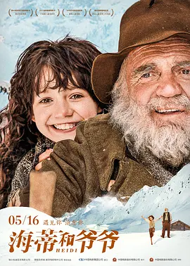

**评分**: ⭐ 9.3 (N/A)

**信息**: 导演: 阿兰·葛斯彭纳 Alain Gsponer   主演: 阿努克·斯特芬 Anuk Steffen /...2015 / 德国 瑞士 / 剧情 冒险 家庭

**剧情简介**:

孤儿海蒂（阿努克·斯特芬 饰）被姨母迪蒂（安娜·希恩斯 饰）送上了阿尔卑斯山，与远离小镇独居于高山的祖父（布鲁诺·甘茨 饰）一同生活。活泼的海蒂在这里如鱼得水，不仅收获了羊倌彼得（奎林·阿格里皮 饰）的友情和孤僻祖父的亲情，还与山下彼得的家人打成一片。一天，海蒂同彼得在山上放羊，姨母突然出现，连哄带骗将海蒂卖到法兰克福的泽塞曼家。从此，目不识丁的海蒂成为了小姐克拉拉（伊莎贝尔·奥特曼 饰）的伴读。克拉拉幼年丧母，大病一场再不能站立，只能被困在豪宅中与轮椅相伴。父亲（马克西姆·梅米特 饰）常年在外很少回家，寂寞的克拉拉把海蒂当成了救命稻草。海蒂能适应泽塞曼家的新生活吗？远在天边的祖父和彼得还能再见吗？克拉拉的腿还有好起来的希望吗？

**详情**: https://movie.douban.com/subject/25958717/

---

## 41. 猫鼠游戏 / 逍遥法外  /  捉智双雄(港)

**评分**: ⭐ 9.1 (N/A)

**信息**: 导演: 史蒂文·斯皮尔伯格 Steven Spielberg   主演: 莱昂纳多·迪卡普里奥 L...2002 / 美国 加拿大 / 传记 犯罪 剧情

**剧情简介**:

弗兰克（莱昂纳多·迪卡普里奥 Leonardo DiCaprio饰）是FBI有史以来年龄最小的通缉犯。他的犯罪手段神通广大，伪装身份的能力超乎常人，全美各地几乎都留下他的犯罪足迹。乔装医生、律师、飞行员，统统都是他曾经的身份。当然，弗兰克凭着这个“本领”，骗取了高达几百万的金额。
                                        
                                    　　活得逍遥快乐的弗兰克这次又成功伪造了一份学历证明，去医院做起了大夫。弗兰克不但在这里认识了护士布雷达（艾米·亚当斯 Amy Adams饰），二人擦出爱火花，还通过布雷达的父亲得到了一份检察官助理的优差。然而，这只是暴风雨前夕——一双眼睛已经盯住了弗兰克，誓要把他绳之于法不可。这就是FBI探员卡尔（汤姆·汉克斯 Tom Hanks饰）。
                                        
                                    　　在研究追捕弗兰克的过程中，卡尔领教到这个犯罪天才的过人智商。他屡次被弗兰克这个黄毛小子捉弄，心里又恨又不得不佩服。每当弗兰克有惊无险地从他的...

**详情**: https://movie.douban.com/subject/1305487/

---

## 42. 天空之城 / 天空之城拉普他  /  空中城堡拉普他

**评分**: ⭐ 9.2 (N/A)

**信息**: 导演: 宫崎骏 Hayao Miyazaki   主演: 田中真弓 Mayumi Tanaka / 横泽启子 Ke...1986 / 日本 / 动画 奇幻 冒险

**剧情简介**:

古老帝国拉普达是一座漂浮在空中的巨大的机器岛，传说那里已经无人居住，蕴藏着巨大的财富。因此，无论军方还是海盗，都在找寻着这座传说中的飞行岛。
                                    
                                　　矿工巴鲁这天偶遇拉普达继承人希达，两人一见如故。因为希达身上有找寻拉普达帝国的重要物件飞行石，军方和海盗两帮人马都在追杀希达。巴鲁带着希达一起逃亡，最终都没有逃出军方的手中，希达被军队掳走了。
                                    
                                　　为救朋友，只能选择与海盗合作。巴鲁与海盗成功救出了希达，同时，他们也发现了军方的邪恶计划。为了阻止军方邪恶计划的实施，他们和海盗一起踏上了寻找拉普达之旅。

**详情**: https://movie.douban.com/subject/1291583/

---

## 43. 鬼子来了 / Devils on the Doorstep

**评分**: ⭐ 9.3 (N/A)

**信息**: 导演: 姜文 Wen Jiang   主演: 姜文 Wen Jiang / 香川照之 Teruyuki Kagawa /...2000 / 中国大陆 / 剧情 喜剧

**剧情简介**:

第二次世界大战期间，中国河北挂甲台村的农民马大三（姜文饰）在日本人的统治下过着平静的生活。一个晚上，游击队绑架了日军陆军士兵花屋小三郎（香川照之饰）和翻译董汉臣，把他们捆绑塞入麻袋放在马大三家里，并吩咐马好好看管，几天后的大年三十来带人。马大三和村民战战兢兢地看守两人，花屋小三郎和董汉臣数次发出求救信号，皆被村民化解。半年过去了，村民们担心事情暴露，却又不敢把花屋等放了。
                                    
                                　　马大三最终被董汉臣说动，把花屋和董送到了日军宪兵队驻地，以换取粮食。日军宪兵军官酒冢猪吉是花屋的同乡。他表面上对马等人客气，但背后指责花屋让皇军蒙耻并殴打了他。宪兵队整队去马的村子里和村民联欢送粮，酒到酣时却乍露杀机。

**详情**: https://movie.douban.com/subject/1291858/

---

## 44. 摔跤吧！爸爸 / 我和我的冠军女儿(台)  /  打死不离3父女(港)

**评分**: ⭐ 9.0 (N/A)

**信息**: 导演: 涅提·蒂瓦里 Nitesh Tiwari   主演: 阿米尔·汗 Aamir Khan / 法缇玛...2016 / 印度 / 剧情 传记 运动 家庭

**剧情简介**:

马哈维亚（阿米尔·汗 Aamir Khan 饰）曾经是一名前途无量的摔跤运动员，在放弃了职业生涯后，他最大的遗憾就是没有能够替国家赢得金牌。马哈维亚将这份希望寄托在了尚未出生的儿子身上，哪知道妻子接连给他生了两个女儿，取名吉塔（法缇玛·萨那·纱卡 Fatima Sana Shaikh 饰）和巴比塔（桑亚·玛荷塔 Sanya Malhotra 饰）。让马哈维亚没有想到的是，两个姑娘展现出了杰出的摔跤天赋，让他幡然醒悟，就算是女孩，也能够昂首挺胸的站在比赛场上，为了国家和她们自己赢得荣誉。
                                    
                                　　就这样，在马哈维亚的指导下，吉塔和巴比塔开始了艰苦的训练，两人进步神速，很快就因为在比赛中连连获胜而成为了当地的名人。为了获得更多的机会，吉塔进入了国家体育学院学习，在那里，她将面对更大的诱惑和更多的选择。

**详情**: https://movie.douban.com/subject/26387939/

---

## 45. 少年派的奇幻漂流 / 少年Pi的奇幻漂流  /  漂流少年Pi

**评分**: ⭐ 9.1 (N/A)

**信息**: 导演: 李安 Ang Lee   主演: 苏拉·沙玛 Suraj Sharma / 伊尔凡·可汗 Irrfan...2012 / 美国 中国台湾 英国 加拿大 / 剧情 奇幻 冒险

**剧情简介**:

故事开始于蒙特娄，也结束于蒙特娄。一名在找寻灵感的作家（拉菲·斯波 Rafe Spall 饰）无意间得知派·帕帖尔（伊尔凡·可汗 Irrfan Khan 饰）的传奇故事。派的父亲（阿迪勒·侯赛因 Adil Hussain 饰）开了一家动物园。因这样特殊的生活环境，少年派（苏拉·沙玛 Suraj Sharma 饰 ）对信仰与人的本性自有一套看法。在派17岁那一年，他的父母决定举家移民加拿大以追求更好的生活，而他也必须离开他的初恋情人。在前往加拿大的船上，他们遇见一位残忍成性的法国厨师（杰拉尔·德帕迪约 Gérard Depardieu 饰）。当天深夜在茫茫大海中，原本令派感到刺激无比的暴风雨一瞬间就成了吞噬货船的大灾难。派却奇迹般地活了下来，搭着救生船在太平洋上漂流，而且有一名最令人意想不到的同伴——理查德·帕克，一只孟加拉老虎。神奇的冒险旅程就这样意...

**详情**: https://movie.douban.com/subject/1929463/

---

## 46. 钢琴家 / 钢琴战曲(港)  /  战地琴人(台)

**评分**: ⭐ 9.3 (N/A)

**信息**: 导演: 罗曼·波兰斯基 Roman Polanski   主演: 艾德里安·布洛迪 Adrien Brod...2002 / 英国 法国 波兰 德国 美国 / 剧情 传记 战争 音乐

**剧情简介**:

史标曼（艾德里安•布洛迪 Adrien Brody 饰）是波兰一家电台的钢琴师。二战即将爆发之时，他们全家被迫被赶进华沙的犹太区。在战争的颠沛流离中，家人和亲戚最终被纳粹杀害，而史标曼本人也受尽种种羞辱和折磨，他侥幸得到一位朋友的帮助，暂时有了藏身之处。战争愈加猛烈，朋友不得不抛下他回老家寻得安全的住所养育儿女。此时史标曼恶病缠身，却还要在搜捕中逃亡。在废墟的阁楼上他遇见了一名德国军官，在军官的要求下他弹奏了钢琴曲。美妙的琴声令德国军官萌发了恻隐之心，他暗暗帮助史标曼直到苏军对波兰的解放到来…… 影片根据波兰钢琴家瓦拉迪斯罗•斯皮曼(Wladyslaw Szpilman)的自传体小说《死亡城市》改编。

**详情**: https://movie.douban.com/subject/1296736/

---

## 47. 指环王2：双塔奇兵 / 魔戒二部曲：双城奇谋  /  指环王II：双塔

**评分**: ⭐ 9.2 (N/A)

**信息**: 导演: 彼得·杰克逊 Peter Jackson   主演: 伊利亚·伍德 Elijah Wood / 西恩...2002 / 美国 新西兰 / 剧情 动作 奇幻 冒险

**剧情简介**:

第二部在延续第一部风格的同时，故事呈现出多线发展的格局，情节有了更高的观赏性。
                                        
                                    　　第一部结尾，博罗米尔被强兽人杀死之后，两个霍比特人皮平和梅利也被强兽人绑架，阿拉贡、精灵莱戈拉斯（奥兰多·布鲁姆 饰）、侏儒金利一路追踪强兽人，营救皮平和梅利，遇到了“复活”的白袍巫师甘道夫 （伊恩·麦克莱恩 饰）。此时，投降索伦的白袍巫师萨鲁曼控制了人类洛汉王国的国王，并派出大量的强兽人军队，准备消灭人类。阿拉贡、莱戈拉斯和金利在甘道夫的带领下，帮助洛汉王国对抗邪恶力量的入侵。
                                        
                                    　　幸运的皮平和梅利被会说话的树精救了出来，并且遇到“复活”的甘道夫，在甘道夫的授意下，树精保护了两人的安全，并且带他们参加树精大会，大会上，树精们讨论对待中土大战的态度：是继续当中立者，逆来顺受，还是奋起反抗？
                                        
                                    　　身负重任的佛罗多（伊利亚·伍德 饰）和山姆继续向末日山脉前进，一路上被咕噜跟踪，弗罗多...

**详情**: https://movie.douban.com/subject/1291572/

---

## 48. 死亡诗社 / 暴雨骄阳(港)  /  春风化雨(台)

**评分**: ⭐ 9.2 (N/A)

**信息**: 导演: 彼得·威尔 Peter Weir   主演: 罗宾·威廉姆斯 Robin Williams / 罗伯...1989 / 美国 / 剧情

**剧情简介**:

威尔顿预备学院以其沉稳凝重的教学风格和较高的升学率闻名，作为其毕业班的学生，理想就是升入名校。新学期文学老师约翰·基汀（罗宾·威廉姆斯 饰）的到来如同一阵春风，一反传统名校的严肃刻板。
                                    
                                　　基汀带学生们在校史楼内聆听死亡的声音，反思生的意义 ；让男生们在绿茵场上宣读自己的理想；鼓励学生站在课桌上，用新的视角俯瞰世界。老师自由发散式的哲学思维让学生内心产生强烈的共鸣，他们渐渐学会自己思考与求索，勇敢的追问人生的路途，甚至违反门禁，成立死亡诗社，在山洞里击节而歌！
                                    
                                　　基汀教授、基汀老师、基汀队长，他的教育宛若春风化雨，润物无声的留在每个人心里…

**详情**: https://movie.douban.com/subject/1291548/

---

## 49. 大话西游之月光宝盒 / 西游记101回月光宝盒  /  齐天大圣东游记

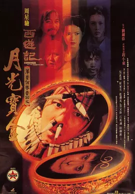

**评分**: ⭐ 9.0 (N/A)

**信息**: 导演: 刘镇伟 Jeffrey Lau   主演: 周星驰 Stephen Chow / 吴孟达 Man Tat Ng...1995 / 中国香港 中国大陆 / 喜剧 爱情 奇幻 古装

**剧情简介**:

孙悟空（周星驰）护送唐三藏（罗家英）去西天取经路上，与牛魔王合谋欲杀害唐三藏，并偷走了月光宝盒，此举使观音萌生将其铲除心思，经唐三藏请求，孙悟空被判五百年后重新投胎做人赎其罪孽。
                                    
                                　　五百年后孙悟空化身强盗头头至尊宝。当遇见预谋吃唐僧肉的妖怪姐妹蜘蛛精春三十娘（蓝洁瑛）和白骨精白晶晶（莫文蔚）时，因为五百年前孙悟空曾与白晶晶有过一段恋情，至尊宝与她一见钟情，但因菩提老祖将二人妖怪身份相告，至尊宝仍带领众强盗开始与二妖展开周旋，过程中，白晶晶为救至尊宝打伤春三十娘，自己也中毒受伤，为了救白晶晶，至尊宝去找春三十娘，遭白晶晶误会，绝望自杀，至尊宝开始用月光宝盒以期使时光倒流。

**详情**: https://movie.douban.com/subject/1299398/

---

## 50. 何以为家 / 迦百农  /  星仔打官司(港)

**评分**: ⭐ 9.1 (N/A)

**信息**: 导演: 娜丁·拉巴基 Nadine Labaki   主演: 扎因·拉费阿 Zain al-Rafeea / ...2018 / 黎巴嫩 美国 法国 塞浦路斯 卡塔尔 英国 / 剧情

**剧情简介**:

法庭上，十二岁的男孩赞恩向法官状告他的亲生父母，原因是，他们给了他生命。是什么样的经历让一个孩子做出如此不可思议的举动？故事中，赞恩的父母在无力抚养和教育的状况下依然不停生育，作为家中的长子赞恩，弱小的肩膀承担了无数生活的重压。当妹妹被强行卖给商贩为妻时，赞恩愤怒离家，之后遇到一对没有合法身份的母子，相互扶持勉强生活。然而生活并没有眷顾赞恩，重重磨难迫使他做出了令人震惊的举动……

**详情**: https://movie.douban.com/subject/30170448/

---

## 51. 闻香识女人 / 女人香  /  女人的芳香

**评分**: ⭐ 9.1 (N/A)

**信息**: 导演: 马丁·布莱斯 Martin Brest   主演: 阿尔·帕西诺 Al Pacino / 克里斯...1992 / 美国 / 剧情

**剧情简介**:

查理（克里斯•奥唐纳 Chris O'Donnell  饰）是一个普通的中学生，他因为见证着一件恶作剧但又不想出卖朋友，于是面临着一道艰难的选择题——要么坦白，要么被学校勒退。而史法兰（阿尔•帕西诺 Al Pacino  饰）是一个退伍军官，因为意外失明，人生从顶点的辉煌滑落谷底。
                                    
                                　　自从两人的人生有了交集，命运的转折慢慢清晰。史法兰打算结束失去了意义的生活，于是在查理的陪伴下，尽情享受着人生最后一趟出行。他吃最美味的佳肴，买光鲜的汽车，在狭窄的街道上飚车，住在豪华的套房里，跟随陌生女子的袅袅香水味，跳一段优雅性感的探戈……极乐的疯狂后，他拿枪对准了自己的头颅。然而，查理声嘶力竭的劝阻改变了一切，曙光亦渐渐在这个老人心中重新升起，二人情深如父子。
                                    
                                　　史法兰在学校礼堂激昂演说，挽救了查理的前途，讽刺了学校的伪善。二人在互相鼓舞中得到重生。

**详情**: https://movie.douban.com/subject/1298624/

---

## 52. 绿皮书 / 绿簿旅友(港)  /  幸福绿皮书(台)

**评分**: ⭐ 8.9 (N/A)

**信息**: 导演: 彼得·法雷里 Peter Farrelly   主演: 维果·莫腾森 Viggo Mortensen /...2018 / 美国 中国大陆 / 剧情 喜剧 传记 音乐

**剧情简介**:

托尼（维果·莫腾森 Viggo Mortensen 饰）是一个吊儿郎当游手好闲的混混，在一家夜总会做侍者。这间夜总会因故要停业几个月，可托尼所要支付的房租和生活费不会因此取消，所以他的当务之急是去寻找另一份工作来填补这几个月的空缺。在这个节骨眼上，一位名叫唐雪莉（马赫沙拉·阿里 Mahershala Ali 饰）的黑人钢琴家提出雇佣托尼。
                                    
                                　　唐雪莉即将开始为期八个星期的南下巡回演出，可是，那个时候南方对黑人的歧视非常的严重，于是托尼便成为了唐雪莉的司机兼保镖。一路上，两人迥异的性格使得他们之间产生了很多的矛盾，与此同时，唐雪莉在南方所遭受的种种不公平的对待也让托尼对种族歧视感到深恶痛绝。

**详情**: https://movie.douban.com/subject/27060077/

---

## 53. 大闹天宫 / 大闹天宫 上下集  /  The Monkey King

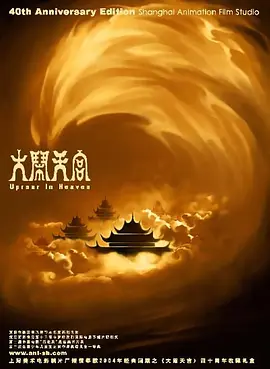

**评分**: ⭐ 9.4 (N/A)

**信息**: 导演: 万籁鸣 Laiming Wan   主演: 邱岳峰 Yuefeng Qiu / 富润生 Runsheng Fu...1961(中国大陆) / 1964(中国大陆) / 1978(中国大陆) / 中国大陆 / 剧情 动画 奇幻 古装

**剧情简介**:

话说在东土傲来国有一座花果山，山上有一尊石猴吸收日精月华化身为一只神猴（邱岳峰 音），统领着山中的猴子猴孙。为求得一件称心的宝贝，神猴孙大圣潜入龙宫，强硬求来大禹治水时的定海神针如意金箍棒。东海龙王（毕克 音）心有不甘，于是上天将此事诉诸玉帝（富润生 音）。玉皇大帝命令太白金星（尚华 音）下界招安，许以爵位。不知有诈的孙大圣欣然前往，却发现只是负责养马的弼马温。得知受骗的猴王反下天庭，与天兵天将在花果山展开大战……
                                    
                                　　本片根据古典名著《西游记》中的故事改编，前后历时4年创作，并荣获1962年捷克斯洛伐克卡罗维发利国际电影节短片特别奖、1978年英国伦敦国际电影节年度杰出电影奖、1982年厄瓜多尔第四届国际儿童电影节三等奖、第二届中国电影“百花奖”最佳美术片奖。

**详情**: https://movie.douban.com/subject/1418019/

---

## 54. 黑客帝国 / 22世纪杀人网络(港)  /  廿二世纪杀人网络(港)

**评分**: ⭐ 9.1 (N/A)

**信息**: 导演: 安迪·沃卓斯基 Andy Wachowski / 拉娜·沃卓斯基 Lana Wachowski   主...1999 / 美国 / 动作 科幻

**剧情简介**:

不久的将来，网络黑客尼奥（基奴李维斯 饰）对这个看似正常的现实世界产生了怀疑。他结识了黑客崔妮蒂（凯莉·安·摩丝 饰），并见到了黑客组织的首领墨菲斯（劳伦斯·菲什伯恩 饰）。墨菲斯告诉他，现实世界其实是由一个名叫“母体”的计算机人工智能系统控制，人们就像他们饲养的动物，没有自由和思想，而尼奥就是能够拯救人类的救世主。
                                    
                                　　可是，救赎之路从来都不会一帆风顺，到底哪里才是真实的世界？如何才能打败那些超人一样的特勤？尼奥是不是人类的希望？这是黑客的帝国，程序和代码欢迎大家的到来。.

**详情**: https://movie.douban.com/subject/1291843/

---

## 55. 指环王1：护戒使者 / 指环王1：魔戒再现  /  指环王I：护戒使者

**评分**: ⭐ 9.1 (N/A)

**信息**: 导演: 彼得·杰克逊 Peter Jackson   主演: 伊利亚·伍德 Elijah Wood / 西恩...2001 / 新西兰 美国 / 剧情 动作 奇幻 冒险

**剧情简介**:

比尔博·巴金斯是100多岁的霍比特人，住在故乡夏尔，生性喜欢冒险，在年轻时的一次探险经历中，他从怪物咕噜手中得到了至尊魔戒，这枚戒指是黑暗魔君索伦打造的至尊魔戒，拥有奴役世界的邪恶力量，能够统领其他几枚力量之戒，在3000年前的人类联盟和半兽人大军的战役中，联盟取得了胜利 ，并得到了至尊魔戒，数千年的辗转后，魔戒落到咕噜手中，被比尔博碰巧得到。
                                        
                                    　　因为和魔戒的朝夕相处，比尔博的心性也受到了影响，在他111岁的生日宴会上，他决定把一切都留给侄子佛罗多（伊利亚‧伍德 饰)，继续冒险。
                                        
                                    　　比尔博的好朋友灰袍巫师甘道夫（伊恩·麦克莱恩 饰）知道至尊魔戒的秘密，同时，黑暗魔君索伦已经知道他的魔戒落在哈比族的手中。索伦正在重新建造要塞巴拉多，集结无数的半兽人，准备以大军 夺取魔戒，并且征服全世界。
                                        
                                    　　甘道夫说服佛罗多将魔戒护送到精灵王国瑞文希尔，佛罗多在好朋友山姆、皮...

**详情**: https://movie.douban.com/subject/1291571/

---

## 56. 罗马假日 / 金枝玉叶(港)  /  罗马假期(台)

**评分**: ⭐ 9.1 (N/A)

**信息**: 导演: 威廉·惠勒 William Wyler   主演: 奥黛丽·赫本 Audrey Hepburn / 格...1953 / 美国 / 喜剧 剧情 爱情

**剧情简介**:

欧洲某国的安妮公主（奥黛丽·赫本 Audrey Hepburn 饰）到访罗马，国务烦身，但她又厌倦繁文缛节。一天晚上，身心俱疲的她偷偷来到民间欣赏夜景，巧遇报社记者乔（格里高利·派克 Gregory Peck 饰）。二人把手同游，相当快乐。公主更是到乔的家中作客并在那过夜。
                                    
                                　　不料乔无意中发现了公主的真实身份，他决定炮制一个独家新闻，于是乔和朋友、摄影师欧文（埃迪·艾伯特 Eddie Albert 饰）一起带公主同游罗马，并且偷拍了公主的很多生活照。然而，在接下来与公主的相处中，乔不知不觉恋上了公主。为了保护公主的形象，乔只能忍痛抛弃功成名就的良机，将照片送予了公主。
                                    
                                　　安妮公主在经历了罗马一日假期后，反而体验了自己对国家的责任，毅然返回了大使馆，为了本身的责任而果断抛弃了爱情。

**详情**: https://movie.douban.com/subject/1293839/

---

## 57. 教父2 / 教父续集(港)  /  教父II

**评分**: ⭐ 9.3 (N/A)

**信息**: 导演: 弗朗西斯·福特·科波拉 Francis Ford Coppola   主演: 阿尔·帕西诺 A...1974 / 美国 / 剧情 犯罪

**剧情简介**:

迈克尔（阿尔·帕西诺 饰）是美利坚黑手党科利昂家族的头目。 迈克尔的父亲维托·安多里尼（罗伯特·德尼罗 饰）出生于意大利科利昂镇。1901年，维托的父亲安东尼奥、兄长保罗、母亲（玛丽亚·卡塔 饰）都死于黑手党西乔家族之手。9岁的维托只得漂洋过海逃亡美利坚谋生。入境时，海关官员（理查德·沃森 饰）将其名姓登记为维托·科利昂。 1958年，迈克尔为儿子安东尼（詹姆斯·古纳瑞斯 饰）举办了初领圣体的聚会，不想当晚便遭遇暗杀。迈克尔侥幸躲过一劫，两名杀手却被人灭口。 维托在异国他乡如何生存？他身负的血海深仇能否得报？想要迈克尔性命的是谁？将杀手灭口的又是谁？

**详情**: https://movie.douban.com/subject/1299131/

---

## 58. 狮子王 / 狮子王3D

**评分**: ⭐ 9.1 (N/A)

**信息**: 导演: Roger Allers / 罗伯·明可夫 Rob Minkoff   主演: 乔纳森·泰勒·托马...1994 / 美国 / 动画 冒险 歌舞

**剧情简介**:

辛巴是狮子王国的小王子，他的父亲穆法沙是一个威严的国王。然而叔叔刀疤却对穆法沙的王位觊觎已久。
                                    
                                　　要想坐上王位宝座，刀疤必须除去小王子。于是，刀疤利用种种借口让辛巴外出，然后伺机大开杀戒，无奈被穆法沙即时来救。在反复的算计下，穆法沙惨死在刀疤手下，刀疤别有用心的劝辛巴离开，一方面派人将他赶尽杀绝。
                                    
                                　　辛巴逃亡中遇到了机智的丁满和善良的彭彭，他们抚养辛巴长成雄壮的大狮子，鼓励他回去森林复国。在接下来一场复国救民的斗争中，辛巴真正长成一个坚强的男子汉，领会了责任的真谛。

**详情**: https://movie.douban.com/subject/1301753/

---

## 59. 天堂电影院 / 星光伴我心(港)  /  新天堂乐园(台)

**评分**: ⭐ 9.2 (N/A)

**信息**: 导演: 朱塞佩·托纳多雷 Giuseppe Tornatore   主演: 菲利普·努瓦雷 Philipp...1988 / 意大利 法国 / 剧情 爱情

**剧情简介**:

意大利南部小镇，古灵精怪的小男孩托托（萨瓦特利·卡西欧 饰）喜欢看电影，更喜欢看放映师阿尔弗雷多（菲利浦·诺瓦雷 饰）放电影，他和阿尔弗雷多成为了忘年之交，在胶片中找到了童年生活的乐趣。
                                        
                                    　　好心的阿尔弗雷多为了让更多的观众看到电影，搞了一次露天电影，结果胶片着火了，托托把阿尔弗雷多从火海中救了出来，但阿尔弗雷多双目失明。托托成了小镇唯一会放电影的人，他接替阿尔弗雷多成了小镇的电影放映师。
                                        
                                    　　托托（马克·莱昂纳蒂 饰）渐渐长大，他爱上了银行家的女儿艾莲娜（阿格妮丝·那诺  饰）。初恋的纯洁情愫美如天堂，但是一对小情侣的海誓山盟被艾莲娜父亲的阻挠给隔断了，托托去服兵役，而艾莲娜去念大学。伤心的托托在阿尔弗雷多的鼓励下，离开小镇，追寻自己生命中的梦想……
                                        
                                    　　30年后，阿尔弗雷多去世，此时的托托已经是功成名就的导演，他回到了家乡，看到残破的天堂电影院，追忆往昔，唏...

**详情**: https://movie.douban.com/subject/1291828/

---

## 60. 饮食男女 / Eat Drink Man Woman

**评分**: ⭐ 9.2 (N/A)

**信息**: 导演: 李安 Ang Lee   主演: 郎雄 Sihung Lung / 杨贵媚 Kuei-Mei Yang / 吴...1994 / 中国台湾 美国 / 剧情 家庭

**剧情简介**:

台湾中国菜硕果仅存的大师老朱（郎雄）退休后，渐尝老年生活的诸多尴尬：每周日费心做出的一桌丰盛菜肴，并无将三个女儿（杨贵媚、吴倩莲、王渝文）齐齐拉到饭桌的吸引力，已经长大成人的她们，心里藏了许多比陪父亲吃饭更重要的事；多年老友的突然离世，令他在友情这块也有了缺口；而对厨师来讲最重要的味觉的丧失，则将其彻底推到人生的低谷。
                                    
                                　　三个女儿虽各忙各事，却也操心着老朱的晚年生活，计划着为其找个老伴，但她们没料到老朱早已悄无声息地谈起了“黄昏恋”。吃惊过后，老朱最看重的继承了他做菜天赋的二女儿家倩因为自身的生活经历，对父亲、她与父亲的关系有了新的认识，而对老朱来讲更大的惊喜，还在后面。

**详情**: https://movie.douban.com/subject/1291818/

---

## 61. 辩护人 / 逆权大状(港)  /  正义辩护人(台)

**评分**: ⭐ 9.2 (N/A)

**信息**: 导演: 杨宇硕 Woo-seok Yang   主演: 宋康昊 Kang-ho Song / 金英爱 Yeong-ae...2013 / 韩国 / 剧情

**剧情简介**:

1978年，只有高中学历的宋佑硕（宋康昊 饰）通过多年的艰苦努力，终于通过司法考试，并在成为法官后很快转行成为一名律师。他敏锐地从最新政策中嗅到商机，以不动产代书业务起家。虽然被同行讥讽为随时随地派发名片的夜店小弟，但佑硕不以为忤，一步一步朝着心中的目标迈进。他依靠赚来的钱让妻儿过上富足的生活，也还了七年前在饭店大婶那里欠下的良心债。进入20世纪80年代，韩国民主化斗争愈演愈烈。佑硕全然不管窗外事，关起门来继续赚钱。然而社会的巨变已经不容他置身事外，饭店大婶的儿子朴镇宇因从属的釜山读书联合会被控为左翼社团而遭到逮捕，更受到残酷的虐待和不公的指控。
                                    
                                　　虽然爱钱却更重感情的佑硕，就这样走上了为民主辩护的道路……

**详情**: https://movie.douban.com/subject/21937445/

---

## 62. 本杰明·巴顿奇事 / 奇幻逆缘(港)  /  班杰明的奇幻旅程(台)

**评分**: ⭐ 9.0 (N/A)

**信息**: 导演: 大卫·芬奇 David Fincher   主演: 凯特·布兰切特 Cate Blanchett / ...2008 / 美国 / 剧情 爱情 奇幻

**剧情简介**:

飓风正在侵袭美国新奥尔良，一位病危的老妇睁开了她的睡眼。老妇名叫戴茜（凯特·布兰切特饰），她叫女儿凯若琳（朱莉娅•奥蒙德饰）为她阅读一本日记。这本日记的作者叫本杰明•巴顿（布拉德•皮特饰）。本杰明出生在第一次世界大战停战之时，但生来便像个老人的他被父亲当作怪物，被遗弃在了养老院。本杰明在养老院与老人们一起生活。但谁都没有想到，本杰明逆向发育——越活越年轻！也许“越活越年轻”是某些人的梦想，但真正这样成长的本杰明却有了别人无法理解的烦恼与快乐。穿越半世纪的世界变革，本杰明身处其中，感受别人感受不到的感受。
                                    
                                　　为何母亲会让自己念这本日记？本杰明•巴顿此人与母亲有什么关系？凯若琳陷入了深深的疑惑与好奇之中。

**详情**: https://movie.douban.com/subject/1485260/

---

## 63. 搏击俱乐部 / 搏击会(港)  /  斗阵俱乐部(台)

**评分**: ⭐ 9.0 (N/A)

**信息**: 导演: 大卫·芬奇 David Fincher   主演: 爱德华·诺顿 Edward Norton / 布拉...1999 / 美国 / 剧情 动作 悬疑 惊悚

**剧情简介**:

杰克（爱德华•诺顿 饰）是一个大汽车公司的职员，患有严重的失眠症，对周围的一切充满危机和憎恨。
                                    
                                　　一个偶然的机会，杰克遇上了卖肥皂的商人泰勒（布拉德•皮特），一个浑身充满叛逆、残酷和暴烈的痞子英雄，并因为自己公寓失火而住进了泰勒破旧不堪的家中。两人因缘际会地成为了好朋友，并创立了“搏击俱乐部”：一个让人们不戴护具而徒手搏击，宗旨在于发泄情绪的地下组织。
                                    
                                　　俱乐部吸引了越来越多的人，逐渐发展成为一个全国性的地下组织，而泰勒也以自己个人的魅力，吸引着那些盲目的信徒。俱乐部的成员们到处滋事打架、大肆破坏，泰勒本人的行为也越来越疯狂。
                                    
                                　　杰克对于“搏击俱乐部”的现况及泰勒的行为越来越无法忍受，和泰勒发生争执，泰勒离开了他。然而，杰克发现，他走到何处都无法摆脱泰勒的影子，他开始思考：我到底是谁？

**详情**: https://movie.douban.com/subject/1292000/

---

## 64. 美丽心灵 / 有你终生美丽(港)  /  美丽境界(台)

**评分**: ⭐ 9.1 (N/A)

**信息**: 导演: 朗·霍华德 Ron Howard   主演: 罗素·克劳 Russell Crowe / 艾德·哈...2001 / 美国 / 传记 剧情

**剧情简介**:

本片是关于20世纪伟大数学家小约翰•福布斯-纳什的人物传记片。
                                    
                                　　小约翰•福布斯-纳什（拉塞尔•克劳）在念研究生时，便发表了著名的博弈理论，该理论虽只有短短26页，却在经济、军事等领域产生了深远的影响。但就在小约翰•福布斯-纳什蜚声国际时，他的出众直觉因为精神分裂症受到困扰，然而这并没阻止他向学术上的最高层进军的步伐，在深爱他的妻子艾丽西亚（珍妮弗•康纳利）的鼓励和帮助下，他走得虽然艰缓，却始终没有停步，而最终，凭借十几年的不懈努力和顽强意志，他如愿以偿。

**详情**: https://movie.douban.com/subject/1306029/

---

## 65. 穿条纹睡衣的男孩 / 穿条纹衣服的男孩  /  穿条纹衣的男孩

**评分**: ⭐ 9.2 (N/A)

**信息**: 导演: 马克·赫尔曼 Mark Herman   主演: 阿萨·巴特菲尔德 Asa Butterfield ...2008 / 英国 美国 / 剧情 战争

**剧情简介**:

八岁男孩布鲁诺（Asa Butterfield 饰）一家随着纳粹军官父亲的一纸调令，由柏林搬迁到了乡下。失去了朋友们的布鲁诺很快对新家附近的“农庄”产生了兴趣，那里有一群身穿“条纹睡衣”的人终日忙碌，并且其中一个为布鲁诺一家服务，他形容肮脏，态度慎微。周遭环境和布鲁诺的举止让母亲暗暗担忧，但纳粹父亲制止家中任何怀疑既定政策的行为。
                                    
                                　　布鲁诺偷偷结识了铁丝网另一边的同龄男孩施穆尔，并时常带给他食物吃。在紧张的家庭氛围和姐姐向成人世界的变化中，施穆尔是布鲁诺惟一的朋友。某日布鲁诺决定，去铁丝网的另一边，以便见到施穆尔的父亲……
                                    
                                　　本片根据约翰·伯恩的同名小说改编，获2008年芝加哥国际电影节观众票选奖。

**详情**: https://movie.douban.com/subject/3008247/

---

## 66. 情书 / When I Close My Eyes  /  Letters of Love

**评分**: ⭐ 8.9 (N/A)

**信息**: 导演: 岩井俊二 Shunji Iwai   主演: 中山美穗 Miho Nakayama / 丰川悦司 Ets...1995 / 日本 / 剧情 爱情

**剧情简介**:

日本神户某个飘雪的冬日，渡边博子（中山美穗）在前未婚夫藤井树的两周年祭日上又一次悲痛到不能自已。正因为无法抑制住对已逝恋人的思念，渡边博子在其中学同学录里发现“藤井树” 在小樽市读书时的地址时，依循着寄发了一封本以为是发往天国的情书。
                                    
                                　　不想不久渡边博子竟然收到署名为“藤井树（酒井美纪）”的回信，经过进一步了解，她知晓此藤井树是一个同她年纪相仿的女孩，且还是男友藤井树（柏原崇）少年时代的同班同学。为了多了解一些昔日恋人在中学时代的情况，渡边博子开始与女性藤井树书信往来。而藤井树在不断的回忆中，渐渐发现少年时代与她同名同姓的那个藤井树曾对自己藏了一腔柔情。

**详情**: https://movie.douban.com/subject/1292220/

---

## 67. 哈利·波特与死亡圣器(下) / 哈利波特7：死神的圣物2(港 / 台)

.jpg)

**评分**: ⭐ 9.0 (N/A)

**信息**: 导演: 大卫·叶茨 David Yates   主演: 丹尼尔·雷德克里夫 Daniel Radcliffe...2011 / 美国 英国 / 奇幻 冒险

**剧情简介**:

当又一次和伏地魔（拉尔夫·费因斯 Ralph Fiennes 饰）的意识连通，哈利·波特（丹尼尔·雷德克里夫 Daniel Radcliffe 饰）断定最后一件魂器藏在霍格沃茨，于是和罗恩（鲁伯特·格林特 Rupert Grint 饰）、赫敏（艾玛·沃森 Emma Watson 饰）一同返回阴云密布的学校。在好友们的帮助下，他们成功驱逐了斯内普（艾伦·瑞克曼 Alan Rickman 饰），然而觉察到哈利目的的伏地魔则率领徒众向霍格沃茨逼近。食死徒、摄魂怪、巨人疯狂涌入这所有着悠久历史的魔法学校，正邪决战旋即爆发，一时间血雨腥风，死伤无数。从斯内普的眼泪中，哈利不仅了解到父辈的故事，也证实了藏缅于他体内最后的秘密。在此之后，他也和伏地魔迎来了最后的对决……
                                    
                                　　本片根据英国作家J.K.罗琳的同名原著改编，也是“哈利·波特”系列影片的完结篇。

**详情**: https://movie.douban.com/subject/3011235/

---

## 68. 两杆大烟枪 / 够姜四小强(港)  /  两根枪管(台)

**评分**: ⭐ 9.1 (N/A)

**信息**: 导演: 盖·里奇 Guy Ritchie   主演: 杰森·弗莱明 Jason Flemyng / 德克斯特...1998 / 英国 / 剧情 喜剧 犯罪

**剧情简介**:

艾迪（尼克·莫伦）思维敏捷，是个玩牌高手。在三个好友的支持下，艾迪携巨资参加了黑社会的高额赌局，不想落入圈套，欠下50万的赌债。为了还清赌债，艾迪和朋友们绞尽脑汁，最终算计到一群毒贩身上，并为打劫购买了两杆老式烟枪。
                                    
                                　　不想这群不安分的毒贩，正惦念着他们毒品供应商的钱，并在同一天实施了打劫。在毒贩们费尽周折，把毒品供应商熨的整整齐齐的钱款拿到手后，艾迪他们幸运的坐享其成。可是他们不知道，这看似简单的抢劫案背后，更有厉害的角色参与其中。他们手里的两杆破烟枪也隐藏着不少故事。
                                    
                                　　在无知与莽撞中置身漩涡的他们能侥幸脱身么？笑料迭出的偶发事件里，穿插着小人物与大人物的辛酸幽默。

**详情**: https://movie.douban.com/subject/1293350/

---

## 69. 窃听风暴 / 窃听者(港)  /  他人的生活

**评分**: ⭐ 9.2 (N/A)

**信息**: 导演: 弗洛里安·亨克尔·冯·多纳斯马尔克 Florian Henckel von Donnersmarck  &n...2006 / 德国 / 剧情 悬疑

**剧情简介**:

1984年的东德，整个社会笼罩在国家安全局的高压统治之下，特工魏斯曼（乌尔里希·穆埃 Ulrich Mühe 饰）奉命监听剧作家德莱曼（塞巴斯蒂安·科赫 Sebastian Koch 饰）及其女友演员克里斯蒂娜（马蒂娜·格德克 Martina Gedeck 饰）的生活，监听过程中，魏斯曼渐渐对这家人的生活产生了兴趣，开始暗中帮助他们。一篇刊登在西德《明镜》报上的文章引起了特工头目的注意，他们认为这篇文章是德莱曼写的，并逮捕了克里斯蒂娜，希望能够从她口中得出她丈夫的秘密？而审问克里斯蒂娜的正是魏斯曼……

**详情**: https://movie.douban.com/subject/1900841/

---

## 70. 音乐之声 / 仙乐飘飘处处闻(港)  /  真善美(台)

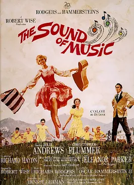

**评分**: ⭐ 9.1 (N/A)

**信息**: 导演: 罗伯特·怀斯 Robert Wise   主演: 朱莉·安德鲁斯 Julie Andrews / 克...1965 / 美国 / 剧情 传记 爱情 歌舞

**剧情简介**:

玛利亚（朱丽·安德鲁斯  饰）是一个年轻活泼的修女，喜欢在大自然下高声歌唱，所以她常常忘记了修道院里的规矩。院长认为玛利亚并不属于规矩严格的修道院。院长与众嬷嬷商量后，决定安排玛利亚到一位名叫特拉普（克里斯托弗·普卢默 饰）上校家当家庭教师。
                                    
                                　　上校的妻子去世多年，留下7个孩子，他要求对孩子严格管教。他告诉玛利亚在他家的家庭教师都做不长久，都是因为孩子的恶作剧。玛利亚果然也遭到了恶作剧，可是这位善良的老师并没有告诉他们的父亲，而是像个母亲一样照顾孩子，很快跟孩子打成一片。上校也渐渐在玛利亚的引导下改变了对孩子们的态度。上校与玛利亚之间发生了感情，他们完婚后回到了已被纳粹占领的奥地利，上校并不想为纳粹办事，一家人准备逃跑……

**详情**: https://movie.douban.com/subject/1294408/

---

## 71. 功夫 / 功夫3D  /  Kung Fu Hustle

**评分**: ⭐ 8.9 (N/A)

**信息**: 导演: 周星驰 Stephen Chow   主演: 周星驰 Stephen Chow / 元秋 Qiu Yuen / ...2004 / 中国大陆 中国香港 / 动作 喜剧 犯罪 奇幻

**剧情简介**:

1940年代的上海，自小受尽欺辱的街头混混阿星（周星驰）为了能出人头地，可谓窥见机会的缝隙就往里钻，今次他盯上行动日益猖獗的黑道势力“斧头帮”，想借之大名成就大业。
                                    
                                　　阿星假冒“斧头帮”成员试图在一个叫“猪笼城寨”的地方对居民敲诈，不想引来真的“斧头帮”与“猪笼城寨”居民的恩怨。“猪笼城寨”原是藏龙卧虎之处，居民中有许多身怀绝技者（元华、梁小龙等），他们隐藏于此本是为远离江湖恩怨，不想麻烦自动上身，躲都躲不及。而在观战正邪两派的斗争中，阿星逐渐领悟功夫的真谛。

**详情**: https://movie.douban.com/subject/1291543/

---

## 72. 西西里的美丽传说 / 真爱伴我行(台)  /  玛莲娜

**评分**: ⭐ 8.9 (N/A)

**信息**: 导演: 朱塞佩·托纳多雷 Giuseppe Tornatore   主演: 莫妮卡·贝鲁奇 Monica ...2000 / 意大利 美国 / 剧情 战争 情色

**剧情简介**:

当我还只是十三岁时，1941年春末的那一天，我初次见到了她那一天，墨索里尼向英法宣战，而我，得到了生命里的第一辆脚踏车。
                                        
                                    　　她，撩著波浪状黑亮的秀发，穿著最时髦的短裙和丝袜，踏著充满情欲诱惑的高跟鞋，来到了西西里岛上宁静的阳光小镇。她的一举一动都引人瞩目、勾人遐想，她的一颦一笑都教男人心醉、女人羡妒。玛莲娜，像个女神一般，征服了这个海滨的天堂乐园。
                                        
                                    　　年仅十三岁的雷纳多也不由自主地掉进了玛莲娜所掀起的漩涡之中，他不仅跟著其他年纪较大的青少年们一起骑著单车，穿梭在小镇的各个角落，搜寻著玛莲娜的诱人丰姿与万种风情，还悄悄地成为她不知情的小跟班，如影随形地跟监、窥视她的生活。她摇曳的倩影、她聆听的音乐、她贴身的衣物都成为这个被荷尔蒙淹没的少年，最真实、最美好的情欲幻想。
                                        
                                    　　然而，透过雷纳多的眼，我们也看到了玛莲娜掉进了越来越黑暗的处境之中，她变成了寡妇，而在镇民...

**详情**: https://movie.douban.com/subject/1292402/

---

## 73. 哈利·波特与阿兹卡班的囚徒 / 哈利波特3：阿兹卡班的逃犯(港 / 台)

**评分**: ⭐ 9.0 (N/A)

**信息**: 导演: 阿方索·卡隆 Alfonso Cuarón   主演: 丹尼尔·雷德克里夫 Daniel Rad...2004 / 英国 美国 / 奇幻 冒险

**剧情简介**:

哈利（丹尼尔·雷德克里夫）即将在霍格沃兹渡过第三个年头，此时在阿兹塔班却传出恶棍小天狼星（加里·奥德曼）越狱的消息。据说小天狼星正是背叛哈利父母的好友，他的教父，而这次小天狼星越狱似乎正是为了找他。哈利的心里悄悄的滋生了为父母报仇的想法，期待着小天狼星的出现。
                                    
                                　　新来的魔法老师卢平（大卫·休里斯）有着桀骜不驯的个性，与哈利关系很好，教了哈利许多实用的黑魔法防御知识。而此时在他的魔法地图上却出现了一个神秘人物，虫尾巴。偶然的机会下，在尖叫棚屋里集齐了哈利父亲当年的所有好友，卢平、虫尾巴、小天狼星，哈利的魔杖直指向小天狼星，但他发现那罪犯看他的眼神里充满了疼爱……

**详情**: https://movie.douban.com/subject/1291544/

---

## 74. 阿凡达 /

**评分**: ⭐ 8.8 (N/A)

**信息**: 导演: 詹姆斯·卡梅隆 James Cameron   主演: 萨姆·沃辛顿 Sam Worthington ...2009 / 美国 / 动作 科幻 冒险

**剧情简介**:

战斗中负伤而下身瘫痪的前海军战士杰克·萨利（萨姆·沃辛顿 Sam Worthington 饰）决定替死去的同胞哥哥来到潘多拉星操纵格蕾丝博士（西格妮·韦弗 Sigourney Weaver 饰）用人类基因与当地纳美部族基因结合创造出的 “阿凡达” 混血生物。杰克的目的是打入纳美部落，外交说服他们自愿离开世代居住的家园，从而SecFor公司可砍伐殆尽该地区的原始森林，开采地下昂贵的“不可得”矿。在探索潘多拉星的过程中，杰克遇到了纳美部落的公主娜蒂瑞（佐伊·索尔达娜 Zoe Saldana 饰），向她学习了纳美人的生存技能与对待自然的态度。与此同时，SecFor公司的经理和军方代表上校迈尔斯（史蒂芬·朗 Stephen Lang 饰）逐渐丧失耐心，决定诉诸武力驱赶纳美人……
                                        
                                    　　本片采用3D技术拍摄，共耗资5亿美元制作发行，是电影史上最为昂贵的作品。本片荣获...

**详情**: https://movie.douban.com/subject/1652587/

---

## 75. 看不见的客人 / 死无对证(港)  /  布局(台)

**评分**: ⭐ 8.8 (N/A)

**信息**: 导演: 奥里奥尔·保罗 Oriol Paulo   主演: 马里奥·卡萨斯 Mario Casas / 阿...2016 / 西班牙 / 剧情 犯罪 悬疑 惊悚

**剧情简介**:

艾德里安（马里奥·卡萨斯 Mario Casas 饰）经营着一间科技公司，事业蒸蒸日上，家中有美丽贤惠的妻子和活泼可爱的女儿，事业家庭双丰收的他是旁人羡慕的对象。然而，野心勃勃的艾德里安并未珍惜眼前来之不易的生活，一直以来，他和一位名叫劳拉（芭芭拉·蓝妮 Bárbara Lennie 饰）的女摄影师保持着肉体关系。
                                    
                                　　某日幽会过后，两人驱车离开别墅，却在路上发生了车祸，为了掩盖事件的真相，两人决定将在车祸中死去的青年丹尼尔联同他的车一起沉入湖底。之后，劳拉遇见了一位善良的老人，老人将劳拉坏掉的车拉回家中修理，然而，令劳拉没有想到的是，这位老人，竟然就是丹尼尔的父亲。

**详情**: https://movie.douban.com/subject/26580232/

---

## 76. 拯救大兵瑞恩 / 雷霆救兵(港)  /  抢救雷恩大兵(台)

**评分**: ⭐ 9.1 (N/A)

**信息**: 导演: 史蒂文·斯皮尔伯格 Steven Spielberg   主演: 汤姆·汉克斯 Tom Hanks...1998 / 美国 / 剧情 战争

**剧情简介**:

瑞恩（马特•达蒙 Matt Damon饰 ）是二战期间的美国伞兵，被困在了敌人后方。更不幸的是，他的三个兄弟全部在战争中死亡，如果他也遇难，家中的老母亲将无依无靠。
                                    
                                　　美国作战总指挥部知道了这个情况，毅然决定组织一个小分队前往救援，其中包括米勒上尉（汤姆•汉克斯 Tom Hanks 饰 ）和翻译厄本（杰里米.戴维斯 Jererry Davies饰）。然而，敌方危险重重，他们一路上随时与死亡打交道。他们非常怀疑，到底值不值得冒着八个人的生命危险，去搭救一个人。
                                    
                                　　大家一路辗转寻找瑞恩，对于这次搭救行动，有人不满，有人热忱，有人好奇。大家一次次闻到死神的气息，瑞恩的获救付出了沉重的代价。

**详情**: https://movie.douban.com/subject/1292849/

---

## 77. 沉默的羔羊 / 沉默的羔羊

**评分**: ⭐ 8.9 (N/A)

**信息**: 导演: 乔纳森·戴米 Jonathan Demme   主演: 朱迪·福斯特 Jodie Foster / 安...1991 / 美国 / 剧情 犯罪 惊悚

**剧情简介**:

联调局学院学员 Clarice M. Starling（朱迪·福斯特 饰）受行为科学组的 Jack Crawford（斯科特·格伦 饰）指派，前往州立巴尔的摩法医院访问被监禁的精神科医生 Hannibal Lecter（安东尼·霍普金斯 饰）。Lecter要求转到条件较好的联邦机构，远离常常折磨他的 Frederick Chilton 医生（安东尼·希尔德 饰），并愿意为此提供持续作案的连环杀手水牛比尔（泰德·莱文 饰）的心理分析……

**详情**: https://movie.douban.com/subject/1293544/

---

## 78. 小鞋子 / 天堂的孩子  /  小童鞋

**评分**: ⭐ 9.2 (N/A)

**信息**: 导演: 马基德·马基迪 Majid Majidi   主演: 默罕默德·阿米尔·纳吉 Mohamma...1997 / 伊朗 / 剧情 儿童 家庭

**剧情简介**:

家境贫寒的男孩Ali（Amir Farrokh Hashemian）帮妹妹Zahra（Bahare Seddiqi）取修补好的鞋子时，不慎将鞋子弄丢，为了不被父（Mohammad Amir Naji）、母（Fereshte Sarabandi ）责罚，他央求Zahra暂时保密，说两人可以替换着穿他的鞋子上学，并答应一定会帮她买双新鞋子。
                                    
                                　　Ali原本指望用他和父亲进城打工挣的钱帮Zahra买双新鞋，父亲的意外受伤打消了他的美梦。看到全市长跑比赛季军的奖品是一双运动鞋时，Ali决定参加比赛，但是他错过了报名日期。几经哀求，老师（Dariush Mokhtari ）破例让实力出众的Ali参加了比赛。比赛场上，Ali不断提醒自己，一定要得第三名！

**详情**: https://movie.douban.com/subject/1303021/

---

## 79. 飞越疯人院 / 飞越杜鹃窝(台)  /  飞越喜鹊巢

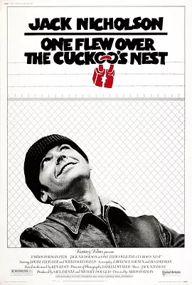

**评分**: ⭐ 9.1 (N/A)

**信息**: 导演: 米洛斯·福尔曼 Miloš Forman   主演: 杰克·尼科尔森 Jack Nichols...1975 / 美国 / 剧情

**剧情简介**:

麦克墨菲（杰克·尼科尔森 Jack Nicholson 饰）为了逃避监狱里的强制劳动，装作精神异常，被送进了精神病院，他的到来，给死气沉沉的精神病院带来了剧烈的冲击。 麦克要求看棒球比赛的电视转播，挑战了医院严格的管理制度，受到护士长拉契特（路易丝·弗莱彻 Louise Fletcher 饰）的百般阻挠；麦克带领病人出海捕鱼，振奋了他们的精神，却让院方头痛不已。院方为了惩处麦克胆大妄为、屡犯院规，决定将他永远留在疯人院。生性自由的麦克再也无法忍受疯人院的生活，他联合病友，高大的印第安人“酋长”，开始自己的计划：飞越疯人院。 本片获1975年第48届奥斯卡最佳影片，最佳男、女主角，最佳导演和最佳改编剧本五项大奖。主人公“不自由，毋宁死”的精神在当今社会仍有很大的现实意义。

**详情**: https://movie.douban.com/subject/1292224/

---

## 80. 布达佩斯大饭店 / 布达佩斯大酒店(港)  /  欢迎来到布达佩斯大饭店(台)

**评分**: ⭐ 8.9 (N/A)

**信息**: 导演: 韦斯·安德森 Wes Anderson   主演: 拉尔夫·费因斯 Ralph Fiennes / ...2014 / 美国 德国 英国 / 剧情 喜剧 冒险

**剧情简介**:

故事要从一位无名作家（裘德·洛 Jude Law 饰）说起，为了专心创作，他来到了名为“布达佩斯”的饭店，在这里，作家遇见了饭店的主人穆斯塔法（F·莫里·亚伯拉罕 F. Murray Abraham 饰），穆斯塔法邀请作家共进晚餐，席间，他向作家讲述了这座饱经风雨的大饭店的前世今生。
                                        
                                    　　饭店曾经的主人名叫古斯塔沃（拉尔夫·费因斯 Ralph Fiennes 饰），而年轻的穆斯塔法（托尼·雷沃罗利 Tony Revolori 饰）在当时不过是追随着他的一介小小门童。古斯塔沃为人正直，精明能干，在他的经营和组织之下，布达佩斯大饭店成为了当时首屈一指的度假胜地。古斯塔沃和年迈的D夫人（蒂尔达·斯文顿 Tilda Swinton 饰）情投意合，D夫人去世后，在遗嘱中将一副价值连城的名画留给了古斯塔沃，这一举动惹恼了她的儿子迪米特里（阿德里安·布洛迪 Adrie...

**详情**: https://movie.douban.com/subject/11525673/

---

## 81. 蝴蝶效应 / 蝴蝶效应

**评分**: ⭐ 8.9 (N/A)

**信息**: 导演: 埃里克·布雷斯 Eric Bress / J·麦基·格鲁伯 J. Mackye Gruber   主...2004 / 美国 加拿大 / 剧情 悬疑 科幻 惊悚

**剧情简介**:

伊万（艾什顿·库奇 Ashton Kutcher 饰）曾经有一个糟糕的童年，因为他行为闯下了大祸，令他童年充满不堪回忆的往事。而事实上，他确实只是依稀记得一点可怕的情景，这些情景一直纠缠着他的正常生活。伊万接受心理学家建议，把琐碎生活记在记事本里，却偶然发现通过记事本回到过去。
                                    
                                　　这时他才清楚记起，童年时候的自己做了那么多的错事。他幻想着用现在的意识，潜入童年的身体，去弥补种种过失给人们带来的伤害，尤其是希望与当年暗恋的凯西最终走回一起。然而他一次次的跨越时空的更改，只能越来越招致现实世界的不可救药。一切就像蝴蝶效应般，牵一发而动全身。

**详情**: https://movie.douban.com/subject/1292343/

---

## 82. 禁闭岛 / 不赦岛(港)  /  隔离岛(台)

**评分**: ⭐ 8.9 (N/A)

**信息**: 导演: Martin Scorsese   主演: 莱昂纳多·迪卡普里奥 Leonardo DiCaprio / ...2010 / 美国 / 剧情 悬疑 惊悚

**剧情简介**:

本片根据美国小说家丹尼斯·勒翰（Dennis Lehane）的同名小说改编。 1954年，联邦警官泰迪（莱昂纳多·迪卡普里奥 Leonardo DiCaprio 饰）和搭档查克（马克·鲁弗洛 Mark Ruffalo 饰）乘船来到波士顿附近的禁闭岛精神病犯监狱调查一桩离奇失踪案。手刃亲生骨肉的女犯蕾切尔（艾米莉·莫迪默 Emily Mortimer 饰）从戒备森严的牢室神秘逃脱，藏匿于孤岛深处。泰迪怀疑监狱的主治精神病医师约翰·考利（本·金斯利 Ben Kingsley 饰）有意隐瞒内情，并向查克透露他上岛的真实目的其实是寻找当年纵火烧死他妻子德洛丽丝（米歇尔·威廉姆斯 Michelle Williams 饰）的管理员，并揭露美国政府利用精神病犯人进行人体科学实验的罪行。但随着调查的逐渐深入，真相却变得越来越扑朔迷离……

**详情**: https://movie.douban.com/subject/2334904/

---

## 83. 心灵捕手 / 骄阳似我(港)  /  心灵捕手

**评分**: ⭐ 9.0 (N/A)

**信息**: 导演: 格斯·范·桑特 Gus Van Sant   主演: 马特·达蒙 Matt Damon / 罗宾·...1997 / 美国 / 剧情

**剧情简介**:

麻省理工学院的数学教授蓝波在席上公布了一道困难的数学题，却被年轻的清洁工威尔（马特·戴蒙 饰）解了出来。可是威尔却是个问题少年，成天和好朋友查克（本·阿弗莱特 饰）等人四处闲逛，打架滋事。当蓝波找到这个天才的时候，他正因为打架袭警被法庭宣判送进看守所。蓝波向法官求情保释，才使他免于牢狱之灾。
                                    
                                　　蓝波为了让威尔找到自己的人生目标，不浪费他的数学天赋，请了很多心理学专家为威尔做辅导，但是威尔十分抗拒，专家们都束手无策。无计可施之下，蓝波求助于他大学的好友，心理学教授尚恩（罗宾·威廉姆斯 饰），希望能够帮助威尔打开心房。
                                    
                                　　经过蓝波和尚恩的不懈努力，威尔渐渐敞开心胸，而好友查克的一席话，更是让他豁然开朗。

**详情**: https://movie.douban.com/subject/1292656/

---

## 84. 致命魔术 / 死亡魔法(港)  /  顶尖对决(台)

**评分**: ⭐ 8.9 (N/A)

**信息**: 导演: 克里斯托弗·诺兰 Christopher Nolan   主演: 休·杰克曼 Hugh Jackman...2006 / 英国 美国 / 剧情 悬疑 惊悚

**剧情简介**:

19世纪末，人们对科学文明还不是认识得太过清楚，于是，安吉尔（休•杰克曼Hugh Jackman饰）和伯登（克里斯蒂安•贝尔Christian Bale饰）的魔术，成为了伦敦城内的神奇人物。安吉尔出身贵族，魔术手段华丽丰富，是富人圈子里的表演常客。而伯登即使出身平平，争强好胜的心智和充满创造力的魔术技巧，却也令他有了名气。两人自小本是要好的伙伴，然而，现在魔术界二人各有领地，并且都有野心想成为音乐大厅里的顶级魔术师，一番明争暗斗如箭在弦上。
                                    
                                　　伯登掌握了精彩的分身术，叫座又叫好。而安吉尔见情势不妙，搬来科学家助阵——他发明的交流电有无穷魔力，保证让观众目瞪口呆。二人出招接招，一来一往，争斗在剧烈升级，友谊和道德都被抛诸脑后，一场血案在悄悄酝酿。

**详情**: https://movie.douban.com/subject/1780330/

---

## 85. 低俗小说 / 危险人物(港)  /  黑色追缉令(台)

**评分**: ⭐ 8.9 (N/A)

**信息**: 导演: 昆汀·塔伦蒂诺 Quentin Tarantino   主演: 约翰·特拉沃尔塔 John Tra...1994 / 美国 / 剧情 喜剧 犯罪

**剧情简介**:

《低俗小说》由“文森特和马沙的妻子”、“金表”、“邦妮的处境”三个故事以及影片首尾的序幕和尾声五个部分组成。看似独立的小故事里面，却又有环环相扣的人和事。
                                        
                                    　　盗贼“小南瓜”和“小兔子”在早餐店里打劫，却遇上了天大的麻烦——黑社会成员朱尔斯（塞缪尔•杰克逊Samuel L. Jackson饰）和文森特（约翰•特拉沃尔塔John Travolta饰）在店内用餐，可谓天外有天。二人是否会放过两名小盗贼？
                                        
                                    　　而文森特是黑社会大哥马沙•华莱士（文•瑞姆斯Ving Rhames饰）的手下，马沙下命令让他陪妻子一个晚上，明知如有雷池必死无疑，但面对马沙妻子美艳诱惑，文森特该怎么办。
                                        
                                    　　文森特的故事还没完，拳击手布奇（布鲁斯•威利斯Bruce Willis饰）的出现将令他的人生从此改变。布奇有一块祖传金表，就是因为这块金表，他和马沙分享了一个耻辱的秘密。
                                        
                                    　　故事环状结构，回...

**详情**: https://movie.douban.com/subject/1291832/

---

## 86. 超脱 / 人间师格(台)

**评分**: ⭐ 9.0 (N/A)

**信息**: 导演: 托尼·凯耶 Tony Kaye   主演: 艾德里安·布洛迪 Adrien Brody / 马西...2011 / 美国 / 剧情

**剧情简介**:

亨利•巴赫特（艾德里安•布洛迪 Adrien Brody 饰）来到社区学校担任代课老师。学校因学生反叛、经营不善而濒临绝境，多丽丝（刘玉玲 饰）为首的一批教师备受煎熬。亨利的第一堂课就遭遇了顽劣学生的挑衅，但是被他巧妙地化解。他赢得了女教师萨沙（克里斯蒂娜•亨德里克斯 Christina Hendricks）的好感。同时，他的教学方式引起了同学们的兴趣，其中就包括因肥胖而苦闷的梅丽迪斯。她一直默默地承受着因体重带来的各种责骂与嘲笑。但是因为老师，她似乎又找到了一切的理由……
                                        
                                    　　但是，亨利其实内心也有很大的压力，他的爷爷处于弥留之际，他的母亲自杀阴影始终在脑海中萦绕。某天夜里，他在公车上黯然神伤，独自流泪。这情形被一个刚受到嫖客凌辱的雏妓艾瑞卡（萨米•盖尔 Sami Gayle 饰）看到了。她尾随他，希望获得他的帮助。他起初拒绝了她的要求，后来他还是把她...

**详情**: https://movie.douban.com/subject/5322596/

---

## 87. 哈利·波特与密室 / 哈利波特2：消失的密室(港 / 台)

**评分**: ⭐ 8.9 (N/A)

**信息**: 导演: Chris Columbus   主演: 丹尼尔·雷德克里夫 Daniel Radcliffe / 艾玛...2002 / 英国 美国 / 奇幻 冒险

**剧情简介**:

哈利波特（丹尼尔•雷德克里夫 Daniel Radcliffe 饰）结束了假期，即将回到霍格沃兹继续学习魔法。一个叫多比的家养小精灵警告哈利不要回到霍格沃兹，否则会陷入极大的危险。哈利没有听从多比的劝告，回到了霍格沃兹。很快，霍格沃兹发生了一连窜怪事:接二连三出现学生被石化，一直找不出原因。而哈利总能听到一种奇怪的声音，从墙壁里传出来。
                                    
                                　　传说，霍格沃兹有一个密室，里面记录着伏地魔年轻时的秘密，只有斯莱特林的人才能打开密室。哈利偶然发现自己能听懂蛇说话，一时传闻是哈利打开了密室。难道多比所指的危险就隐藏在密室？

**详情**: https://movie.douban.com/subject/1296996/

---

## 88. 还有明天 / 明天还有梦(港)  /  我们还有明天(台)

**评分**: ⭐ 9.3 (N/A)

**信息**: 导演: 宝拉·柯特莱西 Paola Cortellesi   主演: 宝拉·柯特莱西 Paola Corte...2023 / 意大利 / 剧情 喜剧 历史

**剧情简介**:

1946年二战后的意大利，女性地位依旧低下。底层女性迪莉娅（宝拉·柯特莱西 Paola Cortellesi 饰），每日在丈夫的暴虐下和生活琐碎中艰难生存，唯有女儿玛塞拉、朋友玛丽莎和每日难得的自由踱步是她痛苦生活中的慰藉……这时，迪莉娅意外收到一封神秘信件，一场出逃即将改变一切……

**详情**: https://movie.douban.com/subject/36445098/

---

## 89. 喜剧之王 / King of Comedy

**评分**: ⭐ 8.8 (N/A)

**信息**: 导演: 周星驰 Stephen Chow / 李力持 Lik-Chi Lee   主演: 周星驰 Stephen Ch...1999 / 中国香港 / 喜剧 剧情 爱情

**剧情简介**:

尹天仇（周星驰 饰）一直醉心戏剧，想成为一名演员，平时除了做跑龙套以外，还会在街坊福利会里开设演员训练班。此时舞小姐柳飘飘在妈妈桑的带领下来到这里要求学做戏，原来柳飘飘有一段非常不愉快的经历，在尹天仇对她指导的过程中，柳飘飘对尹天仇渐生情愫，同时她也成为了夜总会里当红的小姐。尹天仇受到了极多白眼之后，终于得到了大明星鹃姐（莫文蔚 饰）的赏识，提携他担演新戏中的男主角，但没想到突然把他的角色换掉了，令他失望不已。在片场当场务的卧底警员（吴孟达 饰）身份被识穿，尹天仇阴差阳错的帮忙破了案。之后尹天仇继续活跃在街坊福利会的演员训练班里。

**详情**: https://movie.douban.com/subject/1302425/

---

## 90. 摩登时代 / The Masses  /  Les Temps modernes

**评分**: ⭐ 9.3 (N/A)

**信息**: 导演: 查理·卓别林 Charles Chaplin   主演: 查理·卓别林 Charles Chaplin ...1936 / 美国 / 剧情 喜剧 爱情

**剧情简介**:

二十年代的美国处于经济萧条时期，失业率居高不下，工人受尽压榨，成为了大机器生产中的一颗螺丝钉。查理（查理·卓别林 Charles Chaplin 饰）就是一个底层市民，他在一个机器隆隆的厂房里日以继夜地工作，以赚取微薄的收入。重复繁重的工作压得他喘不过气，他把人们的鼻子当成螺丝钉来拧，卷入流水线机器的皮带里，令人苦笑不得。
                                    
                                　　查理尽管贫穷，但却很善良。他在路上搭救了流浪女，和她一起生活，家里破烂却又温馨。每次身无分文的查理为了找到吃的，都会故意犯事，以便进入监牢。光景一时间有了好转，流浪女成了歌舞红星，然而好景太短暂了。

**详情**: https://movie.douban.com/subject/1294371/

---

## 91. 一一 / Yi yi  /  Yi yi: A One and a Two

**评分**: ⭐ 9.1 (N/A)

**信息**: 导演: 杨德昌 Edward Yang   主演: 吴念真 / 李凯莉 Kelly Lee / 金燕玲 Elai...2000 / 中国台湾 日本 / 剧情 爱情 家庭

**剧情简介**:

NJ（吴念真）是个很有原则的生意人，同妻子敏敏（金燕玲）、女儿婷婷（李凯莉）、儿子洋洋（张杨洋）以及外婆住在台北某所普通公寓里。小舅子的一场麻烦婚礼过后，因为外婆突然中风昏迷，他迎来更加混乱的日子。
                                    
                                　　敏敏公司、家里两头跑，时常感觉自己要被耗空；婷婷一直为外婆的中风内疚，恋爱谈到中途发现自己不过是替代品；NJ更是麻烦重重，公司面临破产，他又不愿放下别人眼里一文不值的自尊。一家人里，似乎只有洋洋没有烦恼，他平静地用照相机拍着各种人的背面，帮他们长出另一双眼睛，然而，洋洋简简单单的一句话，道出更深的悲凉。

**详情**: https://movie.douban.com/subject/1292434/

---

## 92. 杀人回忆 / 谋杀回忆  /  杀手回忆录

**评分**: ⭐ 8.9 (N/A)

**信息**: 导演: 奉俊昊 Joon-ho Bong   主演: 宋康昊 Kang-ho Song / 金相庆 Sang-kyun...2003 / 韩国 / 剧情 动作 犯罪 悬疑 惊悚

**剧情简介**:

1986年，韩国京畿道华城郡，热得发昏的夏天，在田野边发现一具女尸，早已发臭。小镇警察朴探员（宋康昊饰）和汉城来的苏探员（金相庆饰）接手案件，唯一可证实的是这具女尸生前被强奸过。线索的严重缺乏让毫无经验的朴探员和搭档曹探员（金罗河饰）只凭粗暴逼供和第六感推断，几次将犯罪 嫌疑人屈打成招。而苏探员客观冷静，据理分析，几次排除嫌疑，警察内部为了证明与推翻矛盾不断，然而无辜女子还是接二连三被残忍杀害，他们只好达成共识一起合作。此时，一个极其符合作案特征的小青年（朴海日饰）成为最大嫌疑人，警方神经绷紧地锁定住他，同时DNA检测报告也被送往美国，然而案件并未在此处停止。

**详情**: https://movie.douban.com/subject/1300299/

---

## 93. 致命ID / 杀人游戏  /  致命身份

**评分**: ⭐ 8.9 (N/A)

**信息**: 导演: 詹姆斯·曼高德 James Mangold   主演: 约翰·库萨克 John Cusack / 雷...2003 / 美国 / 剧情 悬疑 惊悚

**剧情简介**:

一个典型而又引人入胜的悬疑故事：一个汽车旅馆里，住进了10个人，他们中间有司机、妓女、过气女星、夫妇、警探和他的犯人，还有神秘的旅馆经理。这天风雨大作，通讯中断，10人被困在了旅馆里，惊悚的故事开始了。
                                    
                                　　他们一个接一个的死去，并且按照顺序留下牌号。10个人存活下来的渐渐变少，他们开始恐慌，互相猜忌，却无意间发现了彼此间的联系。但是，大家怀疑的嫌疑人却纷纷死去，谜团笼罩在旅馆狭小的空间里，这样的凶杀案件却有着人们猜不到的真相……

**详情**: https://movie.douban.com/subject/1297192/

---

## 94. 春光乍泄 / 一起快乐  /  Happy Together

**评分**: ⭐ 9.0 (N/A)

**信息**: 导演: 王家卫 Kar Wai Wong   主演: 张国荣 Leslie Cheung / 梁朝伟 Tony Leu...1997 / 中国香港 日本 韩国 / 剧情 爱情 同性

**剧情简介**:

黎耀辉（梁朝伟）与何宝荣（张国荣）是一对同性恋人，为了有新的开始，他们怀着美丽的梦想（去看南美洲大瀑布）离开香港来到阿根廷，却在布宜诺斯艾利斯迷了路。黎耀辉想安下心来过日子，无奈何宝荣于夜夜笙歌中放纵着自己的生命，以期找寻更多的刺激，只当黎耀辉是他受伤后的港湾，两人分歧 、争吵越来越多，心的距离越来越远。
                                    
                                　　黎耀辉明白过去的日子不可能再复返时，决定离开何宝荣，而正是在他离开后，绝望的意味（对黎耀辉的爱）才在何宝荣的脑海中完整地浮现。

**详情**: https://movie.douban.com/subject/1292679/

---

## 95. 海豚湾 / 血色海湾(台)  /  海湾

**评分**: ⭐ 9.3 (N/A)

**信息**: 导演: 路易·西霍尤斯 Louie Psihoyos   主演: 路易·西霍尤斯 Louie Psihoyo...2009 / 美国 / 纪录片

**剧情简介**:

日本和歌山县太地，是一个景色优美的小渔村，然而这里却常年上演着惨无人道的一幕。每年，数以万计的海豚经过这片海域，他们的旅程却在太地戛然而止。渔民们将海豚驱赶到靠近岸边的一个地方，来自世界各地的海豚训练师挑选合适的对象，剩下的大批海豚则被渔民毫无理由地赶尽杀绝。这些屠杀，这些罪行，因为种种利益而被政府和相关组织所隐瞒。
                                    
                                　　理查德•贝瑞（Richard O’Barry）年轻时曾是一名海豚训练师，他所参与拍摄电影《海豚的故事》备受欢迎。但是，一头海豚的死让理查德的心灵受到强烈的震撼。从此，他致力于拯救海豚的活动。不顾当地政府和村民百般阻挠，他和他的摄影团队想方设法潜入太地的海豚屠杀场，只为将罪行公之于众，拯救人类可爱的朋友……
                                    
                                　　本片荣获2010年第82届奥斯卡金像奖最佳纪录长片奖。

**详情**: https://movie.douban.com/subject/3442220/

---

## 96. 加勒比海盗 / 加勒比海盗1：黑珍珠号的诅咒  /  神鬼奇航：鬼盗船魔咒(台)

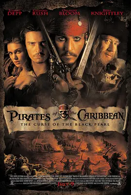

**评分**: ⭐ 8.8 (N/A)

**信息**: 导演: 戈尔·维宾斯基 Gore Verbinski   主演: 约翰尼·德普 Johnny Depp / ...2003 / 美国 / 动作 冒险 奇幻

**剧情简介**:

故事发生在18世纪，传说中海盗最为活跃的加勒比海。风趣迷人的杰克·斯伯洛（约翰尼·德普 Johnny Depp 饰），是活跃在加勒比海上的海盗，拥有属于自己的“黑珍珠”号海盗船。对他来说，最惬意的生活就是驾驶着“黑珍珠”号在加勒比海上游荡，自由自在的打劫过往船只。但不幸的是，他的仇敌，老谋深算的巴尔巴罗萨船长(杰弗里·拉什 Geoffrey Rush 饰)偷走了他的“黑珍珠”号。巴伯萨是一个无恶不作的坏蛋，他抢劫了杰克的"黑珍珠号"后，更加猖狂，在加勒比海上横行霸道，一时成为整个加勒比海的霸主。
                                        
                                    　　一次，巴伯萨一伙袭击了罗亚尔港小镇，还绑架了总督的女儿伊莉莎白·斯万(凯拉·奈特莉 Keira Knightley 饰)和伊莉莎白青梅竹马的铁匠学徒威尔·特纳（奥兰多·布鲁姆 Orlando Bloom 饰），想方设法救出了狱中的船长杰克，偷来英国皇家舰队最...

**详情**: https://movie.douban.com/subject/1298070/

---

## 97. 美国往事 / 四海兄弟(台)  /  义薄云天(港)

**评分**: ⭐ 9.1 (N/A)

**信息**: 导演: 赛尔乔·莱翁内 Sergio Leone   主演: 罗伯特·德尼罗 Robert De Niro ...1984 / 美国 意大利 / 犯罪 剧情

**剧情简介**:

1933年，纽约流氓Noodles（罗伯特·德·尼罗 饰）因向哈洛伦警司（布鲁斯·巴伦堡 饰）通风报信害死了三名同伙而被追杀。逃亡之前，他打开了存放帮派基金的手提箱，里面却只有报纸。 1968年，已改名换姓的Noodles收到一封犹太会堂通知迁葬亲友的信。Noodles联系拉比，得知信是八个月前寄出的，他的三名同伙已被迁葬至一所豪华公墓。Noodles回到纽约，找老友莫（拉里·拉普 饰）了解情况，却一无所获。闲谈中，Noodles问起莫的妹妹黛博拉（伊丽莎白·麦戈文 饰）的情况，得知其已成名角。 原来，两人少时互有好感，但黛博拉（詹妮弗·康纳利 饰）志向高远脚踏实地，理智地将街头混混Noodles（斯科特·提勒 饰）拒于门外。 Noodles在公墓发现了一把钥匙，并用钥匙打开了当年存放手提箱的储物柜。这一次，箱子里有满满的百元钞，还有写着“下一份工作...

**详情**: https://movie.douban.com/subject/1292262/

---

## 98. 红辣椒 / 盗梦侦探(港 / 台)

**评分**: ⭐ 9.0 (N/A)

**信息**: 导演: 今敏 Satoshi Kon   主演: 林原惠美 Megumi Hayashibara / 江守彻 Toru...2006 / 日本 / 动画 悬疑 科幻 惊悚

**剧情简介**:

近未来，为了治疗现代人类越来越多、越来越严重的精神疾病，位于东京的精神医疗综合研究所开发出一种可以反映他人梦境的机器。通过微型DC的帮助，梦境在显示器上呈现出来，更方便找到一个人焦虑的症结。
                                    
                                　　某日，三台微型DC失窃，与之相关的研究人员的梦境接连被人侵入，随后受到严重伤害。美女医疗师千叶敦子另一个身份是梦境侦探“红辣椒”，她能够与患者同步体验梦境。为避免盗贼利用微型DC进一步作恶，她不得不潜入受害者的梦中寻找恐怖分子，一场充满奇幻和惊险的争斗旋即展开……
                                    
                                　　本片入围2006年威尼斯电影节主竞赛单元，荣获2007年葡萄牙奇幻电影节影评人选择奖、2006年蒙特利尔电影节大众选择奖。

**详情**: https://movie.douban.com/subject/1865703/

---

## 99. 七宗罪 / 火线追缉令(台)  /  7宗罪

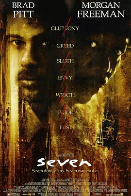

**评分**: ⭐ 8.8 (N/A)

**信息**: 导演: 大卫·芬奇 David Fincher   主演: 摩根·弗里曼 Morgan Freeman / 布...1995 / 美国 / 剧情 犯罪 悬疑 惊悚

**剧情简介**:

“暴食”、“贪婪”、“懒惰”、“嫉妒”、“骄傲”、“淫欲”、“愤怒”，这是天主教教义所指的人性七宗罪。城市中发生的连坏杀人案，死者恰好都是犯有这些教义的人。凶手故弄玄虚的作案手法，令资深冷静的警员沙摩塞（摩根•弗里曼 Morgan Freeman 饰）和血气方刚的新扎警员米尔斯（布拉德•皮特 Brad Pitt 饰）都陷入了破案的谜团中。他们去图书馆研读但丁的《神曲》，企图从人间地狱的描绘中找到线索，最后从宗教文学哲学的世界中找到了凶手作案计划和手段的蛛丝马迹。凶手前来投案自首，这令众人都松了一口气，以为案件就此结束，怎料还是逃不出七宗罪的杀人逻辑，这次凶手瞄准的目标，是那个犯了“愤怒”罪的人……

**详情**: https://movie.douban.com/subject/1292223/

---

## 100. 唐伯虎点秋香 / Flirting Scholar

**评分**: ⭐ 8.8 (N/A)

**信息**: 导演: 李力持 Lik-Chi Lee   主演: 周星驰 Stephen Chow / 巩俐 Li Gong / 陈...1993 / 中国香港 / 喜剧 爱情 古装

**剧情简介**:

唐伯虎（周星驰 饰）身为江南四大才子之首，却有道不尽的心酸。宁王想唐伯虎帮忙图谋作反，唐伯虎只好用内功改变脉象，令众人都相信他命不久矣。母亲埋怨他不应该把功夫暴露，因为他们家族一直被当年的仇人追杀。唐伯虎在与朋友出游时，遇到了貌若天仙的秋香并对她一见钟情，决心要到华府当 家丁以追求秋香，唐伯虎被取名华安。期间华太师遇到了宁王上门刁难，幸好有唐伯虎出面相助，并暴露了自己是唐伯虎的身份。秋香才知道华安是自己欣赏的唐伯虎。华夫人跟唐家有怨，因此二人便开始斗法。怎料宁王跟夺命书生再次上门，华夫人不是对手，幸得唐伯虎出手，华夫人也答应把秋香许配给唐伯虎。

**详情**: https://movie.douban.com/subject/1306249/

---

## 101. 狩猎 / 诬网(港)  /  谎言的烙印(台)

**评分**: ⭐ 9.1 (N/A)

**信息**: 导演: 托马斯·温特伯格 Thomas Vinterberg   主演: 麦斯·米科尔森 Mads Mik...2012 / 丹麦 瑞典 / 剧情

**剧情简介**:

刚刚和妻子离婚的卢卡斯（麦斯·米科尔森 Mads Mikkelsen 饰）目前在一家托儿所工作，心地善良个性温和的他很快就受到了同事和孩子们的喜爱，其中，一个名叫卡拉（安妮卡·韦德科普 Annika Wedderkopp 饰）的早熟女孩对卢卡斯尤为的亲近。面对女孩幼稚 而单纯的示好，卢卡斯只能婉转的拒绝，可令他没有想到的是，这一举动将他的生活推向了风口浪尖。
                                    
                                　　卡拉报复性的谎言让卢卡斯背负起了性侵女童的罪名，一时间，这个好好先生成为了整个小镇排挤和压迫的对象。好友的愤怒，前妻的不信任，爱犬的死亡和陌生人的恶意让卢卡斯几近崩溃，而当小小的卡拉吐露真相之后，恶意却并没有随着卢卡斯的重获清白而划下句点。

**详情**: https://movie.douban.com/subject/6985810/

---

## 102. 幽灵公主 / 魔法公主  /  幽灵少女

**评分**: ⭐ 8.9 (N/A)

**信息**: 导演: 宫崎骏 Hayao Miyazaki   主演: 松田洋治 Yôji Matsuda / 石田百合...1997 / 日本 / 动画 奇幻 冒险

**剧情简介**:

少年阿席达卡为解开诅咒之谜，意外卷入一场人类与森林的战争漩涡。由白狼养大的幽灵公主小桑，挥舞利刃守护森林圣地；而炼铁场的首领黑帽，为百姓生存不断掠夺森林，正策划着一场“弑神行动”......随着森林山兽神的现身，各方势力蠢蠢欲动，在这场跨越种族的生死博弈中，一个关于人类命运的终极秘密，即将揭晓……

**详情**: https://movie.douban.com/subject/1297359/

---

## 103. 甜蜜蜜 / Comrades: Almost a Love Story

**评分**: ⭐ 8.9 (N/A)

**信息**: 导演: 陈可辛 Peter Chan   主演: 黎明 Leon Lai / 张曼玉 Maggie Cheung / ...1996 / 中国香港 / 剧情 爱情

**剧情简介**:

改革开放初期，黎小军（黎明 饰）告别女友小婷（杨恭如 饰）从天津（国语版中为无锡）来到香港讨生活，期望有天挣到大钱把小婷接来与之风风光光地成婚，没料想日子会比想象中的难熬许多。
                                    
                                　　黎小军在快餐店与同样从大陆到港讨生活但避讳谈自己身份的李翘（张曼玉 饰）结识后，因为共同喜爱邓丽君，两人人在异乡的孤独都有了某种程度的缓解，并在交往的过程中生出了真爱，可是世事难料，两人最终无奈分手，黎小军成了小婷的老公，李翘跟了在黑社会做事的豹哥（曾志伟 饰）。然而因为邓丽君，两人的缘分并没到此为止。

**详情**: https://movie.douban.com/subject/1305164/

---

## 104. 寄生虫 / 寄生上流(台)  /  上流寄生族(港)

**评分**: ⭐ 8.8 (N/A)

**信息**: 导演: 奉俊昊 Joon-ho Bong   主演: 宋康昊 Kang-ho Song / 李善均 Seon-gyun...2019 / 韩国 / 剧情

**剧情简介**:

基宇（崔宇植 饰）出生在一个贫穷的家庭之中，和妹妹基婷（朴素丹 饰）以及父母在狭窄的地下室里过着相依为命的日子。一天，基宇的同学上门拜访，他告诉基宇，自己在一个有钱人家里给他们的女儿做家教，太太是一个头脑简单出手又阔绰的女人，因为自己要出国留学，所以将家教的职位暂时转交给基宇。
                                    
                                　　就这样，基宇来到了朴社长（李善均 饰）家中，并且见到了他的太太（赵汝贞 饰），没过多久，基宇的妹妹和父母也如同寄生虫一般的进入了朴社长家里工作。然而，他们的野心并没有止步于此，基宇更是和大小姐坠入了爱河。随着时间的推移，朴社长家里隐藏的秘密渐渐浮出了水面。

**详情**: https://movie.douban.com/subject/27010768/

---

## 105. 蝙蝠侠：黑暗骑士崛起 / 蝙蝠侠前传3：黑暗骑士崛起  /  黑暗骑士：黎明升起(台)

**评分**: ⭐ 8.9 (N/A)

**信息**: 导演: 克里斯托弗·诺兰 Christopher Nolan   主演: 克里斯蒂安·贝尔 Christ...2012 / 美国 英国 / 剧情 动作 科幻 犯罪 惊悚

**剧情简介**:

检察官哈维·登特（艾伦·艾克哈特 Aaron Eckhart 饰）死后的八年间，哥谭市在戈登警长（加里·奥德曼 Gary Oldman 饰）的努力下有效地遏制了犯罪活动。而蝙蝠侠布鲁斯·韦恩（克里斯蒂安·贝尔 Christian Bale 饰）因为背负谋杀登特的罪名，被 警方通缉，在哥谭市销声匿迹。然而，这看似平静的状态被恐怖分子贝恩（汤姆·哈迪 Tom Hardy 饰）的出现打破，他利用猫女（安妮·海瑟薇 Anne Hathaway 饰）偷取布鲁斯的指纹，致使韦恩集团面临破财，布鲁斯被赶出董事会。为了保证韦恩集团投资的能源项目不被坏人利用制造核弹，布鲁斯帮助米兰达（玛丽昂·歌迪亚 Marion Cotillard 饰）成为董事会主席。贝恩接下来一连串精密设计的计划将哥谭市陷入孤绝之境，毁灭之日指日可待。布鲁斯只能再次肩负起拯救哥谭的重任，然而至亲的...

**详情**: https://movie.douban.com/subject/3395373/

---

## 106. 天书奇谭 / 天书奇谭4K纪念版  /  The Legend of Sealed Book

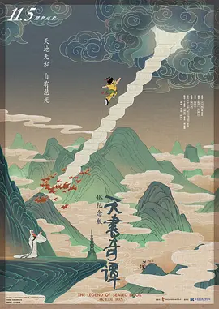

**评分**: ⭐ 9.2 (N/A)

**信息**: 导演: 王树忱 Shuchen Wang / 钱运达 Yunda Qian   主演: 丁建华 Jianhua Din...1983(中国大陆) / 2021 / 中国大陆 / 动画 奇幻

**剧情简介**:

天庭有珍奇书籍“天书”，被锁在石龛门里三千年。看守天书的袁公对天书的内容好奇不已，他乘无人之际，偷偷拿出观看。原来，天书上记录了一百〇八条法术，袁公偷偷下凡，把天书上的内容刻在石壁上。但本意造福人类的袁公此举却触犯了天条，遭到了玉帝的惩罚。
                                    
                                　　炼丹炉里的仙丹不慎被三条狐狸偷吃了，她们变成精下凡骗人钱财，还假扮仙姑和官府勾结，欺压百姓，祸害人间。袁公便指引天赋异禀的蛋生——一个从蛋里跳出来的孩子修习天书上的法术，和狐狸精斗智斗勇，为民除害。

**详情**: https://movie.douban.com/subject/1428581/

---

## 107. 7号房的礼物 / 戆爸的礼物(港)  /  7号囚房的礼物

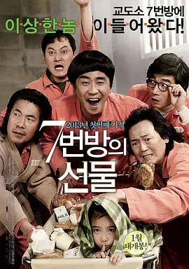

**评分**: ⭐ 8.9 (N/A)

**信息**: 导演: 李焕庆 Hwan-kyeong Lee   主演: 柳承龙 Seung-yong Ryoo / 朴信惠 Shi...2013 / 韩国 / 剧情 喜剧 家庭

**剧情简介**:

1997年，只有6岁儿童智商的智障男子李龙久（柳成龙 饰）和可爱的女儿艺胜（葛素媛 饰）相依为命，生活虽然简单清贫，却充满幸福。某天，执着为女儿买美少女战士书包的龙久意外卷入一起幼童诱拐奸杀案，而死者竟是警察局长的女儿。龙久懵懂无知，搞不清状况，昏头昏脑就被投入监狱。在7号牢房中，聚集着走私犯蘇杨浩（吴达洙 饰）、诈骗犯崔春浩（朴元尚 饰）、通奸犯姜万范（金正泰 饰）、恐吓犯老徐（金基灿 饰）和抢劫犯申奉植（郑万植 饰）等五毒俱全的“社会渣滓”。龙久孩子般纯洁的心渐渐感动了这几个“大坏蛋”，他们甚至不惜冒险将艺胜带入牢房与父亲相会。
                                    
                                　　黑暗冰冷的监牢内，7号牢房阳光满满……

**详情**: https://movie.douban.com/subject/10777687/

---

## 108. 超能陆战队 / 大英雄联盟(港)  /  大英雄天团(台)

**评分**: ⭐ 8.8 (N/A)

**信息**: 导演: 唐·霍尔 Don Hall / 克里斯·威廉姆斯 Chris Williams   主演: 斯科特...2014 / 美国 / 喜剧 动作 科幻 动画 冒险

**剧情简介**:

未来世界的超级都市旧京山（San Fransokyo），热爱发明创造的天才少年小宏，在哥哥泰迪的鼓励下参加了罗伯特·卡拉汉教授主持的理工学院机器人专业的入学大赛。他凭借神奇的微型磁力机器人赢得观众、参赛者以及考官的一致好评，谁知突如其来的灾难却将小宏的梦想和人生毁于一旦。大火烧毁了展示会场，而哥哥为了救出受困的卡拉汉教授命丧火场。身心饱受创伤的小宏闭门不出，哥哥生前留下的治疗型机器人大白则成为安慰他的唯一伙伴。原以为微型机器人也毁于火灾，谁知小宏和大白竟意外发现有人在某座废弃工厂内大批量地生产他的发明。
                                    
                                　　稍后哥哥的朋友们弗雷德等人也加入进来，他们穿上小宏发明的超级战士战斗装备，和怀有险恶阴谋的神秘对手展开较量……

**详情**: https://movie.douban.com/subject/11026735/

---

## 109. 爱在黎明破晓前 / 情留半天(港)  /  爱在黎明破晓时(台)

**评分**: ⭐ 8.8 (N/A)

**信息**: 导演: 理查德·林克莱特 Richard Linklater   主演: 伊桑·霍克 Ethan Hawke ...1995 / 美国 奥地利 瑞士 / 剧情 爱情

**剧情简介**:

美国青年杰西（伊桑·霍克 Ethan Hawke 饰）在火车上偶遇了法国女学生塞琳娜（朱莉·德尔佩 Julie Delpy 饰），两人在火车上交谈甚欢。当火车到达维也纳时，杰西盛情邀请塞琳娜一起在维也纳游览一番，即使杰西翌日便要坐飞机离开。与杰西一见钟情的塞琳娜接受了杰西的邀请。
                                    
                                　　他们一边游览城市，一边谈论着彼此的过去 ，彼此对生活的感想，两人了解越加深刻。他们非常珍惜这美妙的晚上，这对恋人一起经历了很多浪漫的经历因为他们约定在半年后再见，而此次约会将会在日出之间结束……

**详情**: https://movie.douban.com/subject/1296339/

---

## 110. 第六感 / 鬼眼(港)  /  灵异第六感(台)

**评分**: ⭐ 8.9 (N/A)

**信息**: 导演: M·奈特·沙马兰 M. Night Shyamalan   主演: 布鲁斯·威利斯 Bruce Wi...1999 / 美国 / 剧情 悬疑 惊悚

**剧情简介**:

麦克（布鲁斯·威利斯 饰）是著名儿童心理学家，却也有始终未能治愈的患者，甚至因此遭到枪击，这名少年随后也饮枪自毙。这给麦克带来很大心理阴影，一年后他找到另一个症状很像这名患者的男孩柯尔（海利·乔·奥斯蒙 饰），并耐心的做起了他的医生。柯尔并不容易接近，但麦克还是慢慢赢得 了他的信任，得知了柯尔的秘密。原来柯尔有着灵异的第六感，可以看到鬼魂。虽然这令人感到难以置信，但麦克在证实了事情的真相后还是帮助柯尔接受了这个事实。
                                    
                                　　可是就在问题即将得到解决的时候，麦克却在柯尔的引导下，发现了一个更令人震惊的秘密……

**详情**: https://movie.douban.com/subject/1297630/

---

## 111. 爱在日落黄昏时 / 日落巴黎(港)  /  爱在日落巴黎时(台)

**评分**: ⭐ 8.9 (N/A)

**信息**: 导演: 理查德·林克莱特 Richard Linklater   主演: 伊桑·霍克 Ethan Hawke ...2004 / 美国 法国 / 剧情 爱情

**剧情简介**:

九年前，杰西（伊桑·霍克 Ethan Hawke 饰）与席琳（朱莉·德尔佩 Julie Delpy 饰）在火车上不期而遇，怦然心动。在维也纳渡过疯狂而又浪漫的一夜后，他们在日出前分手，并相约在维也纳重逢。
                                    
                                　　九年之后，杰西已成为畅销书作家，而席琳则是法国环保组织成员。杰西在新书里娓娓道来的，正是九年前的浪漫夜晚。在巴黎促销新书时，杰西与席琳在书店相遇，然而他们只有一下午的时光相处，日落之前，杰西要乘飞机赶回美国。两人在午后的巴黎街头散步，在美丽的护城河上泛舟，无所不谈，兴致勃勃。可是就像命运的捉弄，快乐的时光像烟花一样醉人却短暂。
                                    
                                　　杰西对席琳一送再送，难以忘情；席琳用吉他和歌声，怀念着内心深处的爱恋。太阳就快落下去了，杰西就要误了飞机，又或许他更不想错过的，是命里注定的缘分。

**详情**: https://movie.douban.com/subject/1291990/

---

## 112. 被嫌弃的松子的一生 / 花样奇缘(港)  /  令人讨厌的松子的一生(台)

**评分**: ⭐ 8.8 (N/A)

**信息**: 导演: 中岛哲也 Tetsuya Nakashima   主演: 中谷美纪 Miki Nakatani / 瑛太 E...2006 / 日本 / 剧情 歌舞

**剧情简介**:

有一天父亲（香川照之饰）突然来找阿笙（瑛太饰），告诉他有个素未谋面的姑姑死了，叫他去收拾下姑姑的房子。在河边的破烂小屋里，阿笙渐渐开始了解父亲口中的姑姑，到底有着怎样的一生。
                                    
                                　　小时候的姑姑川尻松子（中谷美纪饰）经常做着白雪公主似的美梦，她后来成为一名安分的中学教师，却因百口莫辩的误会被辞退了，之后和一作家同居，作家却因为太爱她而选择自杀，死前留下遗言：生而为人对不起。这件事对松子打击极大；之后与该作家的事业敌人同居直至，又忍受不住去找对方妻子的诱惑，结果惨遭抛弃；又是当上浴室女郎，甚至还杀人入狱，然而不管有意无意，她从不放弃生活的希望。不管生活再怎样破碎，她仍然本能地生存下去，这生存本身，足以打动任何人，包括阿笙。

**详情**: https://movie.douban.com/subject/1787291/

---

## 113. 茶馆 / The Teahouse

**评分**: ⭐ 9.6 (N/A)

**信息**: 导演: 谢添 Tian Xie   主演: 于是之 Shizhi Yu / 郑榕 Rong Zhen / 蓝天野 T...1982(中国大陆) / 中国大陆 / 剧情 历史

**剧情简介**:

世纪之交，古老的中国正迎来前所未有的巨大变革。老态龙钟的大清王朝摇摇欲坠，六君子的鲜血无法阻止历史车轮的滚动，老北京城的上空风云变幻，波谲云诡。王利发（于是之 饰），北京城内裕泰茶馆的年轻掌柜。他谨记父亲的教诲，体面周全地迎送四方宾客。小小的茶馆内，三教九流各色人等穿梭于此：提笼架鸟哀叹时运的松二爷（黄宗洛 饰）；慨叹国之将亡的刚毅满人常四爷（郑榕 饰）；一心谋求实业救国的秦仲义（蓝天野 饰）；丧尽天良买卖人口的刘麻子（英若诚 饰）；打算娶老婆的庞太监（童超 饰）……你方唱罢我登场，小小茶馆之内演尽世间的沧桑与凄凉……
                                    
                                　　本片根据老舍同名原著改编，并1983年第3届中国电影金鸡奖特别奖、文化部1982年优秀影片奖特别奖。

**详情**: https://movie.douban.com/subject/1461403/

---

## 114. 重庆森林 / Chungking Express

**评分**: ⭐ 8.8 (N/A)

**信息**: 导演: 王家卫 Kar Wai Wong   主演: 林青霞 Brigitte Lin / 金城武 Takeshi K...1994 / 中国香港 / 剧情 爱情

**剧情简介**:

编号为223的警察（金城武）失恋后患上失恋综合症，在与金发女杀手（林青霞）擦肩而过又离奇相遇并有了一晚温情后，原本以为包括“爱情”在内的所有东西都有保质期的他意外地迎来心灵的短暂温暖。可是，他们的爱情还是结束了。
                                    
                                　　快餐店新来的女招待阿菲（王菲）爱上了时常光顾快餐店的编号 为663的警察（梁朝伟），因拆了他的女友（周嘉玲）留在快餐店给他的“分手” 信，阿菲知晓了他的心情，偷拿到他的钥匙趁他不在时常潜入他家，一边梦游一边悄悄地改变他的生活，终在被他撞见时令其感受到情感的回归。然而，这才是他们爱情的开始。

**详情**: https://movie.douban.com/subject/1291999/

---

## 115. 未麻的部屋 / 蓝色恐惧(港 / 台)

**评分**: ⭐ 9.1 (N/A)

**信息**: 导演: 今敏 Satoshi Kon   主演: 岩男润子 Junko Iwao / 松本梨香 Rica Matsu...1997 / 日本 / 剧情 犯罪 动画 悬疑 惊悚

**剧情简介**:

当红三人少女偶像团体Charming Bird面临解散，核心成员雾越未麻在事务所的安排下不得不退出团体，转型成为一名电视剧演员。万事开头难，对于偶像歌手转型而来的未麻尤其如此，她在工作中承受着压力，闷闷不乐。与此同时，各种恐吓信不断、经纪人田所先生遇袭以及以自己的口吻在网站上写日记的神秘人都让未麻焦虑不已，恍惚间她甚至看到另一个自己。
                                    
                                　　未麻的苦恼无人知晓，贪婪的田所甚至同意剧组的剧本，要求未麻出演一场尺度极大的强暴戏。这次演出成为未麻演艺事业的转折点，她的出镜率开始攀升，甚至还拍摄了裸露的写真。与此相对，电视剧编剧涩谷和曾给未麻拍下裸照摄影师村野接连遇害。未麻的生活变得混乱不堪，真相究竟如何？
                                    
                                　　本片荣获1997年亚洲奇幻电影节最佳亚洲影片。

**详情**: https://movie.douban.com/subject/1395091/

---

## 116. 哈利·波特与火焰杯 / 哈利波特4：火杯的考验(港 / 台)

**评分**: ⭐ 8.8 (N/A)

**信息**: 导演: 迈克·内威尔 Mike Newell   主演: 丹尼尔·雷德克里夫 Daniel Radclif...2005 / 英国 美国 / 悬疑 奇幻 冒险

**剧情简介**:

这是一个不同寻常的学期，魔法学校的盛事：三强争霸赛在霍格沃茨举行。学生们争先报名，希翼获得永恒无上的荣誉。火焰杯在选出三所学校的三名勇士后，竟将未足年龄的哈利也挑选出来。
                                    
                                　　哈利（Daniel Radcliffe饰）的当选引起其他学生的嫉妒连连，就连铁哥们罗恩（Rupert Grint饰）也首次和他闹起了别扭，哈利感到孤立无援，还好有教父小天狼星和赫敏一直支持他。可总有些好事者如记者丽塔等着看他的好戏。天知道这场比赛是何等艰辛危险，在龙的眼皮下偷蛋，潜入湖底救人，在迷宫中探险……一不小心，甚至可能付出生命的代价。
                                    
                                　　黑魔王伏地魔的威胁渐渐显现，每一天都险象环生，动人心弦。

**详情**: https://movie.douban.com/subject/1309055/

---

## 117. 入殓师 / 礼仪师之奏鸣曲(港)  /  礼仪师(台)

**评分**: ⭐ 8.9 (N/A)

**信息**: 导演: 泷田洋二郎 Yôjirô Takita   主演: 本木雅弘 Masahiro Motoki / ...2008 / 日本 / 剧情

**剧情简介**:

买了昂贵的大提琴，想要成就一番事业的小林大悟（本木雅弘 饰），经历了4个月的管弦乐演奏，得到的却是“乐团解散”的噩耗与购买乐器的高昂债务。迫不得已，大悟与妻子美香（广末凉子 饰）搬到老屋，过着清贫的日子。某日，一则广告吸引了大悟的注意：NK代理公司，帮助旅行，高薪短工时。大悟来到NK代理公司面试，社长佐佐木生荣（山崎努 饰）二话不说就决定聘用大悟，但却对工作内容避而不谈。在大悟的再三追问下，佐佐木社长终于道明：是入殓（日语Nou Kan）工作！
                                    
                                　　虽然心理上有所忌惮，高额的薪水还是令大悟接受了这份工作。但这样的工作对普通人谈何容易，一方面对遗体的不适，一方面又要对妻友隐瞒自己的工作，小林大悟不平凡的工作就这样开始了。

**详情**: https://movie.douban.com/subject/2149806/

---

## 118. 头脑特工队 / 玩转脑朋友(港)  /  脑筋急转弯(台)

**评分**: ⭐ 8.8 (N/A)

**信息**: 导演: 彼特·道格特 Pete Docter / 罗纳尔多·德尔·卡门 Ronaldo Del Carmen  &nb...2015 / 美国 / 喜剧 动画 冒险

**剧情简介**:

可爱的小女孩莱莉（凯特林·迪亚斯 Kaitlyn Dias 配音）出生在明尼苏达州一个平凡的家庭中，从小她在父母的呵护下长大，脑海中保存着无数美好甜蜜的回忆。当然这些记忆还与几个莱莉未曾谋面的伙伴息息相关，他们就是人类的五种主要情绪：乐乐（艾米·波勒 Amy Poehl er 配音）、忧忧（菲利丝·史密斯 Phyllis Smith 配音）、怕怕（比尔·哈德尔 Bill Hader 配音）、厌厌（敏迪·卡灵 Mindy Kaling 配音）和怒怒（刘易斯·布莱克 Lewis Black 配音）。乐乐作为团队的领导，她协同其他伙伴致力于为小主人营造更多美好的珍贵回忆。某天，莱莉随同父母搬到了旧金山，肮脏逼仄的公寓、陌生的校园环境、逐渐失落的友情都让莱莉无所适从，她的负面情绪逐渐累积，内心美好的世界渐次崩塌。
                                    
                                　　为了保护这一切，乐乐只有行动起来……

**详情**: https://movie.douban.com/subject/10533913/

---

## 119. 借东西的小人阿莉埃蒂 / 借物少女艾莉缇(台)  /  借东西的小矮人亚莉亚蒂(港)

**评分**: ⭐ 8.9 (N/A)

**信息**: 导演: 米林宏昌 Hiromasa Yonebayashi   主演: 志田未来 Mirai Shida / 神木...2010 / 日本 / 动画 奇幻 冒险

**剧情简介**:

虽然患有心脏方面的疾病，但是少年翔（神木隆之介 配音）的父母依然对他疏于呵护。为了准备即将到来的手术，翔来到了位于偏远乡间的姨婆（竹下景子 配音）家静养。姨婆家位于一片幽静的丛林中，这是一幢有着上百年历史的欧式别墅。这里除了生活着姨婆和女佣阿春（树木希林 配音）外，还有一个奇特的三口之家，“借东西一族”——小人阿莉埃蒂（志田未来 配音）和她的爸爸（三浦友和 配音）妈妈（大竹忍 配音），他们生活在别墅的地板下，只有几公分高，过着不为人类察觉的生活。遇到所需的日常用品时，便会在夜深人静之时偷偷潜入厨房借出来。翔无意中瞥见阿莉埃蒂的身影，他有心接近这些传说中的小人，却不知不觉打扰了他们的生活…… 本片根据英国作家玛丽·诺顿的原著《借东西的小人》改编，并荣获2011年日本电影学院奖最佳动画片奖。

**详情**: https://movie.douban.com/subject/4202302/

---

## 120. 菊次郎的夏天 / 菊次郎之夏  /  Kikujirô no natsu

**评分**: ⭐ 8.9 (N/A)

**信息**: 导演: 北野武 Takeshi Kitano   主演: 北野武 Takeshi Kitano / 关口雄介 Yus...1999 / 日本 / 剧情 喜剧

**剧情简介**:

暑假到来，自幼丧父的小学三年级学生正男（关口雄介饰），如今和奶奶生活在一起，暑假特别无聊。他拿出母亲从外地寄回的信，准备自己一个人去爱知县丰桥市看望母亲。
                                    
                                　　邻居阿姨（岸本加世子饰）发现后，决定帮正男完成心愿。她拿出一笔钱做为旅费，还安排游手好闲的老公菊次郎（北野武饰）陪伴正男一起踏上寻母之途。可是在第一天，菊次郎就把老婆给的钱全部输光，于是两个人只好步行前往爱知。
                                    
                                　　一路搭顺风车，惹了不少麻烦后，菊次郎终于带着正男到了他母亲的家，但小男孩却十分沮丧。归途中，菊次郎努力安慰他，二人过得十分愉快，夏天就这么过去了。

**详情**: https://movie.douban.com/subject/1293359/

---

## 121. 剪刀手爱德华 / 幻海奇缘(港)  /  剪刀手爱德华

**评分**: ⭐ 8.7 (N/A)

**信息**: 导演: 蒂姆·波顿 Tim Burton   主演: 约翰尼·德普 Johnny Depp / 薇诺娜·...1990 / 美国 / 剧情 爱情 奇幻

**剧情简介**:

爱德华（约翰尼•戴普 饰）是一个机器人，他拥有人的心智，却有一双剪刀手，孤独地生活在古堡里，闯入古堡的化妆品推销员佩格把他带回家，让他走进了人类的世界。单纯的爱德华爱上了佩格的女儿金（薇诺娜•瑞德 饰），金也慢慢的被爱德华的善良所吸引。
                                    
                                　　但是，一连串的意外事情让周围的人邻居对爱德华的态度从喜欢变成无法接受，爱德华痛苦地发现，他总是好心办坏事，连自己的爱人都不能拥抱，或许，他注定就不属于这个世界。

**详情**: https://movie.douban.com/subject/1292370/

---

## 122. 断背山 / 断臂山  /  BBM

**评分**: ⭐ 8.8 (N/A)

**信息**: 导演: 李安 Ang Lee   主演: 希斯·莱杰 Heath Ledger / 杰克·吉伦哈尔 Jake...2005 / 美国 加拿大 / 剧情 爱情 同性 家庭

**剧情简介**:

美国怀俄明州的西部，沉默寡言的农夫恩尼斯（希斯•莱杰饰）和热情开朗的牛仔杰克（杰克•吉伦希尔饰)一道被派到山上牧羊，那里人迹罕至，他们只有与羊群为伴，生活单调无味。一个天寒地冻的夜晚，在酒精与荷尔蒙的作用下，他们做了“不该做的事情”，也就此他们在断背山上度过了人生中最美好的时光。
                                    
                                　　季节性放牧结束，迫于世俗压力，杰克和恩尼斯不舍地与对方分离并各自结婚生子。恩尼斯迎娶了自幼相识的阿尔玛，并有了两个可爱的女儿；杰克到了德州，在妻子露琳家族的扶植下事业顺利，还有了个儿子。虽然彼此真心相应，他们只能每年定期约会。一边知情的阿尔玛痛苦无比，而他们又无法满足一年只有几天的团聚。这时意外发生……

**详情**: https://movie.douban.com/subject/1418834/

---

## 123. 勇敢的心 / 惊世未了缘(港)  /  梅尔吉勃逊之英雄本色(台)

**评分**: ⭐ 8.9 (N/A)

**信息**: 导演: 梅尔·吉布森 Mel Gibson   主演: 梅尔·吉布森 Mel Gibson / 苏菲·玛...1995 / 美国 / 动作 传记 剧情 历史 战争

**剧情简介**:

威廉•华莱士童年时，其父、苏格兰民族英雄马索•华莱士在与英军的斗争中牺牲，他开始接受父亲好友的指导，学习苏格兰文化和武术。青年华莱士（梅尔•吉布森）学成回到故乡，向美丽的少女梅伦求婚，不想梅伦被英军抢去且遭杀害。在广大村民“英雄之后”的呼声中，华莱士率众揭竿起义，并与苏格兰贵族罗伯结成联盟，但不久他发现，苏格兰贵族考虑的只是自身的利益。
                                    
                                　　英王为缓和局势，派伊莎贝拉（苏菲•玛索）前去和华莱士谈判，由于英王只想收买华莱士，根本不顾苏格兰人民的自由和平等，谈判失败，但这一切并不为伊莎贝拉所知。伊莎贝拉归国后发现事情真相，且知晓英王正策划阴招，忙送信给华莱士，而两人的爱情，也在战争与阴谋中悄然滋生。

**详情**: https://movie.douban.com/subject/1294639/

---

## 124. 时空恋旅人 / 回到最爱的一天(港)  /  真爱每一天(台)

**评分**: ⭐ 8.8 (N/A)

**信息**: 导演: 理查德·柯蒂斯 Richard Curtis   主演: 多姆纳尔·格里森 Domhnall Gl...2013 / 英国 美国 / 喜剧 爱情 奇幻

**剧情简介**:

Tim（多姆纳尔·格利森 Domhnall Gleeson 饰）21岁了，他的老爸（比尔·奈伊 Bill Nighy 饰）告诉他，他们家族的男人都有时光旅行的超能力，可以回到过去。于是Tim将信就疑地试了一下，回到了夏天，在那里他试图改变和暗恋对象的关系，却发现怎么穿越时空都不能让不爱你的人爱上你。之后Tim来到了伦敦，成为了一个律师。他爱上了一个漂亮的姑娘Mary（瑞秋·麦克亚当斯 Rachel McAdams 饰），他通过几次时空旅行，努力地想成为Mary的男朋友。再后来，他又试图通过时光旅行，去挽回一场失败的话剧，去改善妹妹的生活，去更好地和亲人、朋友相处，度过生命中的每一天。

**详情**: https://movie.douban.com/subject/10577869/

---

## 125. 消失的爱人 / 失踪的女孩  /  失踪女孩

**评分**: ⭐ 8.7 (N/A)

**信息**: 导演: 大卫·芬奇 David Fincher   主演: 本·阿弗莱克 Ben Affleck / 罗莎蒙...2014 / 美国 / 剧情 犯罪 悬疑 惊悚

**剧情简介**:

结婚五周年纪念日的早上，尼克·邓恩（本·阿弗莱克 Ben Affleck 饰）来到妹妹玛戈（凯莉·库恩 Carrie Coon 饰）的酒吧，咒骂抱怨那个曾经彼此恩爱缠绵的妻子艾米（罗莎蒙德·派克 Rosamund Pike 饰）以及全然看不见希望的婚姻。当他返回家中时， 却发现客厅留下了暴行的痕迹，而妻子竟不见了踪影。女探员朗达·邦妮（金·迪肯斯 Kim Dickens 饰）接到报案后赶来调查，而现场留下的种种蛛丝马迹似乎昭示着这并非是一件寻常的失踪案，其背后或许隐藏着裂变于夫妻之情的谋杀罪行。艾米的失踪通过媒体大肆渲染和妄加揣测很快闻名全国，品行不端的尼克被推上风口浪尖，至今不见踪影的爱人对他进行无情审判，你侬我侬的甜言蜜语早已化作以血洗血的复仇与折磨……
                                    
                                　　本片根据吉莉安·弗琳（Gillian Flynn）的同名小说改编。

**详情**: https://movie.douban.com/subject/21318488/

---

## 126. 无人知晓 / 谁知赤子心(港)  /  无人知晓的夏日清晨(台)

**评分**: ⭐ 9.1 (N/A)

**信息**: 导演: 是枝裕和 Hirokazu Koreeda   主演: 柳乐优弥 Yûya Yagira / 北浦爱...2004 / 日本 / 剧情

**剧情简介**:

新搬来的公寓这家人是母亲惠子（You饰）带着四个孩子：明（柳乐优弥饰）、京子、茂、雪。但母亲却得对周围的人们撒谎说丈夫去海外工作，自己与长子两个人在一起生活。事实是其它三名弟妹是“黑孩子”，因为四个孩子有着各自不同的父亲。他们一直呆在家中，没有去学校上学。
                                    
                                　　在母亲去百货商店工作时，年纪尚小的明就在家中代替母亲行使家长的职责。突然有一天母亲不见了，她把手中仅有的20万日元现金和一张短短的便条留给了孩子们，把弟妹托付给明看管后，就悄然地离家出走。
                                    
                                　　无亲无故，对外面几乎一无所知的四个孩子们，要开始面对新的生活，那实在不是件容易的事情……

**详情**: https://movie.douban.com/subject/1292337/

---

## 127. 倩女幽魂 / 倩女幽魂(87版)  /  倩女幽魂：妖魔道

**评分**: ⭐ 8.8 (N/A)

**信息**: 导演: 程小东 Siu-Tung Ching   主演: 张国荣 Leslie Cheung / 王祖贤 Joey W...1987 / 中国香港 / 爱情 奇幻 武侠 古装

**剧情简介**:

荒郊中的兰若寺频频有人丧命，身无分文的书生宁采臣（张国荣 饰）不顾道士燕赤霞（午马 饰）的反对借宿在此。深夜，宁采臣邂逅女鬼聂小倩（王祖贤 饰），却不料小倩突露杀机，宁采臣的正直、善良打动了小倩，两人展开了一场旷世人鬼绝恋。此事被掌控着小倩的千年树妖姥姥（刘兆铭 饰）发现，欲将小倩许配给黑山老妖。一边是姥姥的威逼利诱，一边是赤诚书生的情义初起，小倩陷入两难选择……

**详情**: https://movie.douban.com/subject/1297447/

---

## 128. 驯龙高手 / 驯龙记(港)

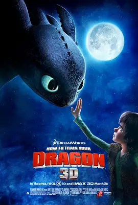

**评分**: ⭐ 8.8 (N/A)

**信息**: 导演: 迪恩·德布洛斯 Dean DeBlois / 克里斯·桑德斯 Chris Sanders   主演:...2010 / 美国 / 动画 奇幻 冒险

**剧情简介**:

维京岛国的少年小嗝嗝（杰伊•巴鲁切尔 Jay Baruchel 配音）是部落统领伟大的斯托里克（杰拉德·巴特勒 Gerard Butler 配音）的儿子，他非常想像自己的父亲一样亲手屠龙——这些飞龙是岛上维京人放牧羊群的主要天敌——但他每次出现在部落屠龙的战斗中都只给大家徒增烦恼。在一次对抗飞龙的战斗中，希卡普偷偷用射龙器击伤了一只最神秘的“夜之怒龙”，并背着族人放生、豢养，甚至驯服了这只龙，还给它起名“无牙”。希卡普的神秘行径引起了一同训练屠龙技巧的女孩阿斯特丽德（亚美莉卡·费雷拉 America Ferrera 配音）的怀疑。阿斯特丽德发现了希卡普的秘密，却同时被身骑“无牙”御风而飞的美妙体验所震撼。格雷决定在屠龙成人礼上向远征归来的斯托里克和族人讲明真相，说服大家放弃屠龙，却偏偏弄巧成拙，害得“无牙”被俘，一场更大的灾难就在眼前……

**详情**: https://movie.douban.com/subject/2353023/

---

## 129. 花样年华 / 花样年华导演特别版  /  花样年华4K修复版

**评分**: ⭐ 8.8 (N/A)

**信息**: 导演: 王家卫 Kar Wai Wong   主演: 张曼玉 Maggie Cheung / 梁朝伟 Tony Leu...2000 / 中国香港 / 剧情 爱情

**剧情简介**:

1960年代的香港，报馆编辑周慕云（梁朝伟 饰）与太太搬进一间住户多是上海人的公寓，和某家日资公司的贸易代表陈先生与太太苏丽珍（张曼玉 饰）成了邻居。因为发现各自在外工作的配偶背着他们有了婚外情，周慕云和苏丽珍开始见面商讨未来可能发生的事情以及相应对策。
                                    
                                　　起初两人是君子之交淡如水就事谈事，可是日子一日接一日过去后，在周围一帮上海邻居的闲言碎语中，他们发现配偶的事早空出了他们的脑袋，彼此眼里只剩下了对方，而刻意回避已生出的感情的结果，是更加刻骨的相思。

**详情**: https://movie.douban.com/subject/1291557/

---

## 130. 傲慢与偏见 / 傲慢与偏见2005  /  Pride And Prejudice

**评分**: ⭐ 8.7 (N/A)

**信息**: 导演: 乔·怀特 Joe Wright   主演: 凯拉·奈特莉 Keira Knightley / 马修·...2005 / 法国 英国 美国 / 剧情 爱情

**剧情简介**:

根据简·奥斯汀同名小说改编。伊丽莎白·班纳特(凯拉·奈特丽 饰)出身于小地主家庭，有四个姐妹，母亲班纳特太太整天操心着为女儿物色称心如意的丈夫。新来的邻居宾格来先生和他的朋友达西（马修·麦克菲迪恩 饰）打破了她们一家人单调的乡村生活。宾格来和伊丽莎白的姐姐简·班纳特互生情愫；达西对善良聪明的伊丽莎白产生了好感，而伊丽莎白却对达西不可一世的傲慢心存偏见，不接受他的感情。然而，世事难料，宾格来和简·班纳特因为误会，关系危在旦夕；达西的种种作为，展示了性格中和伊丽莎白相同的善良一面，逐渐赢得了伊丽莎白的好感。两对有情人能否终成眷属？班纳特姐妹们能否得到自己想要的生活？
                                    
                                　　简·奥斯汀笔下十九世纪初英国乡村生活和社会风貌，重新展现在大银幕上。

**详情**: https://movie.douban.com/subject/1418200/

---

## 131. 新世界 / 暗黑新世界(台)  /  New World

**评分**: ⭐ 8.9 (N/A)

**信息**: 导演: 朴勋政 Hoon-jung Park   主演: 李政宰 Jung-Jae Lee / 崔岷植 Min-sik...2013 / 韩国 / 剧情 犯罪

**剧情简介**:

金门集团会长、暴力组织在虎派大佬石东出遭遇车祸身亡，该事件在黑白两道引起不小震荡。为了遏制金门集团进一步向合法领域渗透并持续壮大，警方及时提出“新世界计划”，旨在干预金门集团继任大佬的选举。而围绕会长头衔，金门旗下三号人物华侨出身的丁青（黄正民 饰）和四号人物常务理事李仲久（朴圣雄 饰）展开一连串明争暗斗。在危机四伏的当下，警方姜科长（崔岷植 饰）命令卧底十年之久的李子成（李政宰 饰）左右选举结果。子成六年前和丁青结识，并且得到对方的器重和信任。早已厌倦黑道生活的子成无奈受命，却无疑将自己投入了凶险非常的黑色漩涡之中。
                                    
                                　　充满鲜血与欲望的战场，新世界何日来临？

**详情**: https://movie.douban.com/subject/10437779/

---

## 132. 完美的世界 / 强盗保镳

**评分**: ⭐ 9.1 (N/A)

**信息**: 导演: 克林特·伊斯特伍德 Clint Eastwood   主演: 凯文·科斯特纳 Kevin Cos...1993 / 美国 / 剧情 犯罪

**剧情简介**:

单亲孩子菲利普·佩里（T·J·劳瑟 T.J. Lowther 饰）的母亲对他管教甚严，8岁的小菲利普甚至从未参加过一次鬼节讨糖果的游戏。附近州监狱的两名罪犯越狱成功，劫持了菲利普作为人质，向德州边界逃窜。途中，罪犯之一的布奇（凯文·科斯特纳 Kevin Costner 饰）干掉了鲁莽愚蠢的同伙，却对小菲利普照顾有加。与此同时，德州警探瑞德（克林特·伊斯特伍德 Clint Eastwood 饰）带着手下和州长特派的犯罪专家萨利（劳拉·邓恩 Laura Dern 饰）一同火速追捕布奇。双方在德克萨斯州境内展开了一场公路赛大竞技；而小菲利普也经历了很多从未想过过的刺激与快乐，并与布奇产生了一种近似父子的不寻常感情……

**详情**: https://movie.douban.com/subject/1300992/

---

## 133. 阳光灿烂的日子 / In the Heat of the Sun

**评分**: ⭐ 8.8 (N/A)

**信息**: 导演: 姜文 Wen Jiang   主演: 夏雨 Yu Xia / 宁静 Jing Ning / 陶虹 Hong Tao1994 / 中国大陆 中国香港 / 剧情 爱情

**剧情简介**:

20世纪70年代初的北京，忙着“闹革命”大人无空理会小孩，加上学校停课无事可做，以军队大院男孩为突出代表的少年人便自找乐子，靠起哄、打架、闹事、拍婆子等方式挥霍过量的荷尔蒙。马小军（夏雨 饰）就是这样的少年，他的嗜好之一是趁别人家无人用万能钥匙将其锁打开，溜进去耍玩一番，正是用这样的方式，少女米兰（宁静 饰）的照片先于其人入了马小军的双眼。通过院里的“头儿”刘忆苦（耿乐 饰），马小军又见到之前在炮局偶然瞥见过一眼的米兰，开始正式将其当作梦中情人，然而在米兰眼中，马小军不过是毛孩一个，她中意的人是成熟、稳重、帅气的刘忆苦。自此，马小军迎来五味混杂的青春期生活。
                                    
                                　　本片改编自王朔短篇小说《动物凶猛》。夏雨凭此片获得第51届威尼斯国际电影节最佳男演员（银狮奖）。

**详情**: https://movie.douban.com/subject/1291875/

---

## 134. 小森林 夏秋篇 / 小森食光 / 夏秋篇(台)

**评分**: ⭐ 9.0 (N/A)

**信息**: 导演: 森淳一 Junichi Mori   主演: 桥本爱 Ai Hashimoto / 三浦贵大 Takahir...2014 / 日本 / 剧情

**剧情简介**:

平凡女孩市子（桥本爱 饰）自幼生长在位于日本东北地区的村庄小森。这里远离都市的喧嚣和浮躁，为青山绿水所环绕，俨然一个幽静怡然的世外桃源。村民们日出而作，日落而息，依靠一双勤劳的双手经营渺小却舒适的生活，与世无争。市子曾经前往东京闯荡，只不过她终究无法适应都市快节奏的步伐，最终回到了妈妈早已不在的老宅。童年时妈妈福子利用山川田野各种食材做出胡乱命名的美食，实心眼的市子在感叹受骗之余，也将美好的回忆留在了味蕾深处。仿佛遵循着母亲的步伐，她将对故乡的热爱融入了美食的烹制中。在朋友佑太（三浦贵大 饰）和吉子（松冈茉优 饰）的环绕下，享受着无忧无虑的人生……
                                    
                                　　本片根据五十岚大介的漫画改编。

**详情**: https://movie.douban.com/subject/25814705/

---

## 135. 一个叫欧维的男人决定去死 / 明天别再来敲门(台)  /  想死冇咁易(港)

**评分**: ⭐ 8.9 (N/A)

**信息**: 导演: 汉内斯·赫尔姆 Hannes Holm   主演: 罗夫·拉斯加德 Rolf Lassgård...2015 / 瑞典 / 剧情

**剧情简介**:

欧维（罗夫·拉斯加德 Rolf Lassgård 饰）是一个刻板而又固执的老头，他的妻子半年前死于疾病，留他一人生活在这个混乱不堪的世界之中。每天早晨，欧维都会定时在社区里进行巡视，确认所有的车辆都停在应停的位置，呵斥违反规定私自驶入社区的车辆，赶走四处乱转破坏环境的猫狗，在社区居民眼里，欧维是“来自地狱的恶邻”，可每个人都明白，这其实是欧维对于社区爱之深刻的表现。
                                    
                                　　某一日，欧维遭到了上司的解雇，离开了恪守了几十年的工作岗位，心灰意冷对现世了无牵挂的欧维决定自杀。然而，就在这个节骨眼上，一位名为帕维娜（巴哈·帕斯 Bahar Pars 饰）的女子和丈夫带着两个孩子搬到了欧维的隔壁，成为了欧维自杀计划的绊脚石。

**详情**: https://movie.douban.com/subject/26628357/

---

## 136. 天使爱美丽 / 艾蜜莉的异想世界(台)  /  天使艾米莉

**评分**: ⭐ 8.7 (N/A)

**信息**: 导演: 让-皮埃尔·热内 Jean-Pierre Jeunet   主演: 奥黛丽·塔图 Audrey Tau...2001 / 法国 德国 / 剧情 喜剧 爱情

**剧情简介**:

艾米莉（奥黛丽·塔图 Audrey Tautou 饰）有着别人看来不幸的童年——父亲给她做健康检查时，发现她心跳过快，便断定她患上心脏病，从此艾米莉与学校绝缘。随后因为一桩意外，母亲在她眼前突然死去。这一切都毫不影响艾米莉对生活的豁达乐观。
                                    
                                　　1997年，戴安娜王妃的去世让她倍感人生的孤独脆弱，艾米莉从此开始了一系列助人计划，包括自闭忧郁的邻居老人，被老板刻薄的菜摊伙计、遗失了童年器物的旧房东、爱情失意的咖啡店同事。但她万万想不到，成人录象带商店店员尼诺（马修·卡索维 Mathieu Kassovitz 饰），竟成为她的棘手对象，艾米莉开始了令人哭笑不得的另类计划……

**详情**: https://movie.douban.com/subject/1292215/

---

## 137. 玩具总动员3 / 反斗奇兵3(港)  /  玩具的故事3

**评分**: ⭐ 8.9 (N/A)

**信息**: 导演: 李·昂克里奇 Lee Unkrich   主演: 汤姆·汉克斯 Tom Hanks / 蒂姆·艾...2010 / 美国 / 喜剧 动画 奇幻 冒险

**剧情简介**:

距上一次的冒险已经过去11个年头，转眼间安迪（约翰·莫里斯 John Morris 配音）变成了17岁的阳光男孩。这年夏天，安迪即将开始大学生活，他必须将自己的房间收拾整齐留给妹妹。此前，伍迪（汤姆·汉克斯 Tom Hanks 配音）与巴斯光年（蒂姆·艾伦 Tim Allen 配音）等玩具一直期待安迪再和他们玩耍，但是随着岁月的流逝，他们被冷落在箱子里很久了。安迪十分珍惜这些童年的玩伴，于是准备将他们收在阁楼。谁曾想，妈妈却把玩具们当作废物扔到街道上。玩具们误解了安迪，于是愤然出走，宁可被捐赠到阳光之家幼儿园。
                                    
                                　　伍迪尽力劝解大家，却收效甚微，只得独自黯然离开。巴斯光年他们原本以为将重新回到往昔的快乐时光，不料却陷入一场阴谋之中……

**详情**: https://movie.douban.com/subject/1858711/

---

## 138. 怪兽电力公司 / 怪兽公司(港)  /  怪物公司

**评分**: ⭐ 8.8 (N/A)

**信息**: 导演: 彼特·道格特 Pete Docter / 大卫·斯沃曼 David Silverman   主演: 约...2001 / 美国 / 儿童 喜剧 动画 奇幻 冒险

**剧情简介**:

我们不知道，在那样的世界里住着那样一群怪物。他们长相滑稽，却必须装作狰狞。因为，在夜深的时候，他们要悄悄的出现在孩子的衣橱里，吓唬刚刚甜美睡去的宝宝。一切，只因为他们是怪物电力公司的员工，而孩子的尖叫，则是怪物王国发电的全部能量。怪物们害怕孩子，却又必须让孩子尖叫。在怪物的国度里，他们都是为全民造福的英雄。
                                        
                                    　　毛怪苏利文（约翰•古德曼）是怪物公司最出色的员工，业绩总是摇摇领先，他吓哭的小孩儿不计其数。他与搭档大眼怪麦克（比利•克里斯托）很受大家的爱戴。一次偶然，毛怪不小心把一个两岁的小女孩阿布（玛丽•吉布斯）带回了怪物世界，引起了极大的恐慌，调皮可爱的阿布把这些可怕的怪物吓的人仰马翻。警方在追捕阿布，而坏蛋亨利（詹姆斯•柯博）也计划利用阿布进行他改革工厂的邪恶计划。
                                        
                                    　　另一方面，在与阿布相处的过程中，毛怪渐渐对她产生莫名的情愫，甚至因此被放逐野外。可是一...

**详情**: https://movie.douban.com/subject/1291579/

---

## 139. 色，戒 / 色|戒  /  色·戒

**评分**: ⭐ 8.7 (N/A)

**信息**: 导演: 李安 Ang Lee   主演: 梁朝伟 Tony Leung Chiu Wai / 汤唯 Wei Tang / ...2007 / 中国台湾 中国大陆 美国 中国香港 / 剧情 爱情 情色

**剧情简介**:

本是岭南大学学生的王佳芝（汤唯 饰）因战争辗转到了香港读书，她在香港大学加入了爱国青年邝裕民（王力宏 饰）组织的话剧组，他们主演的爱国话剧更激起了他们的爱国情操。当邝裕民得知汪伪政府的特务头子易先生（梁朝伟 饰）正在香港的时候，他们便密谋要刺杀易先生。化名“麦太太”的王佳芝很快得到了易太太（陈冲 饰）的信任与喜爱，同时美丽的“麦太太”也吸引了易先生的眼球，正当事情进行得如火如荼之际，易先生突然要回到上海去。
                                    
                                　　此后王佳芝一直生活在上海，没想到重遇了邝裕民。当得知刺杀行动还没结束时，王佳芝再次成为了特务，再次以“麦太太”的身份出现在易先生的面前。
                                    
                                　　重逢后的二人关系进一步发展，此时的易先生因爱上了王佳芝而对她毫无忌讳，王佳芝的内心也变得起伏不定。刺杀行动进行正顺利，但当易先生送给王佳芝璀璨钻戒表达爱意时，王佳芝做出了惊人的决定……

**详情**: https://movie.douban.com/subject/1828115/

---

## 140. 侧耳倾听 / 心之谷(台)  /  梦幻街少女(港)

**评分**: ⭐ 8.9 (N/A)

**信息**: 导演: 近藤喜文 Yoshifumi Kondo   主演: 本名阳子 Youko Honna / 小林桂树 K...1995 / 日本 / 剧情 爱情 动画

**剧情简介**:

正在读初三的月岛雯是一个喜欢看书的女孩，她每次都能在借书卡上看到一个叫天泽圣司名字，因此她对这个人充满了好奇。 雯一直喜欢写诗，有一天她跟好友夕子在讨论写诗的事，夕子告诉雯自己收到了情书，但事实上夕子已有了喜欢的人。更没有想到的是，夕子喜欢的杉村喜欢的是雯，雯一时间感到十分困惑。 雯无意中来到了一个小店，原来店主是圣司的爷爷。认识了圣司之后，听到了圣司对自己理想的追求之后，也激发了雯对自己理想的追求之念。当圣司离开了到意大利学习做小提琴时，雯决定要专心写作。当雯完成了作品之后，她发现原来自己高估了自己，就这样她选择继续考高中，这时她非常想念圣司。 一天凌晨，她站到窗边，突然看到了一个熟悉的身影……

**详情**: https://movie.douban.com/subject/1297052/

---

## 141. 教父3 / 教父第三集  /  教父 III

**评分**: ⭐ 9.0 (N/A)

**信息**: 导演: 弗朗西斯·福特·科波拉 Francis Ford Coppola   主演: 阿尔·帕西诺 A...1990 / 美国 / 剧情 犯罪

**剧情简介**:

转眼间已经是1979年，第二代教父麦克•柯里昂（阿尔•帕西诺 饰）到了垂暮之年，为了灵魂的救赎，麦克慢慢结束家族的黑道事业，转投正当生意。
                                    
                                　　麦克的儿子托尼酷爱艺术，无意接手家族事业，迈克尔决定让大哥逊尼的私生子，火爆好色的文森（安迪•加西亚 饰）继承家业，当第三代教父。麦克的爱女玛丽（索菲娅•科波拉 饰）和文森相恋，遭到父亲的反对，父女渐渐疏远。
                                    
                                　　为了使家族资产合法化，麦克通过在梵蒂冈教廷的关系网，准备投资“屹立”集团，却遭到敌人的暗中阻挠，教皇的去世也让事情更加扑朔迷离。
                                    
                                　　麦克无奈之下，只能重新选择用暴力解决问题，他的亲人也被卷入了这场血雨腥风。

**详情**: https://movie.douban.com/subject/1294240/

---

## 142. 请以你的名字呼唤我 / 以你的名字呼唤我(港 / 台)

**评分**: ⭐ 8.8 (N/A)

**信息**: 导演: 卢卡·瓜达尼诺 Luca Guadagnino   主演: 艾米·汉莫 Armie Hammer / ...2017 / 意大利 法国 巴西 美国 / 剧情 爱情 同性

**剧情简介**:

故事发生在八十年代的意大利里维埃拉，每年夏天，十七岁的少年艾力奥（提莫西·查拉梅 Timothée Chalamet 饰）都会跟家人一起来此地度假。今年，和他们共享假日时光的，还有来自美国的奥利弗（艾米·汉莫 Armie Hammer 饰），高大英俊热情开朗的奥利弗很快就获得了艾力奥一家人的喜爱。
                                    
                                　　随着时间的推移，艾力奥和奥利弗之间渐渐产生了致命的吸引力，但性别和年龄的桎梏让他们迟迟无法跨出那关键的一步，与此同时，单纯善良的少女马奇娅（艾斯特·加莱尔 Esther Garrel 饰）也向艾力奥奉献着自己的感情和身体。最终，汹涌的激情冲破了艾力奥和奥利弗之间的防线，两人开始了一段注定不会有结果的恋情。

**详情**: https://movie.douban.com/subject/26799731/

---

## 143. 哪吒闹海 / Prince Nezha's Triumph Against Dragon King  /  Nezha Conquers the Dragon King

**评分**: ⭐ 9.2 (N/A)

**信息**: 导演: 王树忱 Shuchen Wang / 严定宪 Dingxian Yan   主演: 梁正晖 Zhenghui ...1979 / 中国大陆 / 冒险 动画 奇幻

**剧情简介**:

商末时期，陈塘关总兵李靖的夫人怀胎3年6个月，最终生下一个肉球，肉球中跳出一个伶俐可爱的男孩。李靖原当他是妖孽欲杀之而后快，幸太乙真人前来收之为徒，赐名哪吒，并赐以乾坤圈和混天绫两件宝贝。某年，天下大旱，甘露未降。哪吒和家将到东海洗澡玩耍。他用混天绫搅动海水，撼动龙宫，惹出巡海夜叉李艮和龙王三太子敖丙。几番言语不和，哪吒杀此二人，由此闯下通天大祸。四海龙王齐聚陈塘关索命，为救一方百姓，哪吒决定交出生命……
                                    
                                　　本片根据《封神演义》故事改编，并荣获1980年电影百花奖最佳美术片奖；文化部1979年优秀影片奖、青年优秀创作奖；1983年菲律宾马尼拉国际电影节特别奖；1988年法国布尔波拉斯文化俱乐部青年国际动画电影节评委奖和宽银幕长动画片奖。

**详情**: https://movie.douban.com/subject/1307315/

---

## 144. 幸福终点站 / 机场客运站(港)  /  航站情缘(台)

**评分**: ⭐ 8.8 (N/A)

**信息**: 导演: 史蒂文·斯皮尔伯格 Steven Spielberg   主演: 汤姆·汉克斯 Tom Hanks...2004 / 美国 / 喜剧 剧情 爱情

**剧情简介**:

为了完成父亲的心愿，维克多（汤姆•汉克斯 Tom Hanks 饰）从故国乘坐飞机前往美国肯尼迪机场，但戏剧性的事情发生了：他被告知祖国发生政变，而他的身份证护照一一失效，同时他的签证也无法再使用。进退两难的维克多只有在机场滞留，等待新证件的办理。
                                    
                                　　但是，他在机场等待了整整9个月。在这9个月里面，他用机场的洗手间洗漱，在候机室睡觉，他已经学懂因地制宜，在机场照料自己的生活，甚至还找了一份建筑工地工作。然而维克多的邋遢晦气却招来了机场负责人弗兰克（史坦利•图齐 Stanley Tucci 饰）的不满，而恐怕更令他气愤妒忌的是，美丽的空姐艾米利亚（凯瑟琳•泽塔-琼斯 Catherine Zeta-Jones 饰）竟然爱上了维克多。处在甜蜜中的维克多，也在慢慢观察机场的人生百态，自得其乐。

**详情**: https://movie.douban.com/subject/1292274/

---

## 145. 九品芝麻官 / 九品芝麻官之白面包青天  /  Hail the Judge

**评分**: ⭐ 8.8 (N/A)

**信息**: 导演: 王晶 Jing Wong   主演: 周星驰 Stephen Chow / 吴孟达 Man Tat Ng / ...1994 / 中国香港 / 剧情 喜剧 古装

**剧情简介**:

包龙星（周星驰 饰）用钱买来了一个候补知县的职位，可是为人贪婪，县上的人都对他痛恨之极。在他代替正式知县的时候，戚家媳妇戚秦氏（张敏 饰）遭到了常威( 邹兆龙 饰 )的强暴，后来常威动了杀机把戚家上下都杀害了，更嫁祸于戚秦氏。常威是水师提督大人的儿子，请来大状方唐镜（吴启华 饰），收买了所有证人以便洗脱罪名。包龙星虽然极力寻找证据，也被迫害至落难他乡。他决定要上京告御状，后来他因没钱不得不在妓院打工，向老板娘学习了一身斗嘴的好功夫。他在妓院里误打误撞认识了皇上，帮助皇上有功他被封了大官，重审戚家被害的案件。他凭着聪慧与口才，全力为戚秦氏讨回公道。

**详情**: https://movie.douban.com/subject/1297518/

---

## 146. 被解救的姜戈 / 被解放的姜戈  /  决杀令(台)

**评分**: ⭐ 8.8 (N/A)

**信息**: 导演: 昆汀·塔伦蒂诺 Quentin Tarantino   主演: 杰米·福克斯 Jamie Foxx /...2012 / 美国 / 剧情 动作 西部 冒险

**剧情简介**:

1858年，美国南北战争前两年。德国赏金猎人金·舒尔茨（克里斯托弗·瓦尔兹 Christoph Waltz饰）从贩奴商人手中买下黑奴姜戈（杰米·福克斯 Jamie Foxx饰），让其重获自由。舒尔茨实则是要把姜戈培养成无法无天的赏金猎人，为其缉拿各种通缉犯以换取报酬。姜 戈的唯一条件是：从暴虐的糖果庄园主卡尔文·坎迪（莱昂纳多·迪卡普里奥 Leonardo DiCaprio饰）手中解救出自己的妻子布鲁姆希尔达（凯丽·华盛顿 Kerry Washington饰）。本片是昆汀向1966年由塞吉奥·考布西执导的经典意大利西部片《迪亚戈》的致敬之作。
                                        
                                    　　鬼才导演痞子昆丁三年磨一剑，继《无耻混蛋》后又一巨制力作。本片延续昆汀一贯低调奢华的风格，处处可见奇思妙想的幽默元素和血腥野性的动作场面，更有强档群戏，豪华卡司，可谓看点十足。
                                        
                                    　　《被解放的姜戈》荣获第85届奥斯...

**详情**: https://movie.douban.com/subject/6307447/

---

## 147. 釜山行 / 尸杀列车(港)  /  尸速列车(台)

**评分**: ⭐ 8.6 (N/A)

**信息**: 导演: 延尚昊 Sang-ho Yeon   主演: 孔刘 Yoo Gong / 郑有美 Yu-mi Jung / 马...2016 / 韩国 / 动作 惊悚 灾难

**剧情简介**:

证券公司基金管理人石宇（孔刘 饰）光鲜精干，却也是个重利轻义之徒。妻子为此与之决裂，女儿秀安（金秀安 饰）则对如此自私的父亲越来越失望，决定前往釜山和母亲生活。在秀安生日这天，石宇抽出时间陪伴女儿登上开往釜山的特快列车。而与此同时，城市四处出现了极为可疑的暴动事件。政府 极力洗白无法掩盖丧尸肆虐的事实，即便懵然无知的列车乘客也因为不速之客的到来而堕入恐慌绝望的地狱中。开车的刹那，一名感染者冲入车厢，而她很快尸变并对目光所及之处的健康人展开血腥屠杀。未过多久，丧尸便呈几何数爆发性地增长。石宇被迫和幸存者的乘客们在逼仄的空间中奋力求生。
                                    
                                　　通往釜山的遥遥旅途布满杀机，危难时刻每个幸存者的人性也承受巨大的考验……

**详情**: https://movie.douban.com/subject/25986180/

---

## 148. 小森林 冬春篇 / 小森食光 / 冬春篇(台)

**评分**: ⭐ 9.0 (N/A)

**信息**: 导演: 森淳一 Junichi Mori   主演: 桥本爱 Ai Hashimoto / 三浦贵大 Takahir...2015 / 日本 / 剧情

**剧情简介**:

于无法融入喧嚣吵闹的大城市，平凡女孩市子（桥本爱 饰）选择回到自幼生长的老家——位于日本东北地区的小森村。这里没有过多时尚文明的色彩，当地人过着日出而作日落而息的传统生活，他们靠天吃饭，靠着双手经营人生。生活虽不富裕，心中则是满满的充实和欢喜。受妈妈（桐島かれん 饰） 影响，市子似乎对亲手制作各种美味而廉价的料理有着格外浓厚的兴趣。妈妈失踪已经很久，对料理的回忆与再现成为母女间别具特色的交流方式。更何况还有取自大自然的各种食材，又怎能暴殄天物浪费了大好的韶光？在好友纪子（松冈茉优 饰）和裕太（三浦贵大 饰）的陪伴下，市子静静地走过了春夏秋冬……
                                    
                                　　本片根据漫画家五十岚大介的原作改编。

**详情**: https://movie.douban.com/subject/25814707/

---

## 149. 神偷奶爸 / 卑鄙的我  /  坏蛋奖门人(港)

**评分**: ⭐ 8.7 (N/A)

**信息**: 导演: 皮艾尔·柯芬 Pierre Coffin / 克里斯·雷纳德 Chris Renaud   主演: ...2010 / 美国 法国 / 喜剧 动画 冒险

**剧情简介**:

超级坏蛋格鲁（史蒂夫·卡瑞尔 Steve Carell 配音）在听说埃及金字塔被盗的新闻后不满市面上新贼辈出，决定在纳法利欧博士（拉塞尔·布兰德 Russell Brand 配音）的帮助下建造火箭升空盗取月亮。在向坏蛋银行贷款的过程中，格鲁盗取的收缩射线枪被新贼维克托（杰森·席格尔 Jason Segel 配音）抢走。为了夺回收缩射线枪，格鲁决定领养三位孤儿——玛戈（米兰达·卡斯格拉夫 Miranda Cosgrove 配音）、伊迪丝（达娜·盖伊 Dana Gaier 配音）和阿格蕾丝（埃尔希·费舍 Elsie Fisher 配音），利用她们进入维克托的城堡兜售饼干的机会实施偷盗，计划成功后再偷偷处理掉三个小孩。然而在平凡的日常相处中，格鲁却发现自己越来越离不开这三个小鬼，但这样的感情用事却将严重影响周密的盗月计划……

**详情**: https://movie.douban.com/subject/3287562/

---

## 150. 萤火之森 / 萤火之社  /  Hotarubi no mori e

**评分**: ⭐ 8.8 (N/A)

**信息**: 导演: 大森贵弘 Takahiro Omori   主演: 佐仓绫音 Ayane Sakura / 内山昂辉 K...2011 / 日本 / 剧情 爱情 动画 奇幻

**剧情简介**:

某年夏天，6岁小女孩竹川萤来到爷爷家度假，她闯进了传说住满妖怪的山神森林。正当她因为迷路而焦急万分的时候，一个戴着狐狸面具的大男孩出现在她面前，并引领着萤找到回家的路。虽然萤分外感激，可是男孩却禁止她碰触自己的身体，原来这名叫银的男孩并非人类，他一旦被人类碰触就会烟消云散。在此后的日子里，萤和银成为好朋友，他们走遍了森林的每一个角落玩耍。日复一日，年复一年，每到夏天的时候萤就会如约来到森林和好朋友见面。她遵守着和银的约定，无论如何也不碰触银的身体。随着年龄的增长，萤和银对彼此的情感都悄悄发生了变化，他们共同期待相聚的日子，共同期待拥抱对方……
                                    
                                　　本片根据绿川幸的原作改编。

**详情**: https://movie.douban.com/subject/5989818/

---

## 151. 喜宴 / The Wedding Banquet

**评分**: ⭐ 9.0 (N/A)

**信息**: 导演: 李安 Ang Lee   主演: 赵文瑄 Winston Chao / 归亚蕾 Ya-lei Kuei / 郎...1993 / 中国台湾 美国 / 剧情 喜剧 爱情 同性 家庭

**剧情简介**:

伟同（赵文瑄 饰）是事业有成的男同志，与男友赛门（米切尔·利希藤斯坦 饰）在美国过着幸福的同居日子，烦恼来自要用各种招数应对远在台北的父（郎雄 饰）母（归亚蕾 饰）的一次次逼婚。伟同被逼以“乖乖仔”形象修书一封声称会在美国结婚，没料父母想亲眼见证。无奈，他只得拉上来自上海的不得志的女艺术家葳葳（金素梅 饰）“假婚”，想逃过一劫。
                                    
                                　　父母对葳葳相当满意，却对伟同的草率态度不满，为让父母满意尽快返回台北，伟同犹如“拼命三郎”使出了浑身解数。但人算不如天算，不断的波折使得父母的返台日期一次次推迟，令他和赛门的感情亮起“红灯”，而葳葳又意外怀上了他的孩子。似乎，伟同在强大的父母（传统）面前，只能选择去做一个 “表面正常”的男人

**详情**: https://movie.douban.com/subject/1303037/

---

## 152. 告白 / 自白  /  母亲

**评分**: ⭐ 8.8 (N/A)

**信息**: 导演: 中岛哲也 Tetsuya Nakashima   主演: 松隆子 Takako Matsu / 冈田将生 ...2010 / 日本 / 剧情 悬疑

**剧情简介**:

一所平凡的中学，1年B组即将迎来春假。不知天高地厚的学生们肆意吵闹，殊不知一场绵亘数月的风暴正向他们袭来。级任教师森口悠子（松隆子 饰）全然无视这片混乱，静静地向学生们做出最后的告白。这个单亲妈妈独自抚养着可爱的女儿（芦田爱菜 饰），然而女儿最终在游泳池中溺水身亡。警察 认定这是一起意外，森口则认定女儿死于班上两个学生之手。她不动声色地指责着犯人A和B，并宣布用自己的方式进行复仇。在此之后，森口辞去教师职务，1年B班的学生也心怀惴惴迎来了春假。新学期开始，残酷的风暴袭向了这群无知无畏的少男少女……
                                    
                                　　本片根据湊かなえ的原作改编，并成为2010年电影旬报十佳影片；第34届日本电影学院奖最佳作品、最佳导演、最佳剧本和最佳剪辑4项大奖。

**详情**: https://movie.douban.com/subject/4268598/

---

## 153. 玛丽和麦克斯 / 玛丽和马克思  /  巧克力情缘(台)

**评分**: ⭐ 9.0 (N/A)

**信息**: 导演: 亚当·艾略特 Adam Elliot   主演: 托妮·科莱特 Toni Collette / 菲利...2009 / 澳大利亚 美国 / 剧情 喜剧 动画

**剧情简介**:

1976年，8岁的玛丽·黛西·丁格尔（贝丝妮·惠特摩尔 Bethany Whitmore 配音）是澳大利亚墨尔本的一个小女孩，喜欢动画片“诺布利特”、甜炼乳和巧克力。玛丽的妈妈是个酒鬼，而在茶叶包装厂工作的父亲平日只喜欢制作鸟标本。孤独的玛丽没有朋友，某一天心血来潮给美国纽约市的马克思·杰瑞·霍罗威茨（菲利普·塞默·霍夫曼 Philip Seymour Hoffman 配音）写了一封信询问美国小孩从哪里来，并附上一根樱桃巧克力棒。44岁的马克思患有自闭症及肥胖，碰巧也喜欢看“诺布利特”动画片及吃巧克力。二人的笔友关系从1976年维持到1994年，期间各自经历了许多人生起伏，直到成年的玛丽（托妮·科莱特 Toni Collette 配音）终于来到纽约看望马克思……
                                        
                                    　　本片获2009年法国昂锡国际动画影展最佳动画长片奖，柏林国际电影节水晶熊奖及渥太华国际动...

**详情**: https://movie.douban.com/subject/3072124/

---

## 154. 七武士 / 七侠四义(港)  /  七剑客(港)

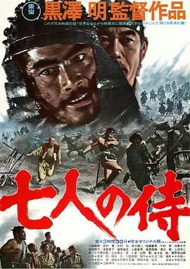

**评分**: ⭐ 9.3 (N/A)

**信息**: 导演: 黑泽明 Akira Kurosawa   主演: 三船敏郎 Toshirô Mifune / 志村乔 ...1954 / 日本 / 动作 冒险 剧情

**剧情简介**:

日本战国时代，一小山村面临着山贼的威胁，为了保护秋天的收成，村中长老决定让去请武士来保护村子安全，但只能拿出的报酬是一天三顿的白米饭。在城里，他们遭到了武士白眼甚至被打。直到勘兵卫（志村乔饰）的出现，他现今已沦为浪人，几经考虑最后答应了。他对农民说至少需要七名武士，于是久藏（宫口精二饰）、胜四郎（木村功饰）、五郎（稻叶义男饰）、七郎（加东大介饰）、平八（千秋实饰）和菊千代（三船敏郎饰）等六人也加入了队伍，七个人肩负保卫村子的任务。
                                    
                                　　整个防御准备的过程中，武士与农民间发生许多摩擦也闹出不少笑话。而在一次偷袭行动中，有武士为救农民被火枪打死，很快山贼的反扑随之而来，一场恶战即将开始。

**详情**: https://movie.douban.com/subject/1295399/

---

## 155. 头号玩家 / 玩家一号  /  挑战者1号(港)

**评分**: ⭐ 8.6 (N/A)

**信息**: 导演: 史蒂文·斯皮尔伯格 Steven Spielberg   主演: 泰伊·谢里丹 Tye Sheri...2018 / 美国 / 动作 科幻 冒险

**剧情简介**:

故事发生在2045年，虚拟现实技术已经渗透到了人类生活的每一个角落。詹姆斯哈利迪（马克·里朗斯 Mark Rylance 饰）一手建造了名为“绿洲”的虚拟现实游戏世界，临终前，他宣布自己在游戏中设置了一个彩蛋，找到这枚彩蛋的人即可成为绿洲的继承人。要找到这枚彩蛋，必须先获得三把钥匙，而寻找钥匙的线索就隐藏在詹姆斯的过往之中。
                                    
                                　　韦德（泰尔·谢里丹 Tye Sheridan 饰）、艾奇（丽娜·维特 Lena Waithe 饰）、大东（森崎温 饰）和修（赵家正 饰）是游戏中的好友，和之后遇见的阿尔忒弥斯（奥利维亚·库克 Olivia Cooke 饰）一起，五人踏上了寻找彩蛋的征程。他们所要对抗的，是名为诺兰索伦托（本·门德尔森 Ben Mendelsohn 饰）的大资本家。

**详情**: https://movie.douban.com/subject/4920389/

---

## 156. 模仿游戏 / 解码游戏(港)  /  模拟游戏

**评分**: ⭐ 8.8 (N/A)

**信息**: 导演: 莫滕·泰杜姆 Morten Tyldum   主演: 本尼迪克特·康伯巴奇 Benedict C...2014 / 英国 美国 / 剧情 传记 战争 同性

**剧情简介**:

二战期间，盟军苦于德国的秘密系统“英格玛”无法破译，政府召集了一批民间数学家、逻辑学家进行秘密破解工作，图灵（本尼迪克特·康伯巴奇 Benedict Cumberbatch 饰）就是其中之一。计划刚开始图灵遭到了以休（马修·古迪 Matthew Goode）为首的组员和 领导的排斥，幸好军情处部长孟席斯（马克·斯特朗 Mark Strong 饰）帮助他立项研究破译密码的机器，而图灵则变成了负责人，招收了新的成员琼（凯拉·奈特莉 Keira Knightley）开始了艰难的工作。琼很快就迷上了图灵，由于她的帮助所有组员空前的团结，并于两年后成功破解德军的密码。图灵一度与琼订婚，但实际上他隐瞒了一个秘密，因为这个秘密他也遭受了非人的待遇……
                                    
                                　　本片改编自安德鲁·霍奇斯编著的《艾伦·图灵传》，上映后获得了第87届奥斯卡最佳改编剧本奖。

**详情**: https://movie.douban.com/subject/10463953/

---

## 157. 大鱼 / 大鱼奇缘(港)  /  大智若鱼(台)

**评分**: ⭐ 8.8 (N/A)

**信息**: 导演: 蒂姆·波顿 Tim Burton   主演: 伊万·麦克格雷格 Ewan McGregor / 阿...2003 / 美国 / 剧情 爱情 奇幻 冒险

**剧情简介**:

爱德华（伊万·麦克格雷格 Ewan McGregor 饰）生性热爱自由，成年之后，他选择离开家乡，踏上了环游世界的旅程。一路上，爱德华遇见了各种各样稀奇古怪的角色，经历了无数精彩绝伦的的冒险，而他日后最大的兴趣，就是向他人喋喋不休的重复讲述他的这一段奇幻旅程。
                                    
                                　　威尔（比利·克鲁德普 Billy Crudup 饰）是爱德华的儿子，他并不相信父亲所讲述的那些光怪陆离的故事，甚至对此感到无比厌烦。婚后，他同父亲中断了联系，一晃眼就是数年过去。当再次得到爱德华的消息之时，威尔才知道父亲即将不久于人世，他决定去见爱德华最后一面。然而，这一次，威尔终于发现了隐藏在这些故事背后的奥秘和真相。

**详情**: https://movie.douban.com/subject/1291545/

---

## 158. 惊魂记 / 精神病患者  /  触目惊心(港)

**评分**: ⭐ 9.0 (N/A)

**信息**: 导演: 阿尔弗雷德·希区柯克 Alfred Hitchcock   主演: 安东尼·博金斯 Antho...1960 / 美国 / 悬疑 惊悚 恐怖

**剧情简介**:

年轻的马里恩·克兰（珍妮特·利 饰）在Phoenix工作，深受老板洛厄里（沃恩·泰勒 饰）信任。男友萨姆·卢米斯（约翰·加文 饰）在Fairvale经营一家五金店，因要替亡父还债又要支付前妻赡养费而无力再婚，只能借出差的机会偶尔来与马里恩幽会。马里恩对此感到不满，于是在周五下午趁机携四万美元公款驾车潜逃。可是马里恩的潜逃之路并不顺利：先是在出城的时候被洛厄里目击，周六一大早又被警察怀疑。花了七百美元以旧车换新车之后，马里恩继续忐忑地行驶。入夜后，天降大雨，视线模糊，无法行驶，马里恩只得将车泊入路边的贝茨汽车旅馆投宿。老板诺尔曼（安东尼·珀金斯 饰）十分友善，试图邀请马里恩到家里共进晚餐，可惜被凶恶的母亲粗暴阻止，只得将晚餐端至旅馆客厅。马里恩在客厅一边进餐一边与诺尔曼交谈，终于决定周日返回Phoenix。用餐完毕，马里恩回房沐浴。这时，一个老妇的身影...

**详情**: https://movie.douban.com/subject/1293181/

---

## 159. 射雕英雄传之东成西就 / 东成西就  /  大英雄 (日本)

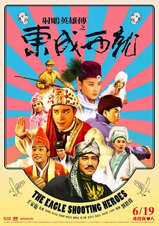

**评分**: ⭐ 8.7 (N/A)

**信息**: 导演: 刘镇伟 Jeffrey Lau   主演: 梁朝伟 Tony Leung Chiu Wai / 林青霞 Bri...1993 / 中国香港 / 喜剧 奇幻 武侠 古装

**剧情简介**:

金轮国王妃（叶玉卿 饰）与表哥欧阳锋（梁朝伟 饰）有染，为霸占江山，他们毒死了国王，但没找到传国玉玺。得知玉玺在前往九宫山找寻其师父求助的三公主（林青霞 饰）手里后，欧阳锋企图抢到手但没成功。糊涂国师（张曼玉 饰）在淫威下屈服，查出三公主的具体下落，欧阳锋乘火箭金靴追赶 ，却误脱落一只插死刚出关的王重阳（钟镇涛 饰），奄奄一息的王重阳恳求适逢路过的三公主找到其师弟周伯通（刘嘉玲 饰）代为报仇。逃到九宫山的三公主邀得师弟黄药师（张国荣 饰）与师妹（王祖贤 饰）相助，再加上前来寻找表妹的洪七（张学友 饰）、找到真心人才能成仙的段智兴（梁家辉 饰），一场与欧阳锋的生死恶战蓄势待发……

**详情**: https://movie.douban.com/subject/1316510/

---

## 160. 血战钢锯岭 / 钢锯岭  /  钢铁英雄(台)

**评分**: ⭐ 8.7 (N/A)

**信息**: 导演: 梅尔·吉布森 Mel Gibson   主演: 安德鲁·加菲尔德 Andrew Garfield /...2016 / 澳大利亚 美国 / 剧情 传记 历史 战争

**剧情简介**:

1945年，第二次世界大战接近尾声，作为邪恶轴心重要成员的日本，其嚣张态势已成强弩之末。是年，决定战局走向的冲绳岛战役拉开序幕，成千上万斗志昂扬的美国大兵被派往冲绳，等待他们的则是敌军重兵防守、凶险异常的钢锯岭。在这群人中间，却有一个不愿拿起武器的军医。他名叫戴斯蒙德·道斯（安德鲁·加菲尔德 Andrew Garfield 饰），来自美国的弗吉尼亚。太平洋爆发之际，瘦弱的戴斯蒙德志愿成为救死扶伤的军医而应征入伍。可因童年和家庭的原因，他始终不愿拿起枪支操练，为此宁愿背上拒服兵役的罪名被送上军事法庭。几经周折，戴斯蒙德最终和战友来到了钢锯岭。枪林弹雨，转瞬之间无数人应声倒地。在信仰和信念的支持下，戴斯蒙德仅凭一己之力拯救了数十条濒死的生命……
                                    
                                　　本片根据真人真事改编。

**详情**: https://movie.douban.com/subject/26325320/

---

## 161. 你的名字。 / 你的名字  /  君之名

**评分**: ⭐ 8.5 (N/A)

**信息**: 导演: 新海诚 Makoto Shinkai   主演: 神木隆之介 Ryûnosuke Kamiki / 上...2016 / 日本 / 剧情 爱情 动画

**剧情简介**:

在远离大都会的小山村，住着巫女世家出身的高中女孩宫水三叶（上白石萌音 配音）。校园和家庭的原因本就让她充满烦恼，而近一段时间发生的奇怪事件，又让三叶摸不清头脑。不知从何时起，三叶在梦中就会变成一个住在东京的高中男孩。那里有陌生的同学和朋友，有亲切的前辈和繁华的街道，一切都是如此诱人而真实。另一方面，住在东京的高中男孩立花泷（神木隆之介 配音）则总在梦里来到陌生的小山村，以女孩子的身份过着全新的生活。许是受那颗神秘彗星的影响，立花和三叶在梦中交换了身份。他们以他者的角度体验着对方的人生，这期间有愤怒、有欢笑也有暖心。只是两人并不知道，身份交换的背后隐藏着重大而锥心的秘密……
                                    
                                　　本片为2016年度日本本土影片票房冠军。

**详情**: https://movie.douban.com/subject/26683290/

---

## 162. 我是山姆 / 不一样的爸爸(港)  /  他不笨，他是我爸爸(台)

**评分**: ⭐ 9.0 (N/A)

**信息**: 导演: 杰茜·尼尔森 Jessie Nelson   主演: Sean Penn / Dakota Fanning / Mi...2001 / 美国 / 剧情 家庭

**剧情简介**:

在星巴克工作的山姆（西恩•潘 Sean Penn 饰），虽已成人，但智力水平只有7岁。一次偶然，他收留了一个流浪女。该女子帮山姆生下了一个女儿后消失得无影无踪。
                                    
                                　　他给女儿取名叫露西（达科塔•范宁 Dakota Fanning 饰），因为他最喜欢甲壳虫乐队的《天空中戴钻石 的露西》。他非常疼爱自己的孩子。露西在山姆的细心呵护下慢慢地长大了，她发现爸爸不能看懂稍微复杂一些的故事。她在拒绝长大，希望和爸爸一样。父女俩的生活是那么幸福。
                                    
                                　　地区的教育官员发现了这个特殊的家庭，他们认为山姆没有能力照顾露西，于是把露西带走了。
                                    
                                　　伤心极了的山姆一心要挣回露西的抚养权，于是他自以为是的去找该地区最好的律师……

**详情**: https://movie.douban.com/subject/1306861/

---

## 163. 背靠背，脸对脸 / 背对背，脸对脸  /  Back to Back, Face to Face

**评分**: ⭐ 9.5 (N/A)

**信息**: 导演: 黄建新 Jianxin Huang / 杨亚洲 Yazhou Yang   主演: 牛振华 Zhenhua N...1994 / 中国大陆 中国香港 / 剧情

**剧情简介**:

王双立（牛振华 饰）是某地文化馆的代馆长，这个馆长一代就是好几年，想升也升不上去，却也没有其他变动。不料一天，来了新的文化馆长老马（雷恪生 饰），这让王双立离正馆长的距离更远了。新馆长老马原是个副乡长，王双立认为他是个土包子，心里很是不以为然，利用自己对文化馆人际关系熟 悉的优势，想方设法给老马出难题。经过几轮较量，老马终于被挤走，王双立又成了代馆长，再次受领导重用，岂料，螳螂捕蝉黄雀在后，秘书小阎（李强 饰）成了新一任馆长。王双立不甘心，再次和小阎斗法，想将对方挤走，这次王双立还能如愿与偿吗？
                                    
                                　　电影《背靠背，脸对脸》获得第二届大学生电影节最佳故事片和最佳男主角奖、东京国际电影节最佳男主角奖、第15届金鸡奖最佳导演和最佳合作片奖、第14届香港电影金像奖十大华语片。

**详情**: https://movie.douban.com/subject/1307856/

---

## 164. 阳光姐妹淘 / 阳光姊妹淘(港)  /  桑尼

**评分**: ⭐ 8.8 (N/A)

**信息**: 导演: 姜炯哲 Hyeong-Cheol Kang   主演: 沈恩京 Eun-kyung Shim / 闵孝琳 Hy...2011 / 韩国 / 剧情 喜剧

**剧情简介**:

25年前，高中生任娜美（沈恩京 饰）一家从全罗道搬到汉城，娜美入读真德女子高中，因方言浓重怯于开口的娜美幸运的得到了同班大姐头夏春花（姜索拉 饰）的维护，并与围绕在夏春花周围的执着于双眼皮的金玫瑰、满嘴脏话的黄珍熙、梦想成为作家的徐金玉、要成为韩国小姐的俞福姬以及沉默傲慢的美人郑秀智等五人结识。在一次和不良少女团对决之后，春花和娜美等七人组成了“Sunny”团体……
                                    
                                　　多年以后，家庭主妇娜美在去医院探望母亲时偶然重逢了身患绝症住院的春花，后者希望在生命的最后两个月内，能够再见当年的Sunny成员。娜美找到金玫瑰，两人委托私家侦探寻找当年的同伴，而那些关于青春的回忆，也在一个个熟悉的名姓后面再次被唤醒。

**详情**: https://movie.douban.com/subject/4917726/

---

## 165. 心灵奇旅 / 灵魂奇遇记(港)  /  灵魂急转弯(台)

**评分**: ⭐ 8.7 (N/A)

**信息**: 导演: 彼特·道格特 Pete Docter / 凯普·鲍尔斯 Kemp Powers   主演: 杰米·...2020 / 美国 / 动画 奇幻 音乐

**剧情简介**:

究竟是什么塑造了真正的你？电影将聚焦乔伊·高纳（杰米·福克斯配音）。这位中学音乐老师获得了梦寐以求的机会——在纽约最好的爵士俱乐部演奏。但一个小失误把他从纽约的街道带到了一个奇幻的地方“生之来处”（the Great Before）。在那里，灵魂们获得培训，在前往地球之前将获得他们的个性特点和兴趣。决心要回到地球生活的乔伊认识了一个早熟的灵魂“二十二”（蒂娜·菲 配音），二十二一直找不到自己对于人类生活的兴趣。随着乔伊不断试图向二十二展示生命的精彩之处，他也将领悟一些人生终极问题的答案。

**详情**: https://movie.douban.com/subject/24733428/

---

## 166. 恐怖直播 / 死亡“动”新闻(港)  /  恐怖攻击直播(台)

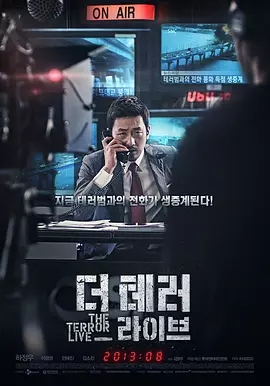

**评分**: ⭐ 8.7 (N/A)

**信息**: 导演: 金秉祐 Byeong-woo Kim   主演: 河正宇 Jung-woo Ha / 李璟荣 Kyeong-y...2013 / 韩国 / 剧情 犯罪 悬疑

**剧情简介**:

韩国首尔某个平凡的早上，广播电台Daily Topic节目的主持人尹英华（河正宇 饰）正就税率改革与听众进行连线，这时一个自称住在首尔昌信洞的普通工人朴鲁圭打入电话，大肆抱怨超高的电费和相关部门对他的威胁。尹英华颇不耐烦，以偏离主题为由强行切断电话。谁知连线无法单方面由电台方面中断，愤怒的朴鲁圭继续抱怨，并扬言炸掉汉江大桥。尹英华不以为然，进而怂恿对方想做就做，谁知话音刚落，窗外的麻浦大桥便炸作废墟。大惊失色的尹英华很快冷静下来，他决定利用这次难得的机会打一次事业的翻身仗。
                                    
                                　　在他的主持下，针对恐怖分子的连线直播就此展开，无关良知的节目拉开帷幕……

**详情**: https://movie.douban.com/subject/21360417/

---

## 167. 黑客帝国3：矩阵革命 / 22世纪杀人网络3：惊变世纪(港)  /  骇客任务完结篇：最后战役(台)

**评分**: ⭐ 8.8 (N/A)

**信息**: 导演: 拉娜·沃卓斯基 Lana Wachowski / 莉莉·沃卓斯基 Lilly Wachowski   ...2003 / 美国 / 动作 科幻

**剧情简介**:

第二集中，尼奥（基努·里维斯 Keanu Reeves 饰）没有能从内部摧毁“母体”，他的身体在真实世界的飞船上陷于昏迷，思想却被困在介于“母体”和真实世界的中间地带，这个地方由“火车人”控制。墨菲斯（劳伦斯·菲什伯恩 Laurence Fishburne 饰）和崔妮蒂（凯瑞-安·莫斯 Carrie-Anne Moss 饰）等人知道了尼奥的情况，在守护天使的带领下， 找到了“火车人”的控制者梅罗纹奇，经过一番激斗，将尼奥救了出来。
                                        
                                    　　此时，电子乌贼部队对锡安发起了猛烈的攻击，人类组织所有机甲战士展开顽强的抵抗，形势危在旦夕；尼奥和崔妮蒂驾驶了一艘飞船克服重重困难，到达机器城市，尼奥终于见到了机器世界的统治者“机器大帝”，双方谈判并达成了协议：尼奥除掉不受“母体”控制的史密斯，以换取锡安的和平。
                                        
                                    　　在“母体”中，尼奥和史密斯展开了关系人类生死存亡的最后决斗...

**详情**: https://movie.douban.com/subject/1302467/

---

## 168. 电锯惊魂 / 恐惧斗室(港)  /  夺魂锯(台)

**评分**: ⭐ 8.7 (N/A)

**信息**: 导演: 詹姆斯·温 James Wan   主演: 雷·沃纳尔 Leigh Whannell / 加利·艾...2004 / 美国 / 悬疑 惊悚 恐怖

**剧情简介**:

一觉醒来的亚当（雷•沃纳尔 Leigh Whannell饰）发现自己被困在一个废弃的厕所里。他的对面是同样命运的劳伦斯（加利•艾尔维斯 Cary Elwes 饰）——他们被人用铁链绑住了腿，并吃惊发现二人中间横亘着一个恐怖的死人。死人鲜血淋漓，左手拿录放机右手拿枪。
                                    
                                　　亚 当兜里被人放进来一盘磁带，他赶紧放到录放机里。磁带里说，劳伦斯必须在今晚6点前杀死亚当，否则二人将同归于尽，劳伦斯的家人也不能幸免。而面前死人流出来的血，剧毒无比。
                                    
                                　　一个血腥的死亡游戏开始了。在剩下不多的时间里，他们必须找到线索，逃出地狱。在最后关头，当他们以为重见天日的时候，新一轮的噩梦才刚刚开始。

**详情**: https://movie.douban.com/subject/1417598/

---

## 169. 小丑 / 小丑起源电影：罗密欧  /  Romeo

**评分**: ⭐ 8.7 (N/A)

**信息**: 导演: 托德·菲利普斯 Todd Phillips   主演: 杰昆·菲尼克斯 Joaquin Phoeni...2019 / 美国 加拿大 / 剧情 犯罪 惊悚

**剧情简介**:

湿冷无望的哥谭市，卑微的亚瑟·弗兰克（华金·菲尼克斯 Joaquin Phoenix 饰）依靠扮演小丑赚取营生。与之相依为命的母亲患有精神疾病，而亚瑟深记母亲的教诲，无论遭受怎样的挫折都笑对人生，却因此让自己背负着莫大的压力，濒临崩溃。他梦想成为一名脱口秀演员，怎奈生活一次次将失望狠狠地砸在他的头上。不仅如此，他因意外丢掉了工作，偶然瞥见母亲的秘密，又使他心中燃起对那个与之地位悬殊却从未谋面的父亲的殷切渴望。命运习惯了事与愿违，空荡荡的地铁内，悲伤的小丑在无法自已的癫狂笑声中大开杀戒……
                                    
                                　　本片荣获第76届威尼斯电影节金狮奖。

**详情**: https://movie.douban.com/subject/27119724/

---

## 170. 三块广告牌 / 广告牌杀人事件(港)  /  意外(台)

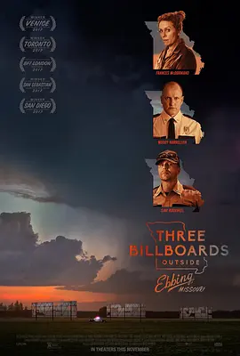

**评分**: ⭐ 8.7 (N/A)

**信息**: 导演: 马丁·麦克唐纳 Martin McDonagh   主演: 弗兰西斯·麦克多蒙德 France...2017 / 英国 美国 / 剧情 犯罪

**剧情简介**:

米尔德雷德（弗兰西斯·麦克多蒙德 Frances McDormand 饰）的女儿在外出时惨遭奸杀，米尔德雷德和丈夫查理（约翰·哈克斯 John Hawkes 饰）之间的婚姻因此走到了尽头，如今，她同儿子罗比（卢卡斯·赫奇斯 Lucas Hedges饰）过着相依为命的生活。一晃眼几个月过去了，案件仍然没有告破预兆，而警方似乎早已经将注意力从案子上转移了开来。
                                    
                                　　被绝望和痛苦缠绕的米尔德雷德租下了高速公路边上的三块巨型广告牌，在上面控诉警方办案无能，并将矛头直接对准了警察局局长威洛比（伍迪·哈里森 Woody Harrelson 饰）。实际上，威洛比一直隐瞒着自己身患绝症命不久矣的事实。因为这三块广告牌，米尔德雷德和威洛比的生活发生了翻天覆地的变化。

**详情**: https://movie.douban.com/subject/26611804/

---

## 171. 谍影重重3 / 叛谍追击3：最后通牒(港)  /  神鬼认证：最后通牒 (台)

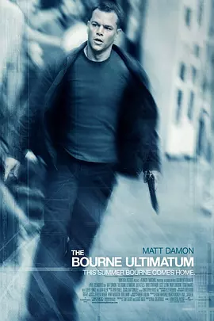

**评分**: ⭐ 8.9 (N/A)

**信息**: 导演: 保罗·格林格拉斯 Paul Greengrass   主演: 马特·达蒙 Matt Damon / ...2007 / 美国 德国 法国 英国 / 动作 悬疑 惊悚

**剧情简介**:

失去了心爱的女人，波恩（马特•戴蒙 饰）面临更为艰难的日子，他努力回忆，却只能在睡梦中被脑海里一知半解的闪回所惊醒，依然无法记起自己的身份。
                                    
                                　　但是波恩注定不是平凡人，不等他冷静下来好好“寻找回”自己真正的身份，中情局派出的杀手又接踵而至。在接连的几次较量之后，杰森•伯恩终于被彻底激怒，决定反戈一击——他主动追击杀手，到过莫斯科、马德里。巴黎，也在伦敦和丹吉尔做过停留。
                                    
                                　　随着问题一个一个解决，杰森回到了纽约，在那里，他将会找到一切的答案，寻回自己的身份。

**详情**: https://movie.douban.com/subject/1578507/

---

## 172. 达拉斯买家俱乐部 / 续命枭雄(港)  /  药命俱乐部(台)

**评分**: ⭐ 8.8 (N/A)

**信息**: 导演: 让-马克·瓦雷 Jean-Marc Vallée   主演: 马修·麦康纳 Matthew McCon...2013 / 美国 / 剧情 传记 同性

**剧情简介**:

1985年美国达拉斯市，恐同的德州电工罗恩·伍德鲁夫（马修·麦康纳 Matthew McConaughey 饰）发现自己患上“同志病”——艾滋，生命只剩30天。他使用的AZT（叠氮胸苷）是当时美国药管局唯一批准面市的抗艾药物，但毒性极大。为了活下去，罗恩开始研究各种抗艾 处方和替代疗法，甚至走私来自世界各地未经批准的药物。在医生萨克斯（詹妮弗·加纳 Jennifer Garner 饰）和异装癖同性恋雷蒙（杰瑞德·莱托 Jared Leto 饰）的帮助下，罗恩开始成立了一个叫做“达拉斯买家俱乐部”的地下组织，为艾滋病人提供更多“非常规疗法”，很多患病的男同性恋亦求助于他。他的举动自然受到了药管局和药商的阻挠和施压。罗恩最终在1992年9月去世，离他被告知只剩30天可活已经过去了2557天。在这近7年时间里，他坚持不懈的与病魔、与药管局及制药商进行艰苦的...

**详情**: https://movie.douban.com/subject/1793929/

---

## 173. 无间道2 / 无间道前传  /  Infernal Affairs II

**评分**: ⭐ 8.8 (N/A)

**信息**: 导演: 刘伟强 Andrew Lau / 麦兆辉 Alan Mak   主演: 陈冠希 Edison Chen / ...2003 / 中国香港 / 剧情 犯罪 惊悚

**剧情简介**:

1991年，香港黑帮龙头倪坤被杀，倪氏家族旗下五大头目中除韩琛（曾志伟）外，均伺机背叛发难，不料却被倪家不起眼的第二代倪永孝（吴镇宇）不费一兵一卒牵制，此举引来重案祖督察黄志诚（黄秋生）的戒心，使其派出警校学生陈永仁（余文乐）渗入倪家进行长期的卧底工作，而韩琛为了巩固势力，早在警察内部安插了线人刘建明（陈冠希）。三年后，事业蒸蒸日上的倪永孝为安枕无忧，决意将五大头目一举歼灭，却因疏忽让韩琛成为漏网之鱼。
                                    
                                　　1997年，大难不死的韩琛重出江湖，为替死去的同事报仇，黄志诚找到他商议合作除掉倪永孝的事宜，不久却发现此举铸成大错，而各自为自己的尴尬身份苦恼的陈永仁和刘建明，则在无间道的路上越行越远。

**详情**: https://movie.douban.com/subject/1307106/

---

## 174. 疯狂原始人 / 古鲁家族(港 / 台)

**评分**: ⭐ 8.7 (N/A)

**信息**: 导演: 科克·德·米科 Kirk De Micco / 克里斯·桑德斯 Chris Sanders   主演...2013 / 美国 / 喜剧 动画 冒险

**剧情简介**:

原始人咕噜一家六口在老爸Grug（尼古拉斯·凯奇 Nicolas Cage 配音）的庇护下生活。每天抢夺鸵鸟蛋为食，躲避野兽的追击，每晚听老爸叙述同一个故事，在山洞里过着一成不变的生活。大女儿Eep（艾玛·斯通 Emma Stone 配音）是一个和老爸性格截然相反的充满好奇心的女孩，她不满足一辈子留在这个小山洞里，一心想要追逐山洞外面的新奇世界。
                                        
                                    　　没想到世界末日突然降临，山洞被毁，一家人被迫离开家园，展开一场全新的旅程。离开了居住了“一辈子”的山洞，展现在他们眼前的是一个崭新绚丽却又充满危险的新世界，到处都是食人的花草和叫不出名字的奇异鸟兽，一家人遇到了全所未有的危机。在旅途中，他们还遇到了游牧部落族人Guy（瑞恩·雷诺兹 Ryan Reynolds 配音），他有着超凡的创造力和革新思想，帮助咕噜一家躲过了重重困难，途中他还发明了很多“高科技”产品，...

**详情**: https://movie.douban.com/subject/1907966/

---

## 175. 末路狂花 / 塞尔玛与路易丝

**评分**: ⭐ 9.0 (N/A)

**信息**: 导演: 雷德利·斯科特 Ridley Scott   主演: 吉娜·戴维斯 Geena Davis / 苏...1991 / 美国 英国 法国 / 犯罪 剧情 惊悚

**剧情简介**:

该片被认为是向男权社会发出抗争的女性主义电影代表作。
                                    
                                　　生活在沉闷与琐碎家务中的家庭主妇赛尔玛（Geena Davis）与在某间咖啡厅做女侍应生的闺中密友路易丝（Susan Sarandon）对平凡的生活与工作产生厌倦后，结伴一起外出旅游散心。路上，在某家酒吧外的停车厂， 赛尔玛险遭无名男子强暴，幸好路易丝及时赶到，拔枪将该男子射杀。惊慌失措的两人掉头逃亡，自此踏上不归路，过程中两人性格均有了很重大的改变。

**详情**: https://movie.douban.com/subject/1291992/

---

## 176. 绿里奇迹 / 绿色奇迹(台)  /  绿色英里

**评分**: ⭐ 8.9 (N/A)

**信息**: 导演: 弗兰克·德拉邦特 Frank Darabont   主演: 汤姆·汉克斯 Tom Hanks / ...1999 / 美国 / 犯罪 剧情 奇幻 悬疑

**剧情简介**:

狱监保罗（汤姆•汉克斯 Tom Hanks 饰）这天迎来了一位不平凡的杀人犯――约翰•考夫利（迈克•克拉克•邓肯 Michael Clarke Duncan 饰）。约翰因杀了两名幼女被判死刑来到了这座著名的冷山监狱，监狱里有一片称为“绿里”的绿地，绿地那头就是刑场。
                                    
                                　　约翰不仅不像想象中的凶残，相反，他出奇的温厚、机智。约翰的到来给狱中的各人带来了天翻地覆的变化：为老囚犯特里沃的小老鼠注入了生命的强度，给特里沃最后的人生带来最后的慰籍；神奇的拯救了被病痛折磨的保罗和马琳达；将金保斯从死神手中拉了回来……保罗这些天也从约翰身上看到了人生的真谛。
                                    
                                　　约翰行刑的那天终于到了。

**详情**: https://movie.douban.com/subject/1300374/

---

## 177. 爱在午夜降临前 / 情约半生(港)  /  爱在午夜希腊时(台)

**评分**: ⭐ 8.9 (N/A)

**信息**: 导演: 理查德·林克莱特 Richard Linklater   主演: 伊桑·霍克 Ethan Hawke ...2013 / 美国 希腊 / 剧情 爱情

**剧情简介**:

被影迷奉为爱情圭臬的《爱在黎明破晓前》、《爱在日落黄昏时》终于迎来了第三部《爱在午夜降临前》。第一部中美国青年杰西（伊桑·霍克 Ethan Hawke 饰）坐火车邂逅法国女孩赛琳（朱莉·德尔佩 Julie Delpy 饰），两人在维也纳度过难忘一晚；9年后的第二部，杰西已成 为作家，他的小说让他和赛琳在巴黎重逢，两人于日落前再续前缘。如今又一个9年过去了，杰西与赛琳已经一起生活并有了一对双胞胎女儿，对人生和爱情也有了更多感悟。《爱在午夜降临前》就是撷取他们在希腊伯罗奔尼撒南部小岛度假的最后一天。
                                        
                                    　　导演理查德·林克莱特和两位主演就像与影迷在赴一个每9年的约会，尽管三部曲的制作跨度长达18年，但故事情节几乎可以写在一张纸的背面。电影惯于只用人与人的对话讲述故事，两位主人公或行走在静谧的村落，或悠然坐在露台和餐桌前，不断的讨论着文学、爱情、生活、两性等话题...

**详情**: https://movie.douban.com/subject/10808442/

---

## 178. 高山下的花环 / 卫国军魂(港)  /  Wreaths at the Foot of the Mountain

**评分**: ⭐ 9.5 (N/A)

**信息**: 导演: 谢晋 Jin Xie   主演: 吕晓禾 Xiaohe Lü / 唐国强 Guoqiang Tang / 何...1984(中国大陆) / 1985 / 中国大陆 / 剧情 战争

**剧情简介**:

驻扎在四川广元的九连长梁三喜（吕晓禾 饰）为了从军政治部调来的指导员赵蒙生（唐国强 饰）推迟了探亲假，可出身高干家庭吃不了苦的蒙生打算只干几个月就走。1979年，赵母吴爽（刘燕生 饰）得知蒙生部队将要赴越作战，加紧督办调动之事。耿直的炮排长靳开来（何伟 饰）听说后火冒三丈，扬言要自费上北京告状。部队开赴云南边境，吴爽孤注一掷请求军长雷震（童超 饰）将蒙生调回后方……

**详情**: https://movie.douban.com/subject/1422283/

---

## 179. 海街日记 / 海街女孩日记(港)  /  Kamakura Diary

**评分**: ⭐ 8.8 (N/A)

**信息**: 导演: 是枝裕和 Hirokazu Koreeda   主演: 绫濑遥 Haruka Ayase / 长泽雅美 M...2015 / 日本 / 剧情 家庭

**剧情简介**:

临海古都镰仓，顺山而成的小镇，不起眼的角落里生活着香田家四姐妹。她们的父亲早年和情人离家出走，母亲则干脆将女儿们抛给了外婆照顾。外婆去世后，外孙女们继承了这栋有着悠久历史的大房子。过早担负起家庭重任的大姐香田幸（绫濑遥 饰），尽心尽力照顾着两个妹妹佳乃（长泽雅美 饰）、千佳（夏帆 饰）健康成长。这一天，父亲去世的消息传到姐妹手中。她们结伴而行参加了父亲的葬礼，并且结识了从未谋面的异母妹妹浅野铃（广濑丝丝 饰）。许是血缘中的亲近之感，幸在临行前邀请铃搬来镰仓同住。未过多久，抱着对姐姐们的憧憬，铃迈入了父亲曾经生活过的房子。四季流转，姐妹们的故事悄然上演……
                                    
                                　　本片根据吉田秋生的同名漫画改编。

**详情**: https://movie.douban.com/subject/25895901/

---

## 180. 疯狂的石头 / Crazy Stone

**评分**: ⭐ 8.6 (N/A)

**信息**: 导演: 宁浩 Hao Ning   主演: 郭涛 Tao Guo / 刘桦 Hua Liu / 连晋 Teddy Lin2006 / 中国大陆 中国香港 / 喜剧 犯罪

**剧情简介**:

重庆一间工艺品厂已经濒临倒闭，却不料在拆倒旧厂房的时候，发现了厕所里的一件宝物——一块价值连城的翡翠。厂里决定用这块翡翠举办一个展览，赚些钱发拖欠了几个月的工人工资。期间由工艺品厂保卫科长包世宏（郭涛 饰）负责看守这件宝物。但是，国际大盗麦克与本地一帮小偷却让包世宏一筹莫展，他们各施其技接近翡翠，展览馆开始了一场明争暗斗的较量。黑色幽默也开始幕幕上演。翡翠的价值几何？最后谁是胜出者？事情远没有表面那么简单……

**详情**: https://movie.douban.com/subject/1862151/

---

## 181. 风之谷 / 风谷少女  /  Kaze no tani no Naushika

**评分**: ⭐ 8.9 (N/A)

**信息**: 导演: 宫崎骏 Hayao Miyazaki   主演: 岛本须美 Sumi Shimamoto / 松田洋治 Y...1984 / 日本 / 动画 奇幻 冒险

**剧情简介**:

工业文明的高度发展，却最终带来灾难，一场为期7天的虫族毁灭战争摧毁了人类文明。一千年后，工业文明遗留下来的症结仍在困扰这个星球。带有强烈毒性的植物组成了令人望而却步的“腐海”森林，随着时间的推移，腐海有条不紊地向四周蔓延，蚕食周边世界。在一片腐海森林的旁边，居住着一群御风而行的人类。女主角娜乌茜卡和族人依靠海风的力量抵御着有毒孢子的侵蚀，过着平静祥和的生活。
                                    
                                　　直到某一天，战火烧到了这里。西方强国特洛梅意欲重新建立人类霸权，他们计划统一周边诸国，然后向虫族发起总攻。另一方面，一千年前曾主导摧毁人类的上古怪兽“猛怪”重现人间。毁灭战争一触即发，人类的命运将会如何……
                                    
                                　　本片根据宫崎骏同名漫画改编，并分获1985年罗马奇幻电影节和1985年电影旬报最佳影片奖、1985年每日电影大藤信郎奖。

**详情**: https://movie.douban.com/subject/1291585/

---

## 182. 上帝之城 / 无主之城(港)  /  无法无天(台)

**评分**: ⭐ 9.0 (N/A)

**信息**: 导演: 费尔南多·梅里尔斯 Fernando Meirelles / 卡迪亚·兰德 Kátia Lund  &nbsp...2002 / 巴西 法国 / 犯罪 剧情

**剧情简介**:

巴西里约热内卢的贫民窟，这里是“上帝之城”，更是魔鬼也会叹息着转身的地方。
                                        
                                    　　阿炮（Alexandre Rodrigues 饰）带着我们到了这里，他见证了这里二十多年来被残暴、贪婪、复仇、野心、背叛、掠夺所裹挟的混乱生活以及最终导致的一场灾难性的黑帮争斗。虽然从小就要 辗转于匪徒间求生存，但胆小怕事的性格与自我保护的本能却使他一直能平安度日。
                                        
                                    　　60年代初，阿毛、阿夹和阿呆是这里的“少年三侠”，在抢劫完旅馆之后，他们三人分道扬镳，阿夹重回上帝的怀抱，而阿呆和阿毛纷纷付出了生命的代价。
                                        
                                    　　70年，当年“少年三侠”手下的小弟小豆子（Douglas Silva 饰）靠着自己的心狠手辣，不停地吞并别人的地盘，成为了贫民区的“小霸王”，生意也从抢劫升级到了更为暴利的毒品买卖，和他一起飞黄腾达的还有班尼（Phellipe Haagensen 饰）。
                                        
                                    　　班尼认识了美丽的安...

**详情**: https://movie.douban.com/subject/1292208/

---

## 183. 雨中曲 / 万花嬉春(港 / 台)

**评分**: ⭐ 9.1 (N/A)

**信息**: 导演: 斯坦利·多南 Stanley Donen / 吉恩·凯利 Gene Kelly   主演: 吉恩·...1952 / 美国 / 喜剧 歌舞 爱情

**剧情简介**:

1927年，由唐·洛克伍德（吉恩·凯利 饰）和丽娜·雷蒙德（简·哈根 饰）主演的《皇家流氓》在好莱坞首映。由于丽娜刺耳的嗓音无法匹配其夺目的外貌，为了维护明星形象，宣传部只得安排唐一人讲话。首映后，由于钢琴师科斯莫·布朗（唐纳德·奥康纳 饰）的汽车爆胎，为了躲避疯狂的影迷，唐意外结识了能歌善舞的凯西·塞尔登（黛比·雷诺斯 饰），并被其深深吸引。数周后，首部有声电影《爵士歌手》爆红，唐与丽娜的新片《决斗骑士》不得不临时改变拍摄方式，而凯西也成为歌舞片演员。因预映口碑极差，科斯莫提议将《决斗骑士》改为歌舞片，由凯西为丽娜配音，凯西积极附议。与凯西吻别后，唐心花怒放，在雨中载歌载舞。科斯莫的计划能否奏效？幕后的凯西能否走到台前接受观众的掌声？

**详情**: https://movie.douban.com/subject/1293460/

---

## 184. 2001太空漫游 / 2001：星际漫游  /  2001：太空奥德赛

**评分**: ⭐ 8.9 (N/A)

**信息**: 导演: 斯坦利·库布里克 Stanley Kubrick   主演: 凯尔·杜拉 Keir Dullea / ...1968 / 英国 美国 / 科幻 惊悚 冒险

**剧情简介**:

这部影片是库布里克花了四年时间制作的充满哲学命题的鸿篇巨制。一块大黑石树立在史前人类的面前，他们刚刚开始认识工具，进入到进化的里程碑。同样的黑石还在宇宙多处出现，它们矗立在月球上，漂浮在太空中，带着某种神秘的寓意。
                                    
                                　　现在的时间是2001年，为了寻找黑石的根源，人类开展一项木星登陆计划。飞船上有冬眠的三名宇航员，大卫船长（凯尔·杜拉 Keir Dullea饰）、富兰克飞行员（加里·洛克伍德 Gary Lockwood饰），还有一部叫“HAL9000”的高智能电脑。HAL在宇宙飞行过程中发生错乱，令到富兰克和三名冬眠人员相继丧命，剩下波曼和这台电脑作战。
                                    
                                　　从死亡线上回来的大卫一气之下关掉主脑系统，HAL彻底失效。现在，茫茫宇宙中只剩大卫一人，向木星进发。穿越瑰异壮观的星门，大卫仿佛去到一个奇特的时空，那里有人类无尽的生死轮回和宇宙的终极知识……

**详情**: https://movie.douban.com/subject/1292226/

---

## 185. 心迷宫 / 殡棺  /  The Coffin in the Mountain

**评分**: ⭐ 8.7 (N/A)

**信息**: 导演: 忻钰坤 Yukun Xin   主演: 霍卫民 Weimin Huo / 王笑天 Xiaotian Wang ...2014 / 中国大陆 / 剧情 犯罪 悬疑

**剧情简介**:

河南中原某个平凡的小山村，清早起来突然多出一具烧焦的尸体，这个消息很快传遍全村。村中妙龄女孩黄欢（罗芸 饰）同时失踪，由于弟弟被黄欢甩掉后酗酒意外身亡，王宝山前一日当众宣称要让黄欢偿命。因此，众人一度以为这是女孩的尸体。可是尸体的男性特征又打破了这个猜测。紧接着，尸体身上发现未烧毁的身份证，其身份指向了村花丽琴（孙黎 饰）的丈夫陈自立。哪曾想葬礼进行中途，丽琴又接到另一处打来的电话，通知她其丈夫意外身亡。这一次，焦尸的身份再度变得扑朔迷离。
                                    
                                　　一向正气凛然的村长（霍卫民 饰）试图查明真相，然而却朝着更为黑暗的方向沉了下去……

**详情**: https://movie.douban.com/subject/25917973/

---

## 186. 英雄本色 / A Better Tomorrow  /  Gangland Boss

**评分**: ⭐ 8.6 (N/A)

**信息**: 导演: 吴宇森 John Woo   主演: 周润发 Yun-Fat Chow / 狄龙 Lung Ti / 张国...1986 / 中国香港 / 剧情 动作 犯罪

**剧情简介**:

香港某个国际伪钞集团重要分子宋子豪（狄龙 饰）和Mark（周润发 饰）情同手足，某次宋子豪带手下谭成（李子雄 饰）去台北交易时被其出卖受枪伤被捕入狱，为替好兄弟报仇，Mark孤身赴台，结果被人打成瘸子，江湖地位自此一落千丈，而宋子豪的父亲也在不久丧命。 一向视宋子豪为偶像的宋子杰（张国荣 饰）得知哥哥的真实身份后，对黑社会及他恨之入骨，立誓利用警察身份将黑帮势力斩草除根，宋子豪出狱后不顾苦等他想重创辉煌的Mark的劝阻，决心弃暗投明，无奈得不到宋子杰的谅解。而此时已成帮会老大的谭成欲找宋子豪再合作，遭拒绝后放言会害宋子杰，被逼走投无路，宋子豪决定再与Mark连手共抗强敌。

**详情**: https://movie.douban.com/subject/1297574/

---

## 187. 机器人之梦 / 再见机器人(台)  /  汪汪梦里人(港)

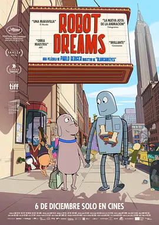

**评分**: ⭐ 9.1 (N/A)

**信息**: 导演: 巴勃罗·贝格尔 Pablo Berger   主演: 伊万·拉班达 Ivan Labanda / 阿...2023 / 西班牙 法国 / 剧情 动画 音乐

**剧情简介**:

一只孤独的小狗遇到了一个机器人，偌大的城市中，他们互相依靠，温暖彼此。然而一次意外让小狗和机器人遗憾错过，从此他们只能把对彼此的想念藏进梦中。只是，反复梦见的人，还会重逢吗？
                                    
                                　　影片改编自Sara Varon的漫画。

**详情**: https://movie.douban.com/subject/35426925/

---

## 188. 记忆碎片 / 凶心人(港)  /  记忆拼图(台)

**评分**: ⭐ 8.7 (N/A)

**信息**: 导演: 克里斯托弗·诺兰 Christopher Nolan   主演: 盖·皮尔斯 Guy Pearce /...2000 / 美国 / 犯罪 剧情 悬疑 惊悚

**剧情简介**:

当记忆支离破碎后，你该怎样面对生活？本片的主人公就遭遇了这样的事情。
                                    
                                　　莱纳•谢尔比（盖伊•皮尔斯 饰）在家遭到歹徒的袭击，妻子被残忍的奸杀，自己脑部也受到严重的伤害。
                                    
                                　　醒来后，他发现自己患了罕见的“短期记忆丧失症”，他只能记住十几分钟前发生的事情，为了让生活继续下去，更为了替惨死的妻子报仇，他凭借纹身、纸条、宝丽来快照等零碎的小东西，保存记忆，收集线索，展开了艰难的调查。
                                    
                                　　调查中，莱纳遇上粗俗的酒吧女招待娜塔莉娅(凯瑞•安妮•莫斯 饰)，她似乎知道一些莱昂纳多感兴趣的事；还有泰迪(乔•潘托利亚诺 饰)，自称是他以前好朋友，但看上去鬼鬼祟祟的，不怀好意。到底谁能相信？娜塔莉娅？泰迪？还是他自己？
                                    
                                　　抽丝剥茧之后，真相呼之欲出，简单之至却又残酷无比，而莱纳是否有面对这一切的勇气？

**详情**: https://movie.douban.com/subject/1304447/

---

## 189. 纵横四海 / Once a Thief

**评分**: ⭐ 8.8 (N/A)

**信息**: 导演: 吴宇森 John Woo   主演: 周润发 Yun-Fat Chow / 张国荣 Leslie Cheung...1991 / 中国香港 / 剧情 喜剧 动作 犯罪

**剧情简介**:

砵仔糕（周润发 饰）、阿占（张国荣 饰）和红豆（钟楚红 饰）均是孤儿，在养父（曾江 饰）栽培下成为国际大盗。长大后成了帮他赚钱的艺术品大盗，而三人同时又认了警察（朱江 饰）为干爹。
                                    
                                　　法国巴黎博物馆内，名画《赫林之女仆》被人盗走。与此同时，阿海、阿占和红豆三人以敏捷身手盗得另一幅名画，在与法国大哥交易时得知名画《赫林之女仆》在妖气重重的古堡内，他们在曾江安排下成功地盗取此画之后，反被集团原凶曾江与法国大哥合谋设下陷阱，派人追杀灭口。阿海驾车与杀手快艇相撞……
                                    
                                　　三人失散，数年后，他们在香港重聚，阿海“瘫痪”住在朱江家里，阿占和红豆已经结婚了。曾江又逼他们去偷画……

**详情**: https://movie.douban.com/subject/1295409/

---

## 190. 卢旺达饭店 / 卢安达饭店(台)

**评分**: ⭐ 8.9 (N/A)

**信息**: 导演: 特瑞·乔治 Terry George   主演: 唐·钱德尔 Don Cheadle / 苏菲·奥...2004 / 英国 南非 意大利 美国 / 剧情 传记 历史 战争

**剧情简介**:

1994年卢旺达宣布独立后，胡图族与图西族两部族之间矛盾重重，多次发生冲突，战事持续不断。胡图族大肆屠杀图西族人，在这种背景下，卢旺达饭店经理保罗一直四面奔走，最终成功挽救了饭店里一千多名图西族和胡图族难民。

**详情**: https://movie.douban.com/subject/1291822/

---

## 191. 无敌破坏王 / 破坏王拉尔夫  /  破坏王大冒险

**评分**: ⭐ 8.7 (N/A)

**信息**: 导演: 瑞奇·莫尔 Rich Moore   主演: 约翰·C·赖利 John C. Reilly / 萨拉...2012 / 美国 / 喜剧 动画 奇幻 冒险

**剧情简介**:

无敌破坏王（约翰·C·赖利 John C. Reilly 配音）生活在一个80年代出品的低精度游戏中。他的设定身份是一个反派，每天的生活就是在游戏《快手阿修》中大搞破坏，其后由玩家操作的英雄人物快手阿修（杰克·麦克布瑞尔 Jack McBrayer 配音） 会及时赶到进行修补，赢得奖牌，包揽一切荣耀。身为反派，破坏王厌倦了自己的生活，眼看阿修被胜利者的光环围绕，自己却日复一日在无趣中过活，他终于决定改变。单纯的他以为只要自己也能得到一枚奖牌，就可以摆脱反派的身份，于是某日在游戏厅歇业后，破坏王偷偷离开了自己的游戏，前去闯荡其他电子游戏的世界。
                                        
                                    　　在途中，破坏王结识了来自《英雄使命》的冷酷队长（简·林奇 Jane Lynch 配音）和来自90年代糖果赛车游戏《甜蜜冲刺》的小女孩云妮（萨拉·丝沃曼 Sarah Silverman 配音）。后者梦想着能上场比...

**详情**: https://movie.douban.com/subject/6534248/

---

## 192. 小偷家族 / Shoplifters  /  Une Affaire de Famille

**评分**: ⭐ 8.7 (N/A)

**信息**: 导演: 是枝裕和 Hirokazu Koreeda   主演: 中川雅也 Lily Franky / 安藤樱 Sa...2018 / 日本 / 剧情 犯罪 家庭

**剧情简介**:

东京的都市丛林中央，残存着一栋古旧寒酸的老房子，这里局促地生活着柴田一家五口人。在工地当临时工的男人阿治（Lily Franky 饰）经常带着儿子祥太（城桧吏 饰）到超市盗窃生活用品，这一天，他们回家路上遇到了独自待在户外的四岁女孩由里（佐佐木美结 饰）。妻子信代（安藤樱 饰）起初极力主张将女孩送回父母身边，但当看到女孩原生家庭的状况时又心生恻隐。原本柴田家就靠着老奶奶初枝（树木希林 饰）的养老金度日，而今多了一口人，自然更艰辛了几分。包括信代的妹妹亚纪（松冈茉优 饰）在内，虽然一家人游走在贫困和违法的边缘，但笃深的羁绊将他们紧紧联系在一起，使他们的心不会随着冰冷的都市而寒冷下去……
                                    
                                　　本片荣获第71届戛纳电影节金棕榈

**详情**: https://movie.douban.com/subject/27622447/

---

## 193. 恐怖游轮 / 汪洋血迷宮(台)  /  轮回三角

**评分**: ⭐ 8.5 (N/A)

**信息**: 导演: 克里斯托弗·史密斯 Christopher Smith   主演: 梅利莎·乔治 Melissa ...2009 / 英国 澳大利亚 / 科幻 悬疑 奇幻 惊悚

**剧情简介**:

单亲母亲杰西（梅利莎·乔治 饰）和一帮朋友乘游艇出海游玩，但她总有一种有不好的事情发生的感觉。不久，他们便在海上遭遇一场强烈的风暴。游艇翻船，众人落海，几经挣扎他们好不容易爬到游艇残骸上来。正当他们无计可施之时，一艘巨大的游轮向众人缓缓驶来。众人欣喜过望，未加思索便登上这艘名为“艾俄洛斯”的游轮，结果发现这竟是一艘1930年便告失踪的神秘之船，而船上更是空无一人。
                                    
                                　　随处可见的鲜血、神秘的指示以及突如其来的凶杀事件，将这群男女带入万劫不复的恐怖轮回之中……

**详情**: https://movie.douban.com/subject/3011051/

---

## 194. 冰川时代 / 冰河世纪  /  冰原历险记

**评分**: ⭐ 8.7 (N/A)

**信息**: 导演: 卡洛斯·沙尔丹哈 Carlos Saldanha / 克里斯·韦奇 Chris Wedge   主演...2002 / 美国 / 喜剧 动画 冒险

**剧情简介**:

冰河时期降至，动物们都急着迁徙到温暖的地方及储存食物。长毛象曼弗瑞德、树獭希德、剑齿虎迪亚戈为了帮助一个人类的婴儿回到父母身边，因而也掉了动物们迁徙的队伍。三只性格各异的动物，觉得集合力量帮助婴儿。一路上，善良的曼弗瑞德总觉得迪亚戈心怀鬼胎，想吃掉婴儿，互相猜疑。他们一起经历了无数艰难险阻，终于能够真诚相对。
                                    
                                　　当剑齿虎迪亚戈的同伴知道它身边正有一个婴儿，饥寒交迫的它们就想迪亚戈把婴儿交给它们当食物，迪亚戈已对可爱的小婴儿产生了感情，无法下手，而迪亚戈该如何选择呢？小婴儿又能否安全回到家中？

**详情**: https://movie.douban.com/subject/1291578/

---

## 195. 牯岭街少年杀人事件 / A Brighter Summer Day

**评分**: ⭐ 8.9 (N/A)

**信息**: 导演: 杨德昌 Edward Yang   主演: 张震 Chen Chang / 杨静怡 Lisa Yang / 张...1991 / 中国台湾 / 剧情 犯罪

**剧情简介**:

结识小明（杨静怡）前，小四（张震）是典型的乖仔，是父母的希望和兄妹的骄傲（一家人指望他考上名牌大学将来提升全家的社会地位），他有一个喜欢摇滚乐的自称“小猫王（王启赞）”的好友，两人虽会去树林看人幽会，但过的是与周围诸多在“小公园”混的少年人完全两样的生活。
                                    
                                　　喜欢上小明后 ，小四便像跌进一个无底深渊，开始被外界的各种力量牵着鼻子走。新识仰慕对象honey（林鸿铭）意外身亡，一向敬重的父亲的自尊与精神因为某次事件严重受损，加上将一次次“欺骗玩弄”他感情的小明“看透”，血气方刚又有很强道德感的小四终于走上犯罪的道路，期望用自己的刀结束事件的根源。但小四不知的是，他眼中的根源只是这条食物链中微不足道的一环。

**详情**: https://movie.douban.com/subject/1292329/

---

## 196. 东京教父 / Tokyo Godfathers

**评分**: ⭐ 9.0 (N/A)

**信息**: 导演: 今敏 Satoshi Kon   主演: 江守彻 Toru Emori / 梅垣义明 Yoshiaki Ume...2003 / 日本 / 剧情 喜剧 动画

**剧情简介**:

圣诞夜，退役自行车选手Gin，性倒错者花，离家出走的少女美由纪三人在东京的雪夜中无所事事。这时，他们发现垃圾堆中有一位哭泣的弃婴。孩子的襁褓中仅有一个酒吧的名片与照片。婴儿的父母身份成了谜团。 花想收留孩子，并将孩子取名清子。但另外2人表示反对。于是三人开始了寻找清子父母的旅程。圣诞夜幸福的气氛，伴随的却是怀中清子的哭泣。无家可归的三个人，开始为同样无家可归的清子找寻属于她的家。这一队流浪者，在一夜经历了诸多奇妙的事件。他们能找到清子的父母吗？

**详情**: https://movie.douban.com/subject/1310177/

---

## 197. 魔女宅急便 / 魔女琪琪(台)  /  小魔女限时专送

**评分**: ⭐ 8.7 (N/A)

**信息**: 导演: 宫崎骏 Hayao Miyazaki   主演: 高山南 Minami Takayama / 佐久间玲 Re...1989 / 日本 / 动画 奇幻 冒险

**剧情简介**:

琪琪今年13岁了，按照魔法界的规矩，魔法少女年满13岁就要出外进行为期一年的修行。所以琪琪带着宠物黑猫吉吉踏上了修行之旅。然而，修行之旅开始得并不顺利，当琪琪来到海边一座大城市时，人们并没有欢迎她的到来，人人都不搭理她。幸亏琪琪有一颗善良的心，当她拾到了一件别人的失物时，热心的琪琪找到了失主。她的善良赢得了面包店老板娘的好感，琪琪就在面包店开始了她用飞行魔法为客人服务的快递业务。琪琪很快适应了新环境，一次，一个热衷于飞机制造的男孩邀请琪琪去参加飞行俱乐部的聚会，途中琪琪因为帮一位老大娘送东西而被雨淋了。从此，琪琪突然发现自己的魔法正在一天天变弱。

**详情**: https://movie.douban.com/subject/1307811/

---

## 198. 岁月神偷 / 1969太空漫游  /  Echoes Of The Rainbow

**评分**: ⭐ 8.7 (N/A)

**信息**: 导演: 罗启锐 Alex Law   主演: 吴君如 Sandra Ng / 任达华 Simon Yam / 钟绍...2010 / 中国香港 中国大陆 / 剧情 家庭

**剧情简介**:

60年代的香港，风云变幻。一面要忍受港英政府的压制，一面又受到内地运动的波及，更要面对不时登陆的台风暴雨。老字号的永利街就处在这样一个风暴的旋涡中心。
                                        
                                    　　鞋匠罗一家四口，在街尾以做鞋为生。罗先生（任达华 饰）做得一手好鞋，在那个混乱的年代仅能养家糊口；罗太太（吴君如 饰）为人辛辣直率，人称“侠盗罗嫂”。大儿子罗进一（李治廷 饰）16岁，品学兼优，是运动会的冠军，全家人的希望，也是永利街的骄傲；小儿子罗进二（钟绍图 饰）8岁，在父母溺爱之下，天性顽劣，出了名的顽皮整蛊……一家人艰难度日，也算其乐融融。
                                        
                                    　　然而大儿子与富家小姐芳菲（蔡颖恩 饰）之间一段纯美的初恋、一场扫荡整个香港的飓风暴雨、更有一场潜伏已久的噩梦，让这个普通家庭的平安幸福在一夜之间陡生变故、支离破碎……面对岁月这个最大的“神偷”，顽强不屈的人该如何去抵抗？
                                        
                                    　　2010第60届柏林电影节“新生代...

**详情**: https://movie.douban.com/subject/3792799/

---

## 199. 忠犬八公物语 / 八千公物语  /  阿八的故事

**评分**: ⭐ 9.2 (N/A)

**信息**: 导演: 神山征二郎 Seijirô Kôyama   主演: 仲代达矢 Tatsuya Nakadai /...1987 / 日本 / 剧情

**剧情简介**:

1923年，日本秋田县大馆市天降大雪，近藤家纯种秋田犬产仔，赠与县土木科长间濑。后者将其中一犬转赠东京帝国大学教授上野秀次郎（仲代达矢 Tatsuya Nakadai 饰）驯养。上野的独生女千鹤子对此欢欣鼓舞，而上野夫妇却面露难色。后来，千鹤子（石野真子 Mako Ishino饰）谈恋爱，竟怀了男友的孩子。男友专程登门造访。上野与之对谈，后者诚惶诚恐，坦言要对其女儿负责，事不宜迟，即日便举行婚礼，上野闻听此言，转怒为喜。千鹤子出嫁后，上野旋即把全部的心血与爱都投注在幼犬身上，并取名为阿八。每日上下班，阿八必在涩谷车站等候，一年四季，风雨无阻，令路人叹为观止，成为地方一道风景，主仆之情感动天地……
                                    
                                　　本片根据真实事件改编，为1987年日本票房冠军，票房成绩高达54亿日元。

**详情**: https://movie.douban.com/subject/1959195/

---

## 200. 芙蓉镇 / Hibiscus Town

**评分**: ⭐ 9.3 (N/A)

**信息**: 导演: 谢晋 Jin Xie   主演: 刘晓庆 Xiaoqing Liu / 姜文 Wen Jiang / 郑在石...1987 / 中国大陆 / 剧情 爱情

**剧情简介**:

本片分上下两集，讲述了位于湘、粤、桂三省交界处的芙蓉镇上，人称“芙蓉姐”的漂亮女人胡玉音（刘晓庆）在“四清运动”及“文化大革命”中的遭遇。
                                        
                                    　　1963年，凭着热情周到的服务，胡玉音与丈夫桂桂（刘利年）经营的米豆腐摊子前渐渐成为早市上最热闹的一道风景，加上夫妻俩省吃俭用，手中积攒了一 笔数目可观的财富。镇党支书也是胡玉音干哥的黎满庚（张光北）、粮站主任谷燕山（郑在石）及乡邻们都为他们高兴。当他们盖好新房准备日子更上一层楼时，迎上“四清运动”，一直嫉妒胡玉音的原国营饮食店经理、今县商业局科长李国香（徐松子）与二流子王秋赦（祝士彬）联手，趁机将她定性为“反革命五类分子”中的“富农婆”，将之派去与原县文化馆馆长、今被人称作“秦癫子”的“右派”秦书田（姜文）一起清扫大街，桂桂身亡。运动中黎满庚昧着良心将胡玉音背叛，谷燕山则一直以老革命军人的标准诚实做人。
                                        
                                    　　196...

**详情**: https://movie.douban.com/subject/1297880/

---

## 201. 荒蛮故事 / 蛮荒故事  /  生命中最抓狂的小事(台)

**评分**: ⭐ 8.7 (N/A)

**信息**: 导演: 达米安·斯兹弗隆 Damián Szifron   主演: 达里奥·葛兰帝内提 Darío...2014 / 阿根廷 西班牙 / 剧情 喜剧 犯罪

**剧情简介**:

《荒蛮故事》是一部黑色喜剧，由6个独立的暴力复仇小故事构成。影片是一次对于人类失控行径的颠覆性创作，从怪异的幽默感，独特的画面和大胆的配乐，到对于身处绝境的普通人这一题材的偏爱，都可以清晰地看到南美鬼才导演达米安·斯兹弗隆与阿莫多瓦在创作方面的相似之处。不过，斯兹弗隆仍然通过这部影片发出了自己独特的声音：一场对于一个腐败成风、经济和社会严重不平等的社会的尖锐抨击。

**详情**: https://movie.douban.com/subject/24750126/

---

## 202. 遗愿清单 / 玩转身前事(港)  /  一路玩到挂(台)

**评分**: ⭐ 8.7 (N/A)

**信息**: 导演: 罗伯·莱纳 Rob Reiner   主演: 杰克·尼科尔森 Jack Nicholson / 摩根...2007 / 美国 / 冒险 喜剧 剧情

**剧情简介**:

老富翁爱德华•科尔（杰克•尼克尔森 Jack Nicholson 饰）近年来在公立医院的私有化改造事业中获利颇丰，他为节省成本，规定病房“一房两床”的做法颇受非议，但性格强势的科尔不以为意，岂料他不久被检查出罹患癌症，本欲入住单人病房的科尔在舆论压力下只得与另一位病人——老卡特（摩根•弗里曼 Morgan Freeman 饰）同处一室。汽车修理技师老卡特博闻强识，将三个子女培养成才，但代价是牺牲了年轻时要做历史教授的梦想。曾经结婚多次如今却孤身一人的科尔逐渐对卡特产生了兴趣，两位老人在病房中结下了友谊。科尔偶然发现了卡特的“遗愿清单”，他决定运用自己的力量，让那些纸面上的疯狂构想一一实现，去发现人生的真正意义……

**详情**: https://movie.douban.com/subject/1867345/

---

## 203. 大佛普拉斯 / The Great Buddha+

**评分**: ⭐ 8.7 (N/A)

**信息**: 导演: 黄信尧 Hsin-yao Huang   主演: 庄益增 Yizeng Zhuang / 陈竹昇 Chu-sh...2017 / 中国台湾 / 剧情 喜剧

**剧情简介**:

菜埔（庄益增 饰）是一家雕塑厂的夜间保安，家中有一位重病的老母亲需要照顾。肚财（陈竹昇 饰）是菜埔唯一的朋友，菜埔经常在值夜班的时候把肚财叫过来和他作伴。一天，两人突发奇想决定看一看菜埔的老板黄启文（戴立忍 饰）的行车记录仪里记录了哪些影像，希望向来风流的老板能够贡献出一些精彩的片段以解两个独身男人内心里的寂寞之苦。
                                    
                                　　行车记录仪所记录的影像果然没有让菜埔和肚财失望，但与此同时，两人也发现了黄启文的许多不可告人的秘密。实际上，菜埔和肚财的一举一动皆没有逃过黄启文的眼睛，为了保住自己的地位和名声，他决定采取一些必要的行动。

**详情**: https://movie.douban.com/subject/27059130/

---

## 204. 源代码 / 启动原始码(台)  /  危机解密(港)

**评分**: ⭐ 8.6 (N/A)

**信息**: 导演: 邓肯·琼斯 Duncan Jones   主演: 杰克·吉伦哈尔 Jake Gyllenhaal / ...2011 / 美国 加拿大 / 科幻 悬疑 惊悚

**剧情简介**:

在阿富汗执行任务的美国空军飞行员科特史蒂文斯上尉（杰克·吉伦哈尔 Jake Gyllenhaal 饰）突然惊醒，发现自己在一辆高速行驶的列车上，而他的身边坐着一个素不相识的女子克里斯蒂安（米歇尔·莫娜汉 Michelle Monaghan 饰）正在与自己讲话。科尔不知自己为什么会在这辆车上，而且他发现自己居然是以另一个人的身份存在，正当他迷惑不解的时候，列车上忽然发生爆炸……
                                        
                                    　　科特又一次惊醒，发现自己身处一个密闭的太空仓里，有一位女军官古德温（维拉·法米加 Vera Farmiga 饰）正在通过视频和自己对话，并要求自己报告列车上发生的事情。一头雾水的科特还没搞明白是怎么回事时，他又一次被送上那辆列车。这次之后，科特终于明白自己在执行一件任务，负责调查芝加哥火车爆炸案找到恐怖份子并查出他的下一个目标。科特被一次又一次的送上那辆高速列车，每次只有八分钟...

**详情**: https://movie.douban.com/subject/3075287/

---

## 205. 疯狂的麦克斯4：狂暴之路 / 末日先锋：战甲飞车(港)  /  疯狂麦斯：愤怒道(台)

**评分**: ⭐ 8.7 (N/A)

**信息**: 导演: 乔治·米勒 George Miller   主演: 汤姆·哈迪 Tom Hardy / 查理兹·塞...2015 / 澳大利亚 美国 / 动作 科幻 冒险

**剧情简介**:

未来世界，水资源短缺引发了连绵的战争。人们相互厮杀，争夺有限的资源，地球变成了血腥十足的杀戮死战场。面容恐怖的不死乔在戈壁山谷建立了难以撼动的强大武装王国，他手下的战郎驾驶装备尖端武器的战车四下抢掠，杀伐无度，甚至将自己的孩子打造成战争机器。在最近一次行动中，不死乔的得力战将弗瑞奥萨（查理兹·塞隆 Charlize Theron 饰）带着生育者们叛逃，这令不死乔恼羞成怒，发誓要追回生育者。经历了激烈的追逐战和摧毁力极强的沙尘暴，弗瑞奥萨和作为血主的麦克斯（汤姆·哈迪 Tom Hardy 饰）被迫上路，而身后不仅有不死乔的追兵，还有汽油镇、子弹农场的重兵追逐。
                                    
                                　　末世战争，全面爆发……

**详情**: https://movie.douban.com/subject/3592854/

---

## 206. 你看起来好像很好吃 / 你看起来很好吃(台)  /  你看上去好像很好吃

**评分**: ⭐ 8.9 (N/A)

**信息**: 导演: 藤森雅也 Masaya Fujimori   主演: 山口胜平 Kappei Yamaguchi / 爱河...2010 / 日本 / 剧情 动画 儿童

**剧情简介**:

哈特（山口胜平 饰）是一只被草食性恐龙养大的霸王龙。其实，早在它破壳而出时，草食性恐龙的首领就曾命令哈特的母亲（原田知世 饰）抛弃它，但母亲却最终还是偷偷把它养大。随着年龄的增长，每天只吃野果的哈特每天饥饿难耐，最终还是抵不住本能的驱使，开始了自己食肉的残暴生涯。然而，由于母亲的影响，在哈特的内心深处，始终涌动着一颗善良的心灵。一天，偶尔遇到一只破壳而出的食草恐龙宝宝，哈特阴差阳错的被恐龙宝宝误认为是“爸爸”，而且为小恐龙取名为“很美味”，自此开始了又一段奇异的恐龙父子情。然而，伴随着生存环境的恶化，恐龙们的生存遭受着前所未有的破坏，哈特和它的亲人最终能否经得起考验……
                                    
                                　　本篇由日本知名漫画家宫西达也的同名漫画改编，本书曾获剑渊绘本乡绘本奖大奖。

**详情**: https://movie.douban.com/subject/4848115/

---

## 207. 贫民窟的百万富翁 / 一百万零一夜(港)  /  贫民百万富翁(台)

**评分**: ⭐ 8.6 (N/A)

**信息**: 导演: 丹尼·鲍尔 Danny Boyle / 洛芙琳·坦丹 Loveleen Tandan   主演: 戴夫...2008 / 英国 / 剧情 爱情

**剧情简介**:

2006年，印度孟买。
                                    
                                　　印度青年杰玛•马利克（戴夫•帕特尔饰）还差一个问题就能赢得2千万卢比。他是怎么做到的？A：他作弊；B：他幸运；C：他是天才；D：一切命中注定。
                                    
                                　　这是《谁想成为百万富翁》电视猜谜节目的人生版。杰玛•马利克在已经赢得1千万卢比的情况下被警方以欺诈罪逮捕，严刑拷问下杰玛说出他获得1千万卢比的真相——他确实知道答案，但他只知道这些！
                                    
                                　　出身贫民窟的杰玛年幼就生活艰苦，他与哥哥沙里姆、少女拉媞卡(芙蕾达•平托饰)三人却一起经历了几十年印度的变迁。之前每一个问题，都好像是杰玛的记忆碎片，牵动他关于亲情、爱情与人生的回忆。
                                    
                                　　而现在，杰玛一方面要洗清自己的犯罪嫌疑，一方面要拯救与拉媞卡的爱。在金钱与爱之前，杰玛能够沉着冷静，选择出正确的答案吗？

**详情**: https://movie.douban.com/subject/2209573/

---

## 208. 花束般的恋爱 / 她和他的恋爱花期(港)  /  爱如花束 恋恋不忘

**评分**: ⭐ 8.6 (N/A)

**信息**: 导演: 土井裕泰 Nobuhiro Doi   主演: 菅田将晖 Masaki Suda / 有村架纯 Kasu...2021 / 日本 / 剧情 爱情

**剧情简介**:

深夜的地铁站，因错过末班车让山音麦（菅田将晖 饰）和八谷绢（有村架纯 饰）两个年轻人不期而遇。他们相约前往附近的咖啡店，并且畅聊文学、电影和各自的爱好。令他们感到惊喜的是，两个人无论是习惯、爱好还是理念居然极其相似，仿佛就是另一个自己，因此他们对对方渐渐产生好感。在此之后，他们相约再次见面，顺理成章成为了情侣。大学毕业，步入社会，小麦和小绢痴心相守。只不过现实生活磨砺着年轻人的意志和爱情。小麦被迫暂时放弃自己绘画的梦想，成为一名上班族，日渐拮据的生活也让他们减弱了对理想生活的要求。
                                    
                                　　不知不觉，曾经如此合拍的两个人渐行渐远，变成了最熟悉的陌生人……

**详情**: https://movie.douban.com/subject/34874432/

---

## 209. 可可西里 / Kekexili: Mountain Patrol

**评分**: ⭐ 8.9 (N/A)

**信息**: 导演: 陆川 Chuan Lu   主演: 多布杰 Duobujie / 张磊 Lei Zhang / 亓亮 Qi L...2004 / 中国大陆 中国香港 / 剧情 犯罪

**剧情简介**:

尕玉（张磊 饰）本来是个警察，为了调查藏羚羊猎杀状况，他假扮记者身份，随考察团来到可可西里——那里气候寒冷、空气稀薄，含氧量极低。就在这个人类生存的“禁区”，尕玉目睹了一幕幕人性的贪婪以及人类与环境的狂暴冲突。首先是藏羚羊保护站的巡山队员被盗猎人枪杀，接下来他们见到了悲惨的一幕：盗猎者逃走，只留下众多只剩嶙峋白骨的藏羚羊。巡山队员在恶劣的环境中追捕凶手，最终只夺回了一部份的藏羚羊皮毛。一方面要与恶劣的自然环境抗争、另一方面还要与凶残的盗猎者周旋，巡山队员和尕玉面临着生死考验。

**详情**: https://movie.douban.com/subject/1308857/

---

## 210. 城市之光 / City Lights: A Comedy Romance in Pantomime  /  Lichter der Großstadt

**评分**: ⭐ 9.3 (N/A)

**信息**: 导演: 查理·卓别林 Charles Chaplin   主演: 查理·卓别林 Charles Chaplin ...1931 / 美国 / 喜剧 剧情 爱情

**剧情简介**:

他是一个流浪汉（查理·卓别林 Charles Chaplin 饰），身无分文，遇上了双目失明的卖花女，却不忍袖手旁观。他想尽办法去凑够费用，供卖花女治病。一天，他搭救了一个富翁，富翁当晚和他称兄道弟，第二天却翻脸不认人。本来打算向他求助的主意行不通了。流浪汉去参加拳击比 赛，以图获得奖金，却输得一败涂地。谁知这时重遇富翁，二人不计前嫌，富翁答应出钱资助卖花女。在交给流浪汉1000元后，富翁遭到偷袭，身上剩下的钱被强盗抢走。流浪汉奋不顾身去追赶，却因为误会被警察押回警局坐牢。另一方面，卖花女凭借流浪汉的资助重获光明，开了一家体面的花店。

**详情**: https://movie.douban.com/subject/1293908/

---

## 211. 东邪西毒 / Ashes of Time

**评分**: ⭐ 8.6 (N/A)

**信息**: 导演: 王家卫 Kar Wai Wong   主演: 张国荣 Leslie Cheung / 林青霞 Brigitte...1994 / 中国香港 中国台湾 / 剧情 动作 爱情 武侠 古装

**剧情简介**:

在恋人（张曼玉）负气嫁给兄长的当晚，欧阳锋（张国荣）黯然离开白陀山，走进沙漠某个小镇，成为一名杀手中介人。他的朋友、风流剑客黄药师（梁家辉）每年都来小镇与他畅饮，酒话里有关白陀山的消息令他忘却往事的念想渐次演变成自欺行为。
                                    
                                　　黄药师只是表面风流。他迷恋好友“盲武士”（梁朝伟）的妻子桃花（刘嘉玲），后者在丈夫死后，永远地离开了他；而对迷恋他的女人慕容嫣（林青霞），他又不愿兑现曾经随口说出的承诺，这使得慕容嫣迷失于自己的身份中。与欧阳锋构成短暂“买凶杀人”关系的洪七（张学友）、村姑（杨采妮）等人，也都有一段只有他们自己才知、不愿回首的痛苦过往。

**详情**: https://movie.douban.com/subject/1292328/

---

## 212. 波西米亚狂想曲 / 波希米亚狂想曲：摇滚传说(港)  /  波希米亚狂想曲(台)

**评分**: ⭐ 8.6 (N/A)

**信息**: 导演: 布莱恩·辛格 Bryan Singer   主演: 拉米·马雷克 Rami Malek / 本·哈...2018 / 英国 美国 / 剧情 传记 同性 音乐

**剧情简介**:

本片是对皇后乐队、传奇主唱弗雷迪·莫库里以及他们音乐的致敬盛宴，这是一段充满爱、痛苦、接纳和音乐的旅程。
                                    
                                　　弗雷迪·莫库里（拉米·马雷克 饰）曾是希思罗机场的一名普通搬运工，对音乐满腔热血的他，与布莱恩·梅（格威利姆·李 饰）、罗杰·泰勒（本·哈迪 饰）、约 翰·迪肯（约瑟夫·梅泽罗 饰）组成皇后乐队。这个殿堂级乐队的从无到有，从疏离到重聚，从低谷到巅峰，仿佛就是弗雷迪一生的缩影。在最后的日子里，弗雷迪做了生命中最重要的决定——在音乐史上最伟大的“拯救生命”大型摇滚乐演唱会上，将所有热血付诸于歌声。

**详情**: https://movie.douban.com/subject/5300054/

---

## 213. 白日梦想家 / 发梦王大历险(港)  /  白日梦冒险王(台)

**评分**: ⭐ 8.6 (N/A)

**信息**: 导演: 本·斯蒂勒 Ben Stiller   主演: 本·斯蒂勒 Ben Stiller / 克里斯汀·...2013 / 美国 英国 / 剧情 喜剧 冒险

**剧情简介**:

沃特.密提（本·斯蒂勒 Ben Stiller 饰）是一名在《生活》杂志工作了16年的胶片洗印经理，他性格内向，甚至无法跟心仪的同事谢莉尔（克里斯汀·韦格 Kristen Wiig 饰）开口搭讪，面对生活他像个旁观者，时常“放空”做白日英雄梦。直到有一天公司被并购，杂志需要做最后一期的封面，而封面成功与否的关键是找到狂野摄影师尚恩（西恩·潘 Sean Penn）的一卷胶片，沃特终于开口搭讪谢莉尔，并在她和母亲（雪莉·麦克雷恩 Shirley MacLaine 饰）的鼓励下踏上真正的冒险之旅，冰原、大海、喜马拉雅山……沃特的白日梦远不及现实壮丽。

**详情**: https://movie.douban.com/subject/2133323/

---

## 214. 爆裂鼓手 / 鼓动真我(港)  /  进击的鼓手(台)

**评分**: ⭐ 8.6 (N/A)

**信息**: 导演: 达米恩·查泽雷 Damien Chazelle   主演: 迈尔斯·特勒 Miles Teller /...2014 / 美国 / 剧情 音乐

**剧情简介**:

19岁少年安德鲁（迈尔斯·特勒 Miles Teller 饰）成长在单亲家庭，一心想成为顶级爵士乐鼓手。某晚他在学校练习时被魔鬼导师弗莱彻（J·K·西蒙斯 J.K. Simmons 饰）相中，进入正规乐队，同时也开始为追求完美付出代价。安德鲁越是刻苦练习，与外部世界越是隔膜。唯一理解他的是弗莱彻，但后者的暴躁与喜怒无常扭曲了这段师生关系，更让安德鲁耳濡目染，连带自身的性格亦发生变化。最后当安德鲁终于登上纽约音乐厅的舞台，他才惊恐的发现原来弗莱彻一直等着将他打入尘埃......
                                        
                                    　　《爆裂鼓手》讲述一名少年在严师督教下，以非常规手段挑战自己的极限、追逐爵士乐鼓手梦的热血故事。主人公热爱打鼓，但过度的投入让他失去对音乐的初衷，进而演变为生命的负荷以及师徒间近乎疯魔的对决。电影不只有音乐人的苦痛，更让人看到传统励志背后的残酷真相。 《爆裂鼓手》获得第30届圣丹...

**详情**: https://movie.douban.com/subject/25773932/

---

## 215. 青蛇 / Green Snake

**评分**: ⭐ 8.6 (N/A)

**信息**: 导演: 徐克 Hark Tsui   主演: 张曼玉 Maggie Cheung / 王祖贤 Joey Wang / ...1993 / 中国香港 中国大陆 / 剧情 爱情 奇幻 古装

**剧情简介**:

南宋是一个人妖难分的时期，法海和尚（赵文卓 饰）到处收服妖精，也扰乱了在西湖底修炼的白青二蛇。青（张曼玉 饰）曾获白（王祖贤 饰）相救，二者便以姐妹相称。姐妹俩受惑佯装成人生活在民间，白更嫁于老实书生许仙，青也同时看上了许仙，便常常以媚态勾引许仙，无奈许仙只深爱白一个。白开设了药店，以为可以自此过上安定的生活，可许仙却受不了青的百般挑逗，更发现了青白二蛇的真实身份，可他却不舍得离开家中的天姿国色。法海得知了青白二蛇的下落，更抓走了许仙。原来白为了爱情放弃修成正果，更怀有了身孕。为了救回丈夫，二蛇与法海展开了搏斗……

**详情**: https://movie.douban.com/subject/1303394/

---

## 216. 爱乐之城 / 星声梦里人(港)  /  乐来越爱你(台)

**评分**: ⭐ 8.4 (N/A)

**信息**: 导演: 达米恩·查泽雷 Damien Chazelle   主演: 瑞恩·高斯林 Ryan Gosling /...2016 / 美国 / 剧情 爱情 歌舞

**剧情简介**:

米娅（艾玛·斯通 Emma Stone 饰）渴望成为一名演员，但至今她仍旧只是片场咖啡厅里的一名平凡的咖啡师，尽管不停的参加着大大小小的试镜，但米娅收获的只有失败。某日，在一场派对之中，米娅邂逅了名为塞巴斯汀（瑞恩·高斯林 Ryan Gosling 饰）的男子，起初两人之间产生了小小的矛盾，但很快，米娅便被塞巴斯汀身上闪耀的才华以及他对爵士乐的纯粹追求所吸引，最终两人走到了一起。
                                    
                                　　在塞巴斯汀的鼓励下，米娅辞掉了咖啡厅的工作，专心为自己写起了剧本，与此同时，塞巴斯汀为了获得一份稳定的收入，加入了一支流行爵士乐队，开始演奏自己并不喜欢的现代爵士乐，没想到一炮而红。随着时间的推移，努力追求梦想的两人，彼此之间的距离却越来越远，在理想和感情之间，他们必须做出选择。

**详情**: https://movie.douban.com/subject/25934014/

---

## 217. 哈利·波特与死亡圣器(上) / 哈利波特7：死神的圣物1(港 / 台)

.jpg)

**评分**: ⭐ 8.6 (N/A)

**信息**: 导演: 大卫·叶茨 David Yates   主演: 丹尼尔·雷德克里夫 Daniel Radcliffe...2010 / 英国 美国 / 奇幻 冒险

**剧情简介**:

《哈利·波特与死亡圣器》小站 http://site.douban.com/108361/

                                　　邓不利多死后，伏地魔（Ralph Fiennes 饰）与食死徒入侵魔法学校，魔法部也被伏地魔的爪牙操控，邪恶的阴云笼罩魔法世界上空。在哈利·波特（丹尼尔·雷德克里夫 Daniel Radcliffe 饰）17岁生日之际，凤凰社成员及一众好友护送他回到了凤凰社的据点陋居，然而这立即遭到食死徒毁灭性地打击。哈利和罗恩（鲁伯特·格林特 Rupert Grint 饰）、赫敏（爱玛·沃特森 Emma Watson 饰）侥幸逃亡，并且按照邓不利多的嘱托继续寻找伏地魔的魂器。死亡的威胁时刻逡巡左右，他们还要面对友情的考验。在寻找摧毁魂器方法的过程中，死亡圣器的面纱也渐渐揭开。
                                    
                                　　与此同时，为了置哈利于死地，伏地魔也在寻找最后一件死亡圣器。最后的决战即将到来……

**详情**: https://movie.douban.com/subject/2051007/

---

## 218. 黑天鹅 / 夺命黑天鹅  /  霸王别鹅(豆友译名)

**评分**: ⭐ 8.6 (N/A)

**信息**: 导演: 达伦·阿罗诺夫斯基 Darren Aronofsky   主演: 娜塔莉·波特曼 Natalie...2010 / 美国 / 剧情 惊悚

**剧情简介**:

纽约剧团要重排《天鹅湖》，因前领舞Beth（薇诺娜•赖德 Winona Ryder 饰）离去，总监Thomas（文森特•卡索尔 Vincent Cassel. 饰）决定海选新领舞，且要求领舞要分饰黑天鹅与白天鹅。Nina（娜塔莉•波特曼Natalie Portman 饰）自幼练习芭蕾舞，在母亲的细心关照下，技艺出众。这次，她希望可以脱颖而出。然而，在竞争中，她发现心机颇重的Lily（米拉•库妮丝 Mila Kunis 饰）是自己的强劲对手。在选拔中，她的白天鹅表演的无可挑剔，但是黑天鹅不及Lily。她感到身心俱疲，回家还发现了背部的红斑与脚伤。她一个人找到总监，希望争取一下。总监趁机亲吻她，却被她强硬拒绝。结果，总监居然选了她。队友怀疑她靠色相上位。在酒会上，Beth甚至当众发泄。这种压力外加伤病，一直影响着她的发挥。总监启发她要释放激情，表现出黑天...

**详情**: https://movie.douban.com/subject/1978709/

---

## 219. 终结者2：审判日 / 未来战士2(港)  /  魔鬼终结者2(台)

**评分**: ⭐ 8.8 (N/A)

**信息**: 导演: 詹姆斯·卡梅隆 James Cameron   主演: 阿诺·施瓦辛格 Arnold Schwarz...1991 / 美国 法国 / 动作 科幻

**剧情简介**:

上一部中，超级电脑“天网”阻止人类抵抗领袖约翰·康纳诞生的行动失败，时隔13年后，在“审判日”到来之前，“天网”派出了更加先进的生化机器人T-1000（罗伯特·帕特里克 饰）从公元2029年回到洛杉矶追杀已经长大的约翰，与此同时，约翰也派出了机器人T-800（阿诺· 施瓦辛格 饰）回去保护年幼的自己。
                                    
                                　　此时，萨拉·康纳（琳达·汉密尔顿 饰）因为怪异的言行而住进了精神疗养院，约翰则和养父母住在一起，行为叛逆。T-800找到他们，在逃避T-1000追杀过程中，获得了二人的信任。
                                    
                                　　为了改变未来的历史，挽救人类的命运，萨拉、约翰和T-800 Model 101找到了“天网”之父，迈尔斯·戴森（乔·莫顿 饰），说服他销毁一切有关“天网”的资料，此时，警察和T-1000同时赶来，他们陷入了多方争斗中。

**详情**: https://movie.douban.com/subject/1291844/

---

## 220. 无耻混蛋 / 希魔撞正杀人狂(港)  /  恶棍特工(台)

**评分**: ⭐ 8.7 (N/A)

**信息**: 导演: 昆汀·塔伦蒂诺 Quentin Tarantino   主演: 布拉德·皮特 Brad Pitt / ...2009 / 德国 美国 / 剧情 犯罪

**剧情简介**:

故事分五章进行。二战中德占法国，德军上校汉斯（克里斯托弗·瓦尔兹 Christoph Waltz 饰）号称“犹太猎人”，在一次屠犹行动中，少女苏珊娜（梅勒尼·劳伦特 Mélanie Laurent 饰）侥幸逃脱。与此同时，八名美国犹太士兵在中尉奥尔多（布拉德·皮特 饰） 的带领下潜入德占法国刺杀德国军人，其行动神出鬼没，手法残忍，对德军造成相当威胁，被称为“杂种”。三年后苏珊娜来到巴黎继承了姑母的电影院，结识了德国战斗英雄，电影《国家荣耀》的主演弗里德里克（丹尼尔·布鲁赫 Daniel Brühl 饰）。对苏珊娜一见钟情的弗里德里克说服德国宣传部长约瑟夫·戈培尔（西尔维斯特·格洛斯 Sylvester Groth 饰）在苏珊娜的影院首映《国家荣耀》，希特勒（马丁·乌特克 Martin Wuttke 饰）本人也将出席。苏珊娜决定借放映之机烧毁影院；而在...

**详情**: https://movie.douban.com/subject/1438652/

---

## 221. 大红灯笼高高挂 / Raise The Red Lantern  /  Épouses et concubines

**评分**: ⭐ 8.8 (N/A)

**信息**: 导演: 张艺谋 Yimou Zhang   主演: 巩俐 Li Gong / 马精武 Jingwu Ma / 何赛...1991 / 中国大陆 中国香港 中国台湾 / 剧情

**剧情简介**:

大学刚读半年的颂莲（巩俐）被贪钱的母亲逼迫着嫁进陈家大院，成了老爷的第四房姨太。陈府有老规矩，姨太太们傍晚时分要站在自已的屋子前，等待下人送来的意味被老爷“临幸”的大红灯笼。
                                    
                                　　起初因为“新人”身份，颂莲得到老爷最多宠幸，但也因此被其它三位姨太太尤其笑里藏刀的二姨太（曹翠芬）挤兑得叫苦不迭。因为涉世不深，生性反叛好强的颂莲急欲争一口气，使计又成老爷身边红人，不想计被看穿，终败于二姨太手下酿成悲剧。而三姨太（何赛飞）的经历虽与颂莲迥异，却也殊途同归逃不出宿命。

**详情**: https://movie.douban.com/subject/1293323/

---

## 222. 初恋这件小事 / 初恋那件小事(港)  /  暗恋那点小事

**评分**: ⭐ 8.5 (N/A)

**信息**: 导演: 普特鹏·普罗萨卡·那·萨克那卡林 Puttipong Promsaka Na Sakolnakorn / 华森·波克彭...2010 / 泰国 / 剧情 喜剧 爱情

**剧情简介**:

初中生小水相貌平平，家境一般，所以在学校里并不受重视。但是她心地善良，又有一群死党，日子过得倒也开心。某天，她遇见了帅气的学长阿亮（马里奥·毛瑞尔 Mario Maurer 饰），春心萌动，无 法遏制。她喜欢看他踢足球，看他拍照，如痴如狂。上英语课时，她不停地给死党传纸条 表达对阿亮的爱慕。然而，英语老师则指出她除了英语一无是处。回到家，叔叔从美国捎来了父亲的消息，说如果她能考全校第一，就可以去美国。于是，她按下决心要努力加油。某天，小水等人在买饮料时，碰到篮球队员蛮横插队。阿亮挺身而出，为她们教训了对方，并挨了校长的责骂。小水也第一次听说，阿亮的父亲因为射失点球而退役的事情，理解了他心中的隐痛。由于舞蹈队是给美女准备的，所以小水等一干姐妹准备在话剧社大展身手，没想到学长也来到这个社团。两人还扮演王子公主，他们的恋情会由此展开么？……

**详情**: https://movie.douban.com/subject/4739952/

---

## 223. 新龙门客栈 / New Dragon Gate Inn

**评分**: ⭐ 8.7 (N/A)

**信息**: 导演: 李惠民 Raymond Lee   主演: 张曼玉 Maggie Cheung / 林青霞 Brigitte ...1992 / 中国香港 中国大陆 / 动作 爱情 武侠 古装

**剧情简介**:

宦官专权的明朝中叶，东厂曹少钦（甄子丹）假造圣旨杀害了忠良杨宇轩，并想斩草除根杀死其后代。侠女邱莫言（林青霞）、江湖义士贺虎等人冒死救出忠良后代后，逃至边关沙漠里的龙门客栈，与杨宇轩部下周淮安（梁家辉）会合。龙门客栈实则黑店，老板娘金镶玉（张曼玉）利用乱世，以美貌和风骚 作诱饵杀人越货聚敛钱财，但她却为英俊潇洒的周淮安动了真心。为了摸清潜藏于龙门客栈中的出关暗道，周淮安将计就计，答应与金镶玉成亲。
                                    
                                　　洞房花烛夜，楼上的周淮安与金镶玉各怀心事暗中较劲，楼下的邱莫言、贺虎等人也与东厂一众“走狗”展开了明争暗斗，战事一触即发。

**详情**: https://movie.douban.com/subject/1292287/

---

## 224. 人工智能 / AI人工智慧

**评分**: ⭐ 8.7 (N/A)

**信息**: 导演: 史蒂文·斯皮尔伯格 Steven Spielberg   主演: 海利·乔·奥斯蒙 Haley...2001 / 美国 英国 / 剧情 科幻

**剧情简介**:

21世纪中期，由于温室效应，南北极冰川融化，地球上很多城市被淹没。此时，人类科技已经高度发达，人工智能机器人就是人类发明出来用以应对恶劣自然环境的科技手段之一，而且，机器人制造技术已经高度发达，先进的机器人不但拥有可以乱真的人类外表，还能感知自身的存在。
                                    
                                　　莫妮卡的儿子马丁重病住院，生命危在旦夕，为了缓解伤痛的心情，她领养了机器人小孩大卫（海利•乔•奥斯蒙特 饰），大卫的生存使命就是爱她。马丁苏醒，恢复健康，回到了家里，一系列的事情使大卫“失宠”，最后被莫妮卡抛弃。
                                    
                                　　在躲过机器屠宰场的残酷追杀后，大卫在机器情人乔（裘德•洛 饰）的帮助下，开始寻找自己的生存价值：渴望变成真正的小孩，重新回到莫妮卡妈妈的身边。谁也不知道他能否完成自己的心愿，脱胎换骨成为真正的人，等待他们的只是凶吉难料的旅程……

**详情**: https://movie.douban.com/subject/1302827/

---

## 225. 雨人 / 手足情未了(港)  /  手足情深

**评分**: ⭐ 8.7 (N/A)

**信息**: 导演: 巴瑞·莱文森 Barry Levinson   主演: 达斯汀·霍夫曼 Dustin Hoffman ...1988 / 美国 / 剧情

**剧情简介**:

查理（汤姆·克鲁斯 Tom Cruise 饰）父亲去世，留下了300万美元的遗产。然而令他意外的是，遗产全部给了一个他不认识的哥哥雷蒙（达斯汀·霍夫曼 Dustin Hoffman 饰）。雷蒙的名字查理从没听过，这个事件让他气愤不已。他决定前去寻找哥哥。谁知雷蒙的住处就在一个精神病院里，原来他自幼患有自闭症，母亲去世后就被送到精神病院治疗。查理心中有了算计，他把雷蒙带出精神病院，企图骗他出让遗产。
                                    
                                　　雷蒙的生活习惯奇异，活在自己的幻想世界里，有很多离奇古怪的行为。并且，查理在共处中发现了雷蒙惊人的记忆能力，他试着利用哥哥过目不忘的本领去赌场上试一下身手，赢得了一大笔奖金，使查理足以摆脱穷困生活。而令查理收获更大的是，他还获得了慢慢升温的亲情，这种手足情远远胜过了他原先图谋的300万的遗产。

**详情**: https://movie.douban.com/subject/1291870/

---

## 226. 崖上的波妞 / 悬崖上的金鱼姬  /  悬崖上的金鱼公主

**评分**: ⭐ 8.6 (N/A)

**信息**: 导演: 宫崎骏 Hayao Miyazaki   主演: 奈良柚莉爱 Yuria Nara / 土井洋辉 Hir...2008 / 日本 / 动画 奇幻 冒险

**剧情简介**:

5岁的宗介生长在海边小城，他的家就在临海的悬崖上。一天，宗介捡到了一个被海浪冲上岸的废玻璃瓶，里面有条受困的小金鱼。小金鱼名叫波尼，她是人鱼女王的女儿，偷偷驾着水母溜出来玩的时候撞进了瓶子里。宗介把波尼带回了自己家，养在塑料盆里。波尼在宗介家过得很愉快，她很喜欢宗介，宗介也喜欢她。然而，快乐的日子很快就过去了，波尼的爸爸藤本把女儿带回了海底。藤本原是一个魔法师，后来和人鱼女王相爱成了海底的住人。
                                    
                                　　波尼回家后，十分思念宗介，她做出了一个大胆的决定——她要变成人，和宗介在一起。在妹妹们的帮助下，波尼偷出了父亲的法宝，向人类世界游去。不料，蕴含着危险魔力的生命之水失控了。于是，海水暴涨，暴风狂作，妹妹们变成了可怕的巨型鱼，海浪向宗介一家所在的悬崖扑去……
                                    
                                　　海边小城被淹没了，波尼没想到自己的美好愿望竟然招来了这样的大祸。她能挽救宗介么？

**详情**: https://movie.douban.com/subject/1959877/

---

## 227. 虎口脱险 / 横冲直撞出重围(港)  /  大進擊(台)

**评分**: ⭐ 8.9 (N/A)

**信息**: 导演: 杰拉尔·乌里 Gérard Oury   主演: 路易·德·菲耐斯 Louis de Funès...1966 / 法国 英国 / 喜剧 战争

**剧情简介**:

二战期间，英国一架飞机在执行轰炸任务中，被德军击中，几名英国士兵被迫跳伞逃生。他们约好在土耳其浴室见面，并用这次行动的代号“鸳鸯茶”作为接头暗号。
                                    
                                　　他们分别降落在法国巴黎德军占领区的不同地点。大胡子中队长雷金纳德被动物园管理员所救。而另外两名士兵，也分别在油漆匠奥古斯德 （布尔维尔 饰）和乐队指挥斯塔尼斯拉斯（路易·德·费内斯 饰）的帮助下掩藏好了。即便德军展开了全城的搜索，油漆匠、指挥和中队长还是在浴室顺利地会面，几经辗转，英国士兵终于接上了头。几个原本并不认识的人，就这样结成了生死同盟，与敌人展开了斗智斗勇的生死游戏。同时，也闹出了不少温情的笑话。他们用微薄的力量对抗严酷德军，险相迭生，滑稽搞笑，为了逃出虎口，共同战斗。

**详情**: https://movie.douban.com/subject/1296909/

---

## 228. 千钧一发 / 变种异煞(港)  /  自然人

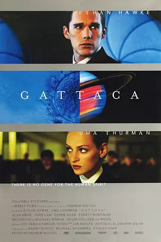

**评分**: ⭐ 8.8 (N/A)

**信息**: 导演: 安德鲁·尼科尔 Andrew Niccol   主演: 伊桑·霍克 Ethan Hawke / 乌玛...1997 / 美国 / 剧情 科幻 惊悚

**剧情简介**:

未来的世界，科技的力量胜过一切，基因决定命运，几乎成为金科玉律。不幸文森特（伊桑•霍克 Ethan Hawke  饰）是一个基因不良的人，出生以来就决定了他近视和心脏病的缺陷，他只能活到30岁。于是父母为文森特增添了一个有着优良基因的弟弟。
                                    
                                　　文森特的梦想是漫游太空，然而恶劣的基因令他无法圆梦，直到他遇到了太空中心的杰罗姆（裘德•洛 Jude Law  饰）。杰罗姆有优秀的基因，却在一次意外中半身瘫痪。二人决定调换身份，文森特千方百计隐藏自己的基因信息，每天都认真清洗掉自己的皮屑毛发，不暴露任何蛛丝马迹。另一方面，杰罗姆帮他筹备进入太空前需要检查的基因物品。事情进展得非常顺利，然而一桩谋杀案和一根睫毛，让事情节外生枝。

**详情**: https://movie.douban.com/subject/1300117/

---

## 229. 罗生门 / Rashomon

**评分**: ⭐ 8.8 (N/A)

**信息**: 导演: 黑泽明 Akira Kurosawa   主演: 三船敏郎 Toshirô Mifune / 京町子 ...1950 / 日本 / 剧情 犯罪 悬疑

**剧情简介**:

罗生门，日本京都的正南门。云游和尚、砍柴人和乞丐在城门底下避雨，三人闲聊，话题开始，故事的序幕拉开：一个武士和他妻子路过荒山，遭遇了不测。妻子被侮辱，而武士惨遭杀害。惨案如何酿成？凶手、妻子、借武士亡魂来做证的女巫，都各有说法。
                                    
                                　　真相只得一个，但是各人提供证词的目的却各有不同。为了美化自己的道德，减轻自己的罪恶，掩饰自己的过失，人人都开始叙述一个美化自己的故事版本。荒山上的惨案，成了一团拨不开看不清的迷雾。
                                    
                                　　谈论完毕，雨过天晴。砍柴人在罗生门旁发现一个哭泣的弃婴。他决定收养下来，抱着婴孩往夕阳深处走去。

**详情**: https://movie.douban.com/subject/1291879/

---

## 230. 真爱至上 / 真的恋爱了(港)  /  爱是您，爱是我(台)

**评分**: ⭐ 8.5 (N/A)

**信息**: 导演: 理查德·柯蒂斯 Richard Curtis   主演: 休·格兰特 Hugh Grant / 连姆...2003 / 英国 美国 法国 / 喜剧 剧情 爱情

**剧情简介**:

这是一出10个爱情故事串成的喜剧杂烩：
                                    
                                　　失去母亲的小男孩终日郁郁寡欢，继父不知该如何安慰。当他得知继子喜欢上学校里最美的女孩，便热烈地鼓励儿子去追。小男孩为了赢得小女孩的关注，废寝忘食地练习架子鼓，只为了在圣诞节的晚会上能与她同台演出。勇敢的他，甚至为了最后的一记道别潇 洒地突破机场的安检区。
                                    
                                　　两个孩子的母亲面对了婚姻危机。丈夫感情出轨，把项链送给了别的女人，给她的，则仅是一张她热爱的女歌手的CD。她找了借口仓皇躲入卧室，在歌声中隐忍啜泣。转个身，又夸张地大笑着，迎向娇女爱子欢喜的面容。 丈夫最终幡然醒悟。
                                    
                                　　……
                                    
                                　　如此的小故事共有十出，温暖你我的心。

**详情**: https://movie.douban.com/subject/1292401/

---

## 231. 哈利·波特与凤凰社 / 哈利波特5：凤凰会的密令(港 / 台)

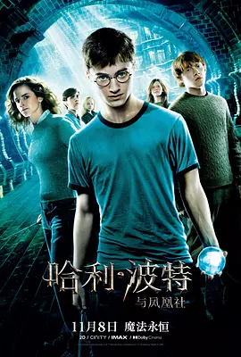

**评分**: ⭐ 8.6 (N/A)

**信息**: 导演: 大卫·叶茨 David Yates   主演: 丹尼尔·雷德克里夫 Daniel Radcliffe...2007 / 英国 美国 / 奇幻 冒险

**剧情简介**:

逃过摄魂怪的追杀，通过魔法部的审查，哈利（丹尼尔·雷德克里夫）终于回到美丽的霍格沃兹。然而这个学期并不轻松，他不仅要完成魔法等级考试，还要应对夜晚的噩梦和黑魔法防御课老师乌姆里奇的打压。在好友的支持下，哈利秘密组建了邓不利多军团，与大家一起练习黑魔法防御术。
                                    
                                　　噩梦中，哈利总是以伏地魔的视角出现，似乎他们之间有着某种神秘的联系。在邓不利多（迈克尔·刚本）的指示下，哈利向斯内普教授（阿伦·瑞克曼）学习封闭术，却鲜有成效。终于在一次噩梦的诱使下，哈利偏执的赶往魔法部营救小天狼星，却不想陷入伏地魔的圈套，引发凤凰社与食死徒之间的正面冲突。在混战中，小天狼星（加里·奥德曼）不幸遇难。
                                    
                                　　究竟哈利与伏地魔（拉尔夫·费因斯）之间有着怎样的联系？在悲恸中，邓不利多为哈利揭开谜底，哈利还有更长、更艰难的路要走……

**详情**: https://movie.douban.com/subject/1457217/

---

## 232. 彗星来的那一夜 / 相干性  /  相干效应

**评分**: ⭐ 8.6 (N/A)

**信息**: 导演: 詹姆斯·沃德·布柯特 James Ward Byrkit   主演: 艾米丽·芭尔多尼 Em...2013 / 美国 英国 / 科幻 悬疑 惊悚

**剧情简介**:

在一个静得有些诡异阴森的夜晚，年轻女子艾米丽（艾米丽·芭尔多尼 Emily Baldoni 饰）驱车来到朋友家参加聚会。此前她一边开车一边和男友打电话，然而通话突然中断，她的手机屏也莫名其妙出现裂痕。这一事件让艾米丽的心中升起隐隐不安，因为当晚一颗彗星刚好接近地球，一个 很久之前听过的传说使她对彗星的到来有着不祥的预感。稍后，朋友们落座，大家彼此交谈，叙说近况，虽然言语中有着许多莫名其妙、蹊跷反常的线索，然而均被一带而过。突然间，灯光尽灭。当光明重新来临时，众人发现附近只有一户人家还在亮灯，而亮灯人家里坐着的竟是……
                                    
                                　　本片荣获2014年阿姆斯特丹奇幻电影节黑郁金香奖。

**详情**: https://movie.douban.com/subject/25807345/

---

## 233. 恋恋笔记本 / 忘了·忘不了(港)  /  手札情缘(台)

**评分**: ⭐ 8.5 (N/A)

**信息**: 导演: 尼克·卡索维茨 Nick Cassavetes   主演: 瑞恩·高斯林 Ryan Gosling /...2004 / 美国 / 剧情 爱情

**剧情简介**:

一个浸润着鲜红与纯白的爱情故事，写在一本洒满昏黄的笔记本上，被一位老先生(詹姆斯·加纳 饰)，一遍一遍的讲述。老太太(吉娜·罗兰兹 饰)总是静静的听着，好奇的追问结果。在一家疗养院，这样不变的场景每天都会上演。
                                    
                                　　笔记本上，秀美的字迹，记载着发生在那个夏天的爱情。艾莉(瑞秋·麦克亚当斯 饰)是富有人家的千金，她随家人来到小镇避暑。在一个充满梦幻的游乐场，邂逅了诺亚(瑞恩·高斯林 饰)。诺亚没有钱，却活的很快乐。艾莉在他那学会了自由，得到了欢笑，两人很快热恋起来。然而在艾莉父母的阻挠下，相爱的两个人，就被分开在夏天结束的那一刻。随着诺亚的365封信被偷偷藏起，艾莉在7年后终于放弃了等待。就在她要步入教堂的前一天，突然在报纸上看到了诺亚曾许诺给自己建造的白色房子。一切记忆，全部苏醒……
                                    
                                　　也许，应该苏醒的，不是故事中的，而是听故事的人。

**详情**: https://movie.douban.com/subject/1309163/

---

## 234. 海边的曼彻斯特 / 情系海边之城(港)

**评分**: ⭐ 8.6 (N/A)

**信息**: 导演: 肯尼斯·罗纳根 Kenneth Lonergan   主演: 卡西·阿弗莱克 Casey Affle...2016 / 美国 / 剧情 家庭

**剧情简介**:

李（卡西·阿弗莱克 Casey Affleck 饰）是一名颓废压抑的修理工，在得知哥哥乔伊（凯尔·钱德勒 Kyle Chandler 饰）去世的消息后，李回到了故乡——海边的曼彻斯特处理乔伊的后事。根据乔伊的遗嘱，李将会成为乔伊的儿子帕特里克（卢卡斯·赫奇斯 Lucas Hedg es 饰）的监护人，李打算将帕特里克带回波士顿，但很显然帕特里克并不愿意离开家乡和朋友们，但李亦不愿在这片伤心地久留。
                                    
                                　　原来，曼彻斯特埋藏着李的一段绝望的回忆，他的过失使得三个孩子葬身火海，妻子兰迪（米歇尔·威廉姆斯 Michelle Williams 饰）亦因此而离开了他。此次重回故乡，李再度见到了已经再婚并且即将做妈妈的兰迪，与此同时，帕特里克那失踪已久的母亲艾丽斯（格瑞辰·摩尔 Gretchen Mol 饰）亦联系上了帕特里克，希望他能够成为她的新家庭中的一员。

**详情**: https://movie.douban.com/subject/25980443/

---

## 235. 火星救援 / 火星任务(港)  /  绝地救援(台)

**评分**: ⭐ 8.5 (N/A)

**信息**: 导演: 雷德利·斯科特 Ridley Scott   主演: 马特·达蒙 Matt Damon / 杰西卡...2015 / 英国 美国 匈牙利 约旦 / 剧情 科幻 冒险

**剧情简介**:

载人航天宇宙飞船阿瑞斯3号成功抵达火星，谁知一场破坏力极其巨大的风暴向宇航员们袭来，阿瑞斯3号被迫中断任务，紧急返航。撤离途中，宇航员马克·沃特尼（马特·达蒙 Matt Damon 饰）被飞船上吹落的零件击中，由于生还希望渺茫，队友们只得匆匆返航，并向世人宣告他已牺牲的事实。出乎意料的是，马克以极低的概率活了下来。他躲进驻火星的航天基地疗伤。下一次火星任务要等到四年后，而基地内的补给仅够他维持31天。短暂的绝望后，马克决定利用有限的食物，在这颗空无一人的星球上种植作物，寻找一线生机。与此同时，地球方面也很快发现马克生还的事实，他们想尽办法部署营救计划。孤军奋战的马克，能否等到救援队伍的到来？
                                    
                                　　影片改编自安迪·威尔的同名科幻小说。

**详情**: https://movie.douban.com/subject/25864085/

---

## 236. 黑客帝国2：重装上阵 / 22世纪杀人网络2：决战未来(港)  /  骇客任务：重装上阵(台)

**评分**: ⭐ 8.7 (N/A)

**信息**: 导演: 拉娜·沃卓斯基 Lana Wachowski / 莉莉·沃卓斯基 Lilly Wachowski   ...2003 / 美国 / 动作 科幻

**剧情简介**:

上一部结尾，尼奥（基奴李维斯 饰）终于意识到自己的能力和使命，中弹复活后，变成了无所不能的“救世主”，他和女友崔妮蒂（凯莉·安·摩丝 饰），舰长墨菲斯（劳伦斯·菲什伯恩 饰）回到了人类的基地锡安，受到人们的热烈欢迎。
                                    
                                　　此时，“母体”决定先下手为强，派出了两万五千只电子乌贼攻击锡安基地；墨菲斯、尼奥和崔妮蒂则再次进入“母体”，寻找“制钥者”，准备从内部破坏；而本该被尼奥消灭的特勤史密斯似乎出了点问题，脱离了“母体”的控制，拥有可怕的复制能力，阻碍尼奥他们的行动。

**详情**: https://movie.douban.com/subject/1304141/

---

## 237. 奇迹男孩 / 奇迹

**评分**: ⭐ 8.6 (N/A)

**信息**: 导演: 斯蒂芬·卓博斯基 Stephen Chbosky   主演: 雅各布·特伦布莱 Jacob Tr...2017 / 美国 中国香港 / 剧情 儿童 家庭

**剧情简介**:

奥吉（雅各布·特瑞布雷 Jacob Tremblay 饰）是一个10岁的男孩，除了头戴一个巨大的太空头盔外，他和其他的同年龄孩子别无二致。头盔下隐藏了奥吉因为各种手术而伤痕累累的脸庞，它不仅完美的隐藏起了奥吉脆弱自卑的内心，也成功的防止了奥吉的模样吓到别的孩子。
                                    
                                　　奥吉没有上过学，他的所有文化知识都是母亲伊莎贝尔（朱莉娅·罗伯茨 Julia Roberts 饰）在家教授给他的。然而，伊莎贝尔渐渐感觉到，家庭课堂无法满足奥吉的成长需要，除了学习知识，奥吉还必须学会的，是如何同除了家人以外的人交流。在忧虑重重之中，伊莎贝尔将奥吉送入了一间公立学校里，在那里，奥吉面临的是他人生中必须要战胜的挑战。

**详情**: https://movie.douban.com/subject/26787574/

---

## 238. 千年女优 / Millennium Actress

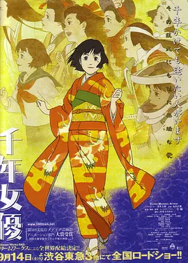

**评分**: ⭐ 8.8 (N/A)

**信息**: 导演: 今敏 Satoshi Kon   主演: 庄司美代子 Miyoko Shôji / 小山茉美 Mam...2001 / 日本 / 动画 剧情 爱情

**剧情简介**:

60岁的立花源也和28岁的摄影师井田恭二不远千里跋山涉水上门去拜访隐居了三十年的一代影星藤原千代子，为了给她拍摄一生自传的纪录片。款款前来的千代子虽然已界75岁高龄，但仍然优雅美丽，左眼下标志性的小痣也仍然俏皮。立花双手递上一把钥匙，千代子深受震动，称这把钥匙是开启一个 秘密的关键，当年她不慎丢失，今日竟还能再回手中。千代子的思绪飞到老远。
                                        
                                    　　1926年9月1日，藤原千代子呱呱坠地，水灵清秀的她16岁就被星探发掘，然而直到遇上一个画家，她救他于乱世中，藏于自家仓库内，他赠她一把钥匙，说这是开启秘密的关键，并承诺再与她重逢时带她去看北海道的雪。然而次日千代子放学归家时画家已经因为逃开追捕逃离远去。
                                        
                                    　　千代子自此进入电影圈，只因为画家最后说他会去满洲作战，而第一部电影承诺会去满洲取景。从此千代子的银幕生涯拉开，拍摄了代表日本战国、幕府、大正及昭和等四个不同时...

**详情**: https://movie.douban.com/subject/1307394/

---

## 239. 步履不停 / 横山家之味(港 / 台)

**评分**: ⭐ 8.8 (N/A)

**信息**: 导演: 是枝裕和 Hirokazu Koreeda   主演: 阿部宽 Hiroshi Abe / 夏川结衣 Yu...2008 / 日本 / 剧情 家庭

**剧情简介**:

“人生路上步履不停，为何总是慢一拍”。
                                    
                                　　位于偏远小镇的横山一家，生活平静祥和。父亲恭平（原田芳雄 饰）是业已退休的医生，却时时牵挂小镇诊所内的事务。长子纯平继承了父亲的事业，却在15年前为救落水儿童而溺水身亡。次子良多（阿部宽 饰）与父亲意见相左，执意前往异地当起了绘画修复师。多年的打拼换来的却是失业，困顿的良多与带着孩子的由香里（夏川结衣 饰）结婚，相互扶持，继续生活。
                                    
                                　　又逢纯平的忌日，良多和姐姐千奈美（YOU 饰）带着家人分别赶回家中。平静的横山家再次热闹起来……
                                    
                                　　本片荣获2009年蓝丝带最佳导演奖和最佳女配角奖（树木希林）、2008年报知电影和2009年电影旬报最佳女配角（树木希林）、2009年每日电影奖最佳男主角（阿部宽）、2008年马塔布拉塔国际电影节评审团大奖和最佳影片。

**详情**: https://movie.douban.com/subject/2222996/

---

## 240. 战争之王 / 军火之王(台 / 港)

**评分**: ⭐ 8.7 (N/A)

**信息**: 导演: 安德鲁·尼科尔 Andrew Niccol   主演: 尼古拉斯·凯奇 Nicolas Cage /...2005 / 美国 德国 / 剧情 犯罪

**剧情简介**:

本来美国移民尤瑞（尼古拉斯•凯奇 Nicolas Cage 饰）的家族生意是开饭馆。但是一个偶然的机会令他踏入了军火生意的大门，从此开始了贩卖武器的“职业生涯”。尤瑞遇事机智，胆大心细，这不仅让他成功俘获了美女埃娃的心，还使得他在地下军火生意中愈战愈勇。但是，不顺心的事情也随之而来：出现了生意上的死对头和一名老是盯着他的国际警察；弟弟染上毒瘾，并在一单生意交易中丧了命，而且，尽管他在竭力维护自己在家庭里的正义形象，但却掩盖不了真相。尤瑞开始反省自己生意的正义性，拷问自己的良心，但一切太迟，他已经众叛亲离……

**详情**: https://movie.douban.com/subject/1419936/

---

## 241. 萤火虫之墓 / 再见萤火虫(港)  /  萤火挽歌

**评分**: ⭐ 8.7 (N/A)

**信息**: 导演: 高畑勋 Isao Takahata   主演: 辰己努 / 白石绫乃 / 志乃原良子1988 / 日本 / 动画 剧情 战争

**剧情简介**:

美日战争爆发，14岁的清太带着年幼的妹妹到处逃命，当他们到达防空洞的时候，母亲已身受重伤，没过多久便不久人世。两兄妹自此过着相依为命的日子。他们只好投靠了母亲的姐妹，纵使他们把家里所有的家当都送给了阿姨，但当食物吃完，他们就越感到了寄人篱下的感觉，清太决定带着妹妹离开独自生活。火灾硝烟中的生活并不好过，清太为了妹妹四处偷取食物，但妹妹还是严重营养不良……

**详情**: https://movie.douban.com/subject/1293318/

---

## 242. 谍影重重2 / 叛谍追击2：机密圈套(港)  /  神鬼认证：神鬼疑云(台)

**评分**: ⭐ 8.7 (N/A)

**信息**: 导演: 保罗·格林格拉斯 Paul Greengrass   主演: 马特·达蒙 Matt Damon / ...2004 / 美国 德国 / 动作 悬疑 惊悚

**剧情简介**:

经过上一集的腥风血雨之后，伯恩（马特·达蒙 饰）和女朋友玛丽（弗兰卡·泼坦特 饰）隐居在印度偏僻的海边小镇，想忘记以前的生活。一天，神秘组织的杀手来到小镇，打破了伯恩二人世界的宁静，女友玛丽在逃亡途中被枪杀。
                                    
                                　　为了查出真相，伯恩重新开始战斗，他发现以前工作的中情局开始重新寻找他，自己被卷入了一场刺杀活动中，被人诬陷破坏了中情局的一次情报交易，杀害特工。伯恩别无选择，他只能找到冒充自己的人，才能洗刷清白，为女友报仇。

**详情**: https://movie.douban.com/subject/1308767/

---

## 243. 攻壳机动队 / Ghost in the Shell

**评分**: ⭐ 9.0 (N/A)

**信息**: 导演: 押井守 Mamoru Oshii   主演: 田中敦子 Atsuko Tanaka / 大冢明夫 Akio...1995 / 日本 / 动作 科幻 动画

**剧情简介**:

公元2029年，未来世界是高科技与信息化的世界。人类生活水平的提高伴随着犯罪活动的高科技化，于是，专门镇压高科技犯罪的特殊部队——公安9课成立了。队长草薙素子，作为一位全身“义体化”的女警，带领公安9课不断展开行动。
                                    
                                　　是次，公安9课帮助公安6课秘密解决了一位程序员外逃他国的麻烦琐事，又卷入传说中的黑客“傀儡师”的犯罪事件。当行动陷入僵局之际，傀儡师竟然不请自来，出现在公安9课！素子与她的战友们，不知不觉地被卷入了一场涉及政府的阴谋之中。

**详情**: https://movie.douban.com/subject/1291936/

---

## 244. 蜘蛛侠：平行宇宙 / 蜘蛛侠：新纪元  /  蜘蛛人：新宇宙(台)

**评分**: ⭐ 8.6 (N/A)

**信息**: 导演: 鲍勃·佩尔西凯蒂 Bob Persichetti / 彼得·拉姆齐 Peter Ramsey   主...2018 / 美国 / 动作 科幻 动画 冒险

**剧情简介**:

正就读中学的少年迈尔斯（沙梅克·摩尔 Shameik Moore 配音）意外被一只遭受放射性污染的蜘蛛咬伤，随后身体发生奇特的变化。偶然机缘，他目睹了蜘蛛侠（克里斯·派恩 Chris Pine 配音）和犯罪头目金并（列维·施瑞博尔 Liev Schreiber 配音）的战斗。为了阻止金并利用时空对撞机扰乱宇宙，蜘蛛侠最终壮烈牺牲。可未过多久，来自平行宇宙的颓废的彼德·帕克（杰克·约翰逊 Jake M. Johnson 配音）出现在迈尔斯面前。为了阻止金并的阴谋，并帮助这个帕克返回自己的宇宙，他们闯入金并的老巢。在这一过程中，二人遭到章鱼博士和徘徊者的狙击。与此同时，来自其他宇宙的女蜘蛛侠、暗影蜘蛛侠、蜘猪侠、二次元蜘蛛妹相继出现。
                                    
                                　　他们合力与恶势力展开斗争……

**详情**: https://movie.douban.com/subject/26374197/

---

## 245. 冰雪奇缘 / 魔雪奇缘(港)  /  冰雪大冒险

**评分**: ⭐ 8.5 (N/A)

**信息**: 导演: 克里斯·巴克 Chris Buck / 珍妮弗·李 Jennifer Lee   主演: 克里斯汀...2013 / 美国 / 喜剧 动画 奇幻 歌舞

**剧情简介**:

在四面环海、风景如画的阿伦黛尔王国，生活着两位可爱美丽的小公主，艾莎和安娜。艾莎天生具有制造冰雪的能力，随着年龄的增长，她的能力越来越强，甚至险些夺走妹妹的生命。为此国王紧闭宫门，也中断了两姐妹的联系。悲哀的海难过后，艾莎（伊迪娜·门泽尔 Idina Menzel 配音 ）终于到了加冕的年龄，各国王公齐来祝贺。艾莎战战兢兢，唯恐被人识破隐藏了多年的秘密。然而当听说安娜（克里斯汀·贝尔 Kristen Bell 配音）将要和初次见面的南埃尔斯王子汉斯（圣蒂诺·方塔纳 Santino Fontana 配音）结婚时，依然情绪失控露出了马脚。在此之后她逃到山中，构建了属于自己的冰雪王国，而阿伦黛尔也陷入可怕的寒冷之中。
                                        
                                    　　安娜独自来到山中，在山民克斯托夫（乔纳森·格罗夫 Jonathan Groff 配音）的帮助下总算来到姐姐的宫殿，她能否让国家重新找回失落的...

**详情**: https://movie.douban.com/subject/4202982/

---

## 246. 血钻 / 血钻石(台)  /  血腥钻石

**评分**: ⭐ 8.7 (N/A)

**信息**: 导演: 爱德华·兹威克 Edward Zwick   主演: 莱昂纳多·迪卡普里奥 Leonardo ...2006 / 美国 德国 英国 / 剧情 惊悚 冒险

**剧情简介**:

九十年代非洲塞拉利昂，连连战火使这片土地饱受摧残，非法钻石贸易日益猖獗。
                                    
                                　　阿彻（莱昂纳多•迪卡普里奥 饰）是一个地道的战争贩子，靠倒卖战区钻石为生，他在监狱中无意得知渔夫所罗门手里有极品粉钻。意识到这是自己离开非洲的机会，出狱后，他找到所罗门，准备和他一起找出钻石，离开非洲。
                                    
                                　　所罗门是普通的渔民，因为内战和家人分离，被叛军强制开采钻石，他发现一颗极品粉钻，藏了起来；战乱来临，所罗门进了监狱，后被阿彻救出，并在战地记者麦迪•鲍文(珍妮弗•康纳利 饰)的帮助下，找到了失散的家人，此时，他的儿子迪亚却被叛军带走，生死未卜。
                                    
                                　　悲愤的所罗门答应和阿彻合作，在叛军的控制范围内寻找钻石，并寻找儿子。
                                    
                                　　两个截然不同的人，因为一颗血钻将命运联系在了一起。

**详情**: https://movie.douban.com/subject/1428175/

---

## 247. 魂断蓝桥 / 滑铁卢桥  /  断桥残梦

**评分**: ⭐ 8.8 (N/A)

**信息**: 导演: 茂文·勒鲁瓦 Mervyn LeRoy   主演: 费雯·丽 Vivien Leigh / 罗伯特·...1940 / 美国 / 剧情 爱情 战争

**剧情简介**:

第一次世界大战期间，回国度假的陆军中尉罗伊（罗伯特·泰勒）在滑铁卢桥上邂逅了舞蹈演员玛拉（费雯·丽），两人彼此倾心，爱情迅速升温。就在两人决定结婚之时，罗伊应招回营地，两人被迫分离。由于错过剧团演出，玛拉被开除，只能和好友相依为命。
                                    
                                　　不久玛拉得知罗伊阵亡的消息，几欲崩溃，备受打击。失去爱情的玛拉感到一切都失去了意义，为了生存，她和好友不得不沦为妓女。然而命运弄人，就在此时玛拉竟然再次遇到了罗伊。虽然为罗伊的生还兴奋不已，玛拉却因自己的失身陷入痛苦之中。
                                    
                                　　感到一切难以挽回的玛拉潸然离开，独自来到两人最初相遇的地点——滑铁卢桥上…

**详情**: https://movie.douban.com/subject/1293964/

---

## 248. 房间 / 不存在的房间(台)  /  抖室(港)

**评分**: ⭐ 8.7 (N/A)

**信息**: 导演: 伦尼·阿伯拉罕森 Lenny Abrahamson   主演: 布丽·拉尔森 Brie Larson...2015 / 爱尔兰 加拿大 英国 美国 / 剧情 家庭

**剧情简介**:

女孩乔伊（布丽·拉尔森 Brie Larson 饰）被一个叫“老尼克”的男人拐骗，之后被他囚禁在其房子后院的棚屋里长达七年之久。在此期间她遭到强奸，并生下儿子杰克（雅各布·特伦布莱 Jacob Tremblay 饰）。靠着老尼克时不时的物资补给，母子二人艰难度日。尽管如此，母亲还是竭尽所能，为儿子杰克创造了一个安全而开心的成长空间。这个狭小逼仄的房间，成了杰克生活成长的神奇小天地。在杰克度过了他的五岁生日后，母亲决定告诉他真相，在这个小小的房间外面，有着更广阔的世界。他们开始策划逃跑计划，决心要逃出这个囚禁他们的房间……
                                    
                                　　本片根据艾玛·唐纳修的同名小说改编。

**详情**: https://movie.douban.com/subject/25724855/

---

## 249. 隐藏人物 / NASA无名英雌(港)  /  关键少数(台)

**评分**: ⭐ 8.9 (N/A)

**信息**: 导演: 特奥多尔·梅尔菲 Theodore Melfi   主演: 塔拉吉·P·汉森 Taraji P. ...2016 / 美国 / 剧情 传记 历史

**剧情简介**:

影片讲述1962年，汉森饰演的非裔美国数学家与斯宾瑟和梦奈两位“同事”组成智囊团，为宇航员约翰·格伦成功绕地球轨道飞行做出贡献。

**详情**: https://movie.douban.com/subject/26615208/

---

## 250. 小姐 / 下女诱罪(港)  /  下女的诱惑(台)

**评分**: ⭐ 8.5 (N/A)

**信息**: 导演: 朴赞郁 Chan-wook Park   主演: 金敏喜 Min-hee Kim / 金泰梨 Tae-ri K...2016 / 韩国 / 剧情 悬疑 情色 同性

**剧情简介**:

公爵（河正宇 饰）为了得到日本贵族秀子小姐（金敏喜 饰）的财产，意欲娶她为妻，而后以其患上精神疾病为由将秀子送入精神病院。为了实现自己的阴谋，公爵将出生于小偷世家的南淑熙（金泰璃 饰）送到秀子的身边担任女佣，如此一来两人里应外合，深闺之中不谙世事的秀子和她的万贯家财根本 就是他们的囊中之物。
                                    
                                　　在南淑熙的眼中，秀子天真而又脆弱，善良但是敏感，随着时间的推移，朝夕相处的两人之间产生了真挚的情谊，而公爵虚伪而又贪婪的假面渐渐令南淑熙意欲作呕。可是，面对高额的报酬，南淑熙选择了背叛，在她的游说之下，秀子和公爵私奔，举行了结婚仪式，就在这时，发生了一件令南淑熙再也想不到的意外。

**详情**: https://movie.douban.com/subject/25977027/

---

